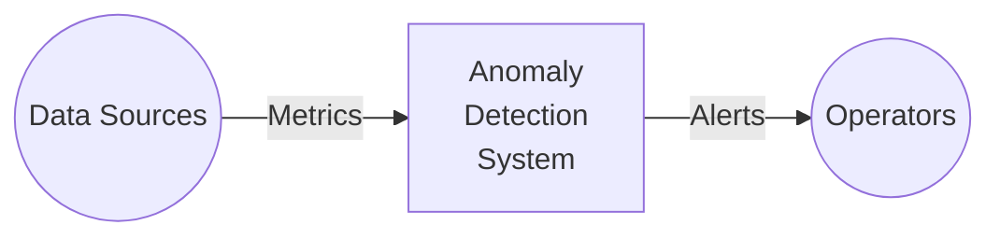
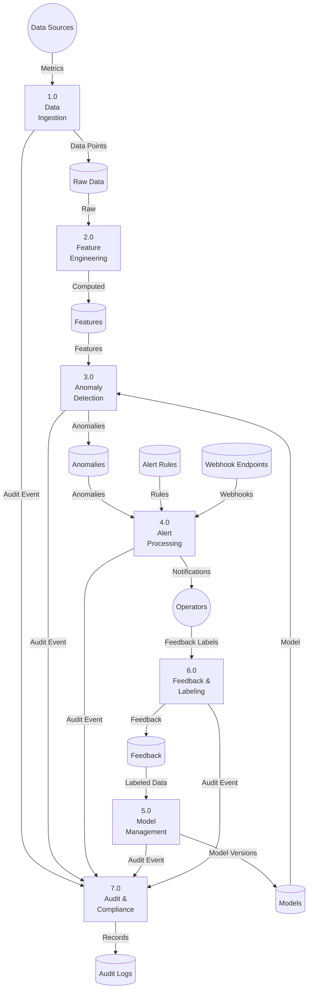
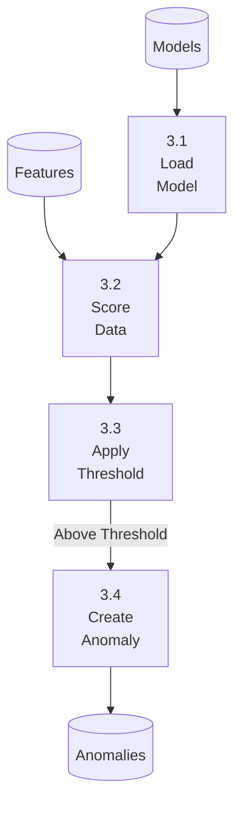
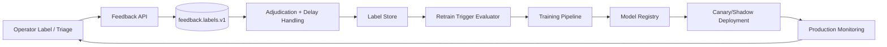

# Data Flow Diagram - Anomaly Detection System

## Level 0: Context

## Level 1: Main Processes

## Level 2: Anomaly Detection (3.0)

## Purpose and Scope
Describes data lineage, trust boundaries, and transformation stages from raw events to analyst-facing artifacts.

## Assumptions and Constraints
- Raw payload retention differs from derived feature retention.
- PII tokenization happens before model-serving zone.
- Every transform stage emits lineage metadata.

### End-to-End Example with Realistic Data
Raw event with `email`/`device_id` enters restricted zone, tokenization service outputs hashed IDs, feature builder computes aggregates, scoring consumes derived features only, case UI retrieves redacted evidence.

## Decision Rationale and Alternatives Considered
- Chose dual-zone data design for security and performance.
- Rejected direct UI access to raw data store.
- Lineage IDs propagated end-to-end for replay and audit.

## Failure Modes and Recovery Behaviors
- Tokenization service outage -> hold high-sensitivity flows; allow low-sensitivity flows with policy exceptions disabled.
- Lineage metadata loss -> block downstream promotion until restored.

## Security and Compliance Implications
- DFD annotates data-classification transitions at each edge.
- Retention/deletion obligations are attached to sink nodes.

## Operational Runbooks and Observability Notes
- Lineage completeness and tokenization error rate are on compliance dashboards.
- Runbook covers replay with lineage integrity checks.

## Bounded Contexts and Ownership

| Bounded Context | Core Responsibilities | Owned Data | Upstream Dependencies | Downstream Consumers |
|---|---|---|---|---|
| Ingestion Context | Source auth, schema enforcement, idempotent event intake | Raw event envelope, source schema version, ingest status | Producers, source registry | Feature context, audit context |
| Feature Context | Online/offline feature computation and freshness checks | Feature vectors, feature lineage, freshness metadata | Ingestion context, feature store | Detection context, training context |
| Detection Context | Real-time scoring, policy thresholds, anomaly decisioning | Score outputs, decision reason codes, model invocation metadata | Feature context, model context | Alerting context, case management |
| Model Management Context | Train/validate/register/deploy/monitor models | Model artifacts, model cards, validation metrics | Feature context, feedback context | Detection context, governance context |
| Alerting Context | Rule evaluation, dedup, channel dispatch, escalation | Alert state, channel receipts, suppression windows | Detection context, rule config | Operators, incident systems |
| Feedback Context | Label collection, analyst annotations, weak-label synthesis | Labels, adjudication metadata, confidence level | Alerting context, operator actions | Model management context |
| Governance & Audit Context | End-to-end lineage, compliance evidence, audit trails | Immutable audit events, lineage graph, retention metadata | All contexts | Compliance reporting, incident review |

## Event and Data Flow (Canonical Topics)

| Flow | Transport | Contract | SLA Budget | Notes |
|---|---|---|---|---|
| `raw.metrics.v1` -> `features.online.v2` | Kafka | Avro + schema registry compatibility `BACKWARD_TRANSITIVE` | < 120 ms p95 | Breaking schema changes blocked pre-ingest. |
| `features.online.v2` -> `scores.realtime.v2` | gRPC + protobuf | Feature vector + feature freshness stamp | < 80 ms p95 | Freshness > 120s marks score degraded. |
| `scores.realtime.v2` -> `anomalies.detected.v1` | Kafka | Decision payload + model/version IDs | < 40 ms p95 | Includes calibrated confidence interval. |
| `anomalies.detected.v1` -> `alerts.dispatch.v1` | Kafka | Alert candidate + dedup key | < 60 ms p95 | Dedup window default: 10 min per tenant/source. |
| `feedback.labels.v1` -> `training.candidates.v1` | Kafka + batch compaction | Label + provenance + adjudication state | < 15 min end-to-end | Delayed labels are backfilled incrementally. |

## Model Lifecycle Stages and Quality Gates

| Stage | Entry Criteria | Exit Criteria | Evidence Produced |
|---|---|---|---|
| Train | Approved dataset snapshot + feature definition hash | Training job success + reproducible artifact hash | Training run metadata, hyperparameters, artifact digest |
| Validate | Candidate model from train stage | Precision/recall/F1 + calibration + bias checks pass | Evaluation report, model card, risk classification |
| Deploy | Validation approved + change ticket + rollback target set | Canary/shadow success gates pass | Deployment record, traffic split evidence |
| Monitor | Model active in staging/prod | Drift/quality/latency within SLO or retraining trigger raised | Continuous metrics, drift reports, alert timeline |

### Mandatory Lifecycle Gates
- **Train -> Validate**: dataset checksum and feature parity check (online vs offline skew < 2%).
- **Validate -> Deploy**: no regression > 1.5% on weighted F1 against current production model.
- **Deploy -> Monitor**: 30-minute canary + 24-hour shadow comparison before full promotion.
- **Monitor -> Retrain**: trigger when drift/quality thresholds are violated for sustained interval.

## Feature Store Interaction Contract

- **Online store (Redis/Aerospike class)**: low-latency feature reads for scoring, strict TTL, write-through from stream features.
- **Offline store (lakehouse/parquet class)**: training and backfill datasets, point-in-time correct joins, lineage retention >= 400 days.
- **Parity controls**:
  - Feature definitions are versioned (`feature_set_id`, `feature_version`).
  - Every score logs `feature_set_id`, `freshness_ms`, and offline snapshot reference.
  - Promotion is blocked if online/offline feature parity tests fail.

## Feedback Loop Design

**Design notes**:
- Labels are confidence-scored (`human_verified`, `heuristic`, `imported`) before entering training candidates.
- Delayed labels are merged with event-time alignment so they do not contaminate recent-window online metrics.
- False-positive clusters create a temporary threshold policy overlay while retraining is in progress.
