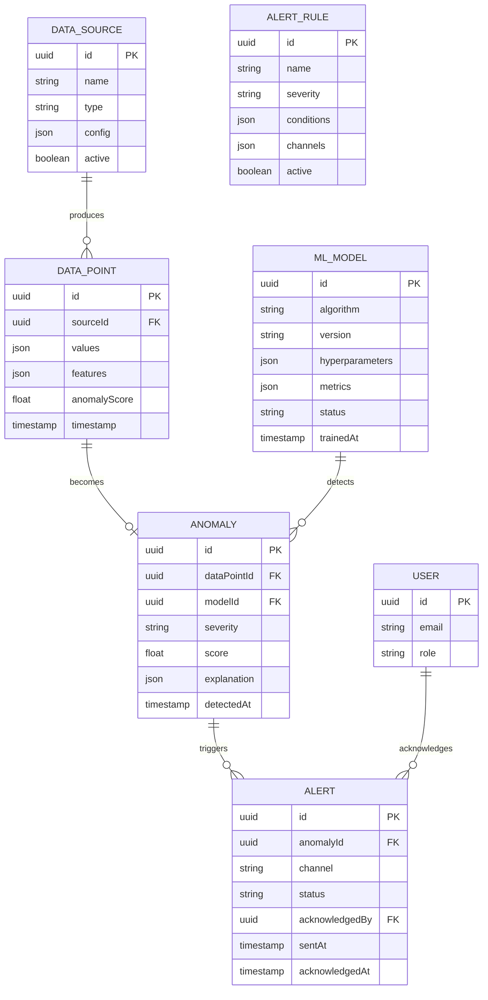

# Domain Model - Anomaly Detection System

**Key Entities**:
- **Data Source**: Origin of monitoring data (Kafka, API, DB)
- **Data Point**: Single measurement with features
- **Anomaly**: Detected unusual data point
- **ML Model**: Trained detection algorithm
- **Alert**: Notification sent to operator
- **Alert Rule**: Configuration for alert routing
