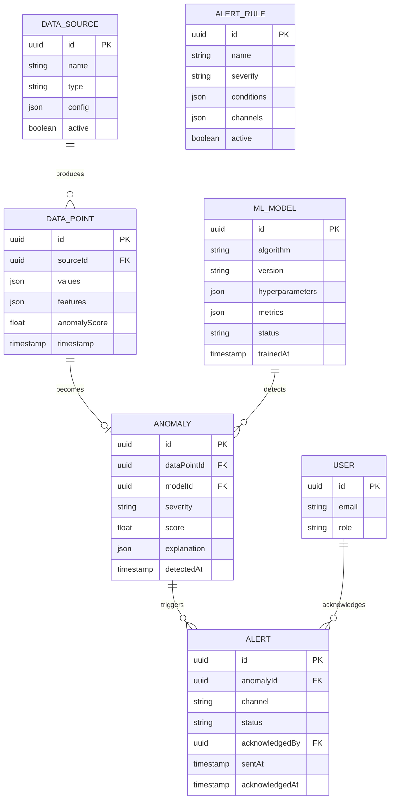

# Domain Model - Anomaly Detection System

```mermaid
erDiagram
    DATA_SOURCE ||--o{ DATA_POINT : produces
    DATA_POINT ||--o| ANOMALY : becomes
    ANOMALY ||--o{ ALERT : triggers
    ML_MODEL ||--o{ ANOMALY : detects
    USER ||--o{ ALERT : acknowledges
    
    DATA_SOURCE {
        uuid id PK
        string name
        string type
        json config
        boolean active
    }
    
    DATA_POINT {
        uuid id PK
        uuid sourceId FK
        json values
        json features
        float anomalyScore
        timestamp timestamp
    }
    
    ANOMALY {
        uuid id PK
        uuid dataPointId FK
        uuid modelId FK
        string severity
        float score
        json explanation
        timestamp detectedAt
    }
    
    ML_MODEL {
        uuid id PK
        string algorithm
        string version
        json hyperparameters
        json metrics
        string status
        timestamp trainedAt
    }
    
    ALERT {
        uuid id PK
        uuid anomalyId FK
        string channel
        string status
        uuid acknowledgedBy FK
        timestamp sentAt
        timestamp acknowledgedAt
    }
    
    ALERT_RULE {
        uuid id PK
        string name
        string severity
        json conditions
        json channels
        boolean active
    }
    
    USER {
        uuid id PK
        string email
        string role
    }
```

**Key Entities**:
- **Data Source**: Origin of monitoring data (Kafka, API, DB)
- **Data Point**: Single measurement with features
- **Anomaly**: Detected unusual data point
- **ML Model**: Trained detection algorithm
- **Alert**: Notification sent to operator
- **Alert Rule**: Configuration for alert routing

## Purpose and Scope
Defines core domain entities and invariants used by services and workflows.

## Assumptions and Constraints
- Aggregates enforce invariants at transaction boundaries.
- State transitions are event-sourced for replayability.
- Domain terms are ubiquitous language across teams.

### End-to-End Example with Realistic Data
`DetectionCase` aggregate contains `AnomalyEvent`, `InvestigationTask`, `PolicyDecision`, `Disposition`. Invariant: case cannot transition to `Resolved` without disposition + evidence pointer + actor identity.

## Decision Rationale and Alternatives Considered
- Used aggregate boundaries to avoid cross-service transactional coupling.
- Rejected anemic model that spreads invariants into UI/service code.
- Kept explicit value objects for risk score and reason code sets.

## Failure Modes and Recovery Behaviors
- Illegal transition attempt -> domain validator rejects and emits audit event.
- Concurrent updates from multiple analysts -> optimistic locking with merge guidance.

## Security and Compliance Implications
- Domain entities include classification metadata to enforce field-level access controls.
- Audit entity is immutable and append-only.

## Operational Runbooks and Observability Notes
- Invariant violation counters alert domain owner immediately.
- Runbook documents manual repair steps for rare concurrency conflicts.
