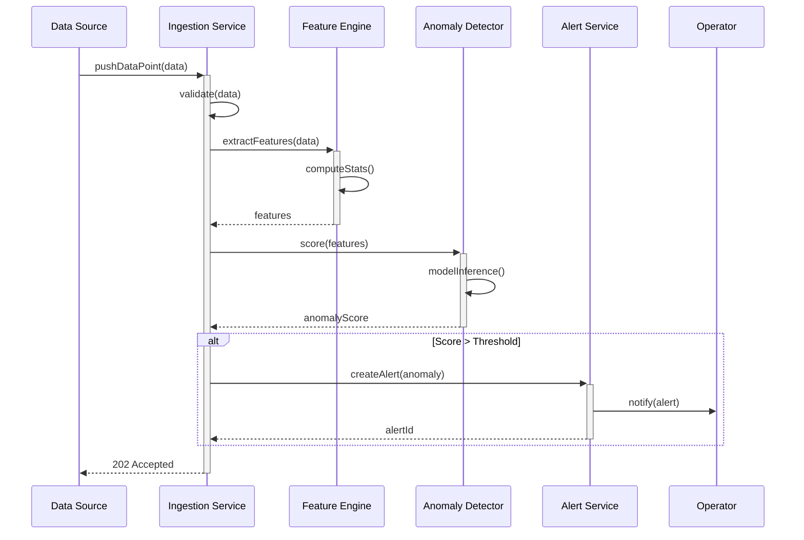
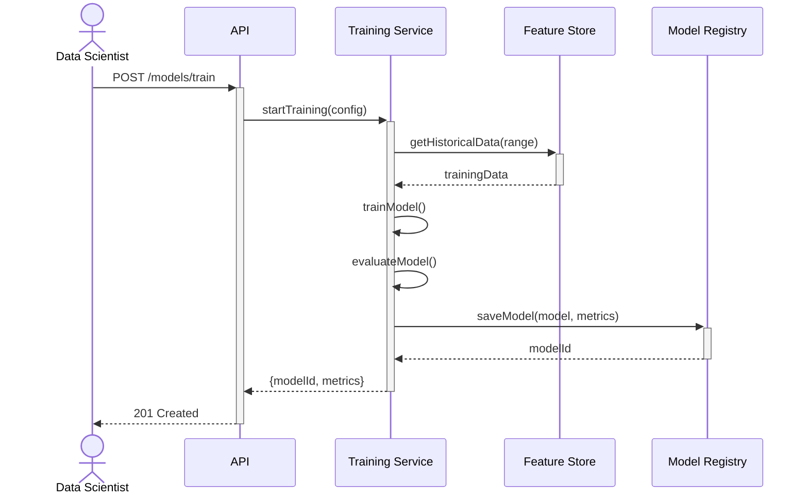
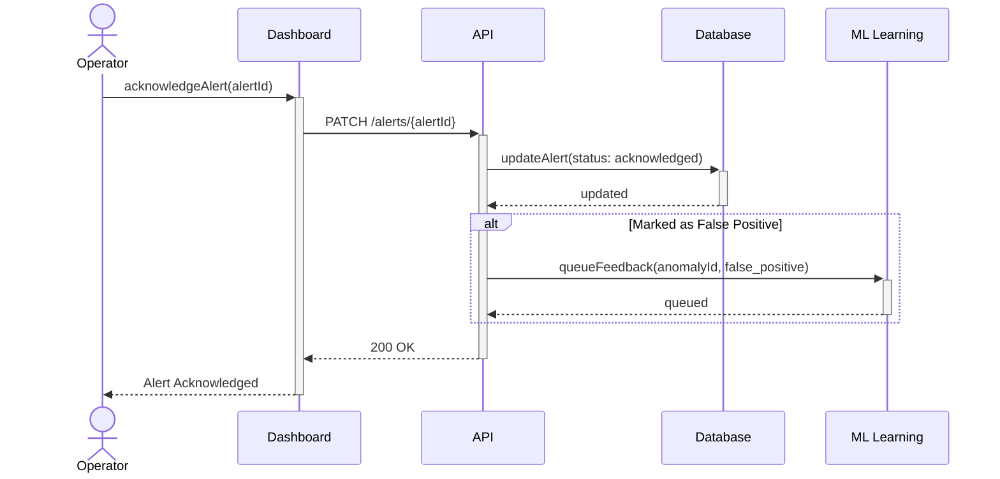

# System Sequence Diagram - Anomaly Detection System

## SSD-01: Real-Time Anomaly Detection

```mermaid
sequenceDiagram
    participant Source as Data Source
    participant Ingestion as Ingestion Service
    participant Feature as Feature Engine
    participant Detector as Anomaly Detector
    participant Alert as Alert Service
    participant Operator
    
    Source->>+Ingestion: pushDataPoint(data)
    Ingestion->>Ingestion: validate(data)
    Ingestion->>+Feature: extractFeatures(data)
    Feature->>Feature: computeStats()
    Feature-->>-Ingestion: features
    
    Ingestion->>+Detector: score(features)
    Detector->>Detector: modelInference()
    Detector-->>-Ingestion: anomalyScore
    
    alt Score > Threshold
        Ingestion->>+Alert: createAlert(anomaly)
        Alert->>Operator: notify(alert)
        Alert-->>-Ingestion: alertId
    end
    
    Ingestion-->>-Source: 202 Accepted
```

## SSD-02: Model Training

```mermaid
sequenceDiagram
    actor DS as Data Scientist
    participant API
    participant Trainer as Training Service
    participant Store as Feature Store
    participant Registry as Model Registry
    
    DS->>+API: POST /models/train
    API->>+Trainer: startTraining(config)
    Trainer->>+Store: getHistoricalData(range)
    Store-->>-Trainer: trainingData
    
    Trainer->>Trainer: trainModel()
    Trainer->>Trainer: evaluateModel()
    
    Trainer->>+Registry: saveModel(model, metrics)
    Registry-->>-Trainer: modelId
    
    Trainer-->>-API: {modelId, metrics}
    API-->>-DS: 201 Created
```

## SSD-03: Alert Acknowledgment

```mermaid
sequenceDiagram
    actor Operator
    participant UI as Dashboard
    participant API
    participant DB as Database
    participant Learning as ML Learning
    
    Operator->>+UI: acknowledgeAlert(alertId)
    UI->>+API: PATCH /alerts/{alertId}
    API->>+DB: updateAlert(status: acknowledged)
    DB-->>-API: updated
    
    alt Marked as False Positive
        API->>+Learning: queueFeedback(anomalyId, false_positive)
        Learning-->>-API: queued
    end
    
    API-->>-UI: 200 OK
    UI-->>-Operator: Alert Acknowledged
```
