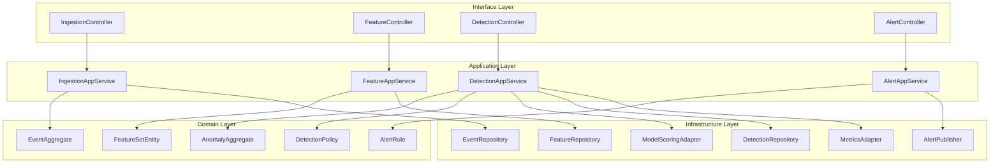
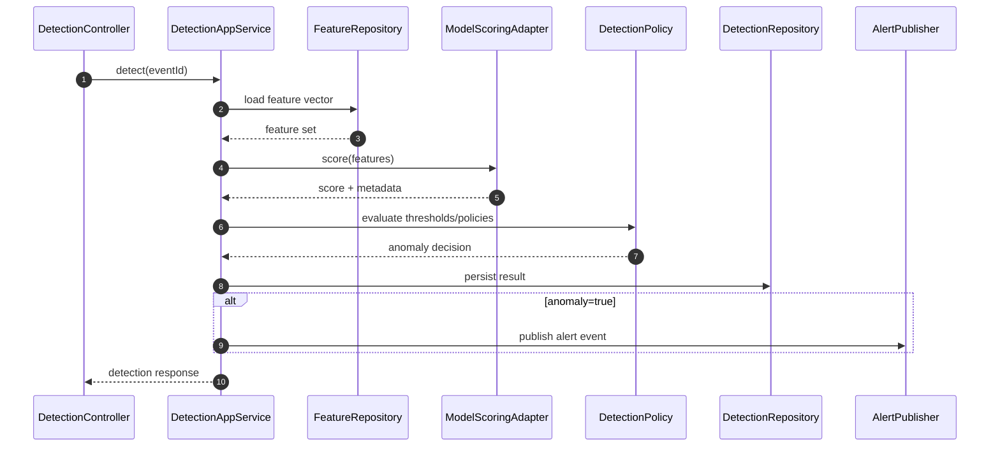

# C4 Code Diagram

This document provides a **code-level C4 view** of the Anomaly Detection System so engineers can map runtime behavior to concrete implementation modules.

## Code-Level Structure

## Critical Runtime Sequence: Online Detection

## Module Responsibilities
- **Controllers**: transport mapping, input validation, and request context propagation.
- **Application services**: orchestration boundaries, transaction scope, idempotency handling.
- **Domain types**: decision invariants (thresholds, suppression windows, severity mapping).
- **Infrastructure adapters**: model invocation, persistence, telemetry, and outbound alert delivery.

## Implementation Notes
- Keep model-scoring adapter stateless; cache only immutable model metadata.
- Persist decision artifacts (`features hash`, `model version`, `policy version`) for auditability.
- Prefer event-driven alert fanout so downstream consumers can evolve independently.
