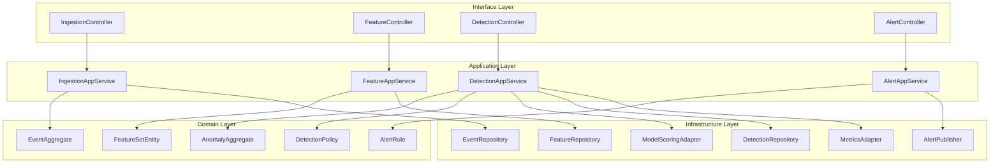
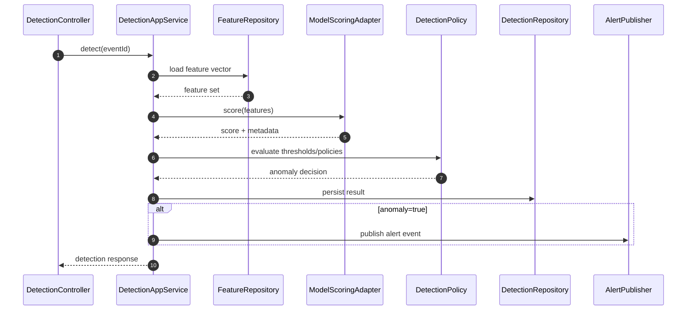

# C4 Code Diagram

This document provides a **code-level C4 view** of the Anomaly Detection System so engineers can map runtime behavior to concrete implementation modules.

## Code-Level Structure

## Critical Runtime Sequence: Online Detection

## Module Responsibilities
- **Controllers**: transport mapping, input validation, and request context propagation.
- **Application services**: orchestration boundaries, transaction scope, idempotency handling.
- **Domain types**: decision invariants (thresholds, suppression windows, severity mapping).
- **Infrastructure adapters**: model invocation, persistence, telemetry, and outbound alert delivery.

## Implementation Notes
- Keep model-scoring adapter stateless; cache only immutable model metadata.
- Persist decision artifacts (`features hash`, `model version`, `policy version`) for auditability.
- Prefer event-driven alert fanout so downstream consumers can evolve independently.

## Purpose and Scope
Connects runtime architecture to concrete code modules, packages, and boundaries.

## Assumptions and Constraints
- Module boundaries map to ownership and review paths.
- Cross-module calls must pass through interface contracts.
- Generated diagrams reflect current package topology.

### End-to-End Example with Realistic Data
`ScoreController` calls `ScoreService`, which delegates to `FeatureClient` and `ModelClient`; `DecisionAssembler` builds response and `AuditRepository` stores decision metadata.

## Decision Rationale and Alternatives Considered
- Aligned package structure to C4 modules for onboarding clarity.
- Rejected utility-sprawl approach that hides domain boundaries.
- Kept adapters thin to simplify backend replacements.

## Failure Modes and Recovery Behaviors
- Module contract drift -> compile-time interface checks + contract tests fail CI.
- Cross-cutting concern leakage -> architecture lint rule blocks merge.

## Security and Compliance Implications
- Code modules handling PII are isolated with stricter review requirements.
- Secrets are loaded only in adapter modules via managed identity.

## Operational Runbooks and Observability Notes
- Code-level tracing tags include module name for hotspot identification.
- Runbook includes module-owner escalation map.
