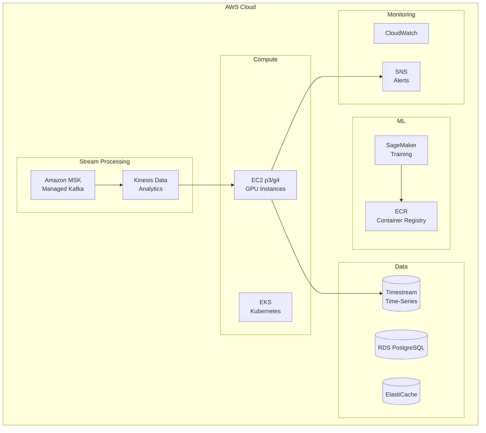
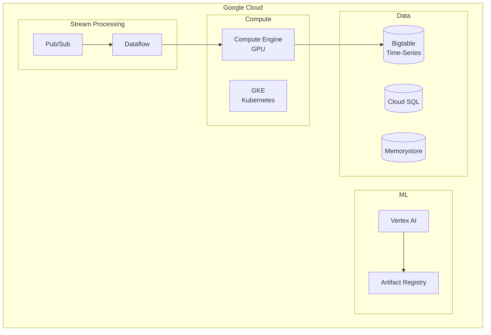

# Cloud Architecture - Anomaly Detection System

## AWS Architecture

## GCP Architecture

## Provider Mapping

| Component | AWS | GCP | Azure |
|-----------|-----|-----|-------|
| Kafka | MSK | Pub/Sub | Event Hubs |
| Stream Processing | Kinesis Analytics | Dataflow | Stream Analytics |
| Kubernetes | EKS | GKE | AKS |
| GPU Compute | EC2 p3/g4 | Compute Engine GPU | NC-series |
| Time-Series DB | Timestream | Bigtable | Time Series Insights |
| ML Platform | SageMaker | Vertex AI | Azure ML |
| Alerting | SNS | Cloud Monitoring | Azure Monitor |

## Cost Estimation (AWS)

| Tier | Monthly Cost | Specs |
|------|--------------|-------|
| **Starter** | ~$1500 | MSK 3-node, g4dn.xlarge x2, Timestream |
| **Growth** | ~$5000 | MSK 6-node, p3.2xlarge x4, Multi-AZ |
| **Enterprise** | ~$15000+ | Multi-region, SageMaker, 24/7 GPU |

**Key Cost Drivers**:
- GPU instances for ML inference
- Kafka/MSK cluster size
- Time-series data retention
- Data transfer volume
