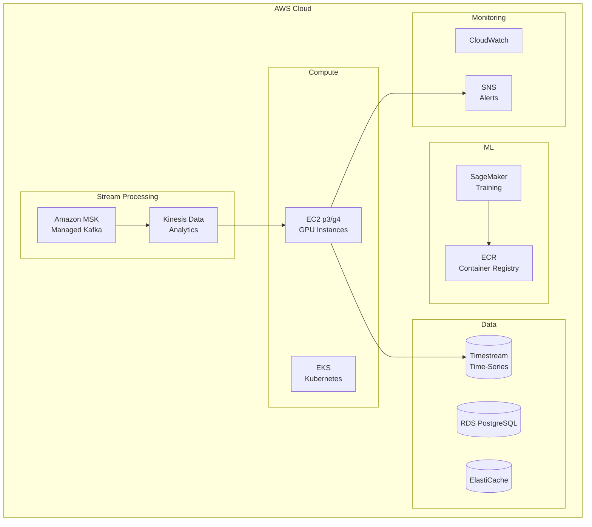
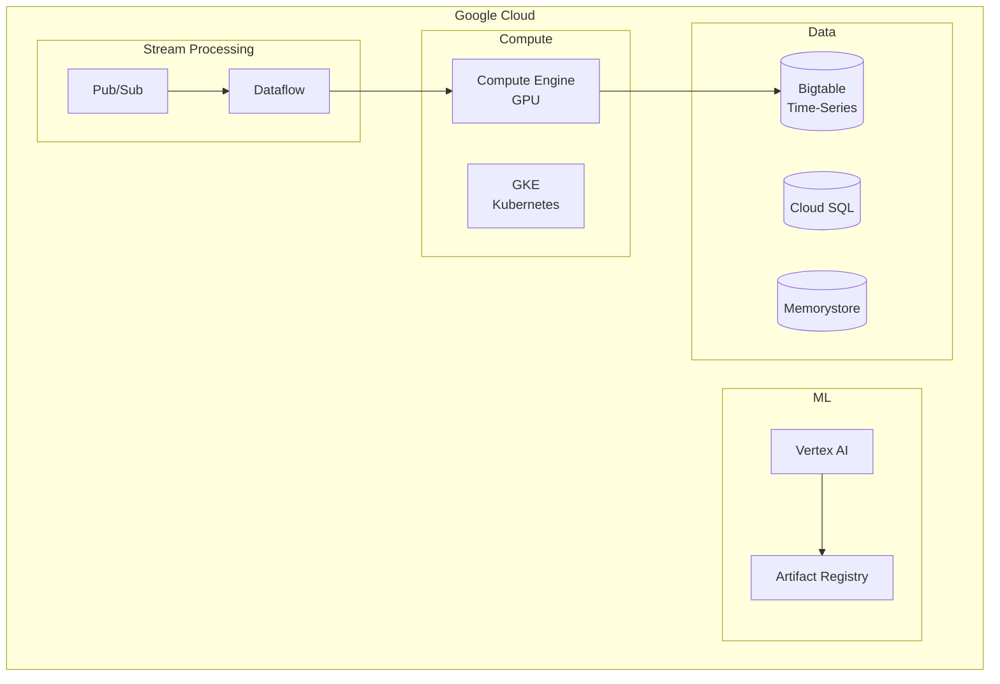

# Cloud Architecture - Anomaly Detection System

## AWS Architecture

```mermaid
graph TB
    subgraph "AWS Cloud"
        subgraph "Stream Processing"
            MSK[Amazon MSK<br/>Managed Kafka]
            KINESIS[Kinesis Data<br/>Analytics]
        end
        
        subgraph "Compute"
            EKS[EKS<br/>Kubernetes]
            EC2_GPU[EC2 p3/g4<br/>GPU Instances]
        end
        
        subgraph "ML"
            SAGEMAKER[SageMaker<br/>Training]
            ECR[ECR<br/>Container Registry]
        end
        
        subgraph "Data"
            TIMESTREAM[(Timestream<br/>Time-Series)]
            RDS[(RDS PostgreSQL)]
            ELASTICACHE[(ElastiCache)]
        end
        
        subgraph "Monitoring"
            CLOUDWATCH[CloudWatch]
            SNS[SNS<br/>Alerts]
        end
    end
    
    MSK --> KINESIS
    KINESIS --> EC2_GPU
    EC2_GPU --> TIMESTREAM
    EC2_GPU --> SNS
    SAGEMAKER --> ECR
```

## GCP Architecture

```mermaid
graph TB
    subgraph "Google Cloud"
        subgraph "Stream Processing"
            PUBSUB[Pub/Sub]
            DATAFLOW[Dataflow]
        end
        
        subgraph "Compute"
            GKE[GKE<br/>Kubernetes]
            COMPUTE_GPU[Compute Engine<br/>GPU]
        end
        
        subgraph "ML"
            VERTEX[Vertex AI]
            ARTIFACT[Artifact Registry]
        end
        
        subgraph "Data"
            BIGTABLE[(Bigtable<br/>Time-Series)]
            CLOUD_SQL[(Cloud SQL)]
            MEMORYSTORE[(Memorystore)]
        end
    end
    
    PUBSUB --> DATAFLOW
    DATAFLOW --> COMPUTE_GPU
    COMPUTE_GPU --> BIGTABLE
    VERTEX --> ARTIFACT
```

## Provider Mapping

| Component | AWS | GCP | Azure |
|-----------|-----|-----|-------|
| Kafka | MSK | Pub/Sub | Event Hubs |
| Stream Processing | Kinesis Analytics | Dataflow | Stream Analytics |
| Kubernetes | EKS | GKE | AKS |
| GPU Compute | EC2 p3/g4 | Compute Engine GPU | NC-series |
| Time-Series DB | Timestream | Bigtable | Time Series Insights |
| ML Platform | SageMaker | Vertex AI | Azure ML |
| Alerting | SNS | Cloud Monitoring | Azure Monitor |

## Cost Estimation (AWS)

| Tier | Monthly Cost | Specs |
|------|--------------|-------|
| **Starter** | ~$1500 | MSK 3-node, g4dn.xlarge x2, Timestream |
| **Growth** | ~$5000 | MSK 6-node, p3.2xlarge x4, Multi-AZ |
| **Enterprise** | ~$15000+ | Multi-region, SageMaker, 24/7 GPU |

**Key Cost Drivers**:
- GPU instances for ML inference
- Kafka/MSK cluster size
- Time-series data retention
- Data transfer volume

## Purpose and Scope
Details cloud service choices, scaling behavior, managed service dependencies, and regional strategy.

## Assumptions and Constraints
- Compute and streaming services support autoscaling by queue lag and CPU.
- Object storage lifecycle policies are enforced centrally.
- Regional failover runbooks are tested, not theoretical.

### End-to-End Example with Realistic Data
During 5x event surge, scorer pods scale 20->140, stream partitions 48->120, and feature-store replicas double; anomaly delay stays <3s end-to-end.

## Decision Rationale and Alternatives Considered
- Used managed stream + autoscaling compute to reduce undifferentiated ops load.
- Rejected single-region design due unacceptable resiliency risk.
- Separated online/offline data stores by workload profile.

## Failure Modes and Recovery Behaviors
- Cloud API quota exhaustion -> pre-provisioned capacity + quota alarms.
- Regional control-plane issue -> failover to warm standby region with read-only degrade option.

## Security and Compliance Implications
- KMS boundaries and key policies align with tenant/data classification.
- Cross-region replication obeys residency and legal restrictions.

## Operational Runbooks and Observability Notes
- FinOps and SRE jointly monitor cost-per-million-events.
- Runbook covers region evacuation and controlled return.
