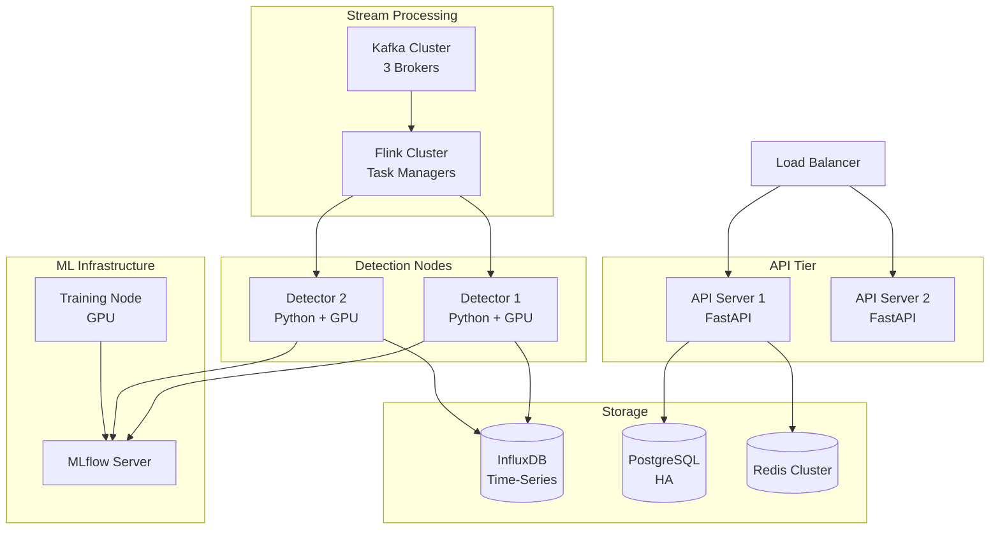

# Deployment Diagram - Anomaly Detection System



## Kubernetes Deployment

```yaml
# Detection Worker with GPU
apiVersion: apps/v1
kind: Deployment
metadata:
  name: anomaly-detector
spec:
  replicas: 2
  template:
    spec:
      containers:
      - name: detector
        image: anomaly-detector:latest
        resources:
          requests:
            memory: "8Gi"
            cpu: "4"
            nvidia.com/gpu: 1
          limits:
            memory: "16Gi"
            nvidia.com/gpu: 1
        env:
        - name: MODEL_PATH
          value: "/models/production"
---
# Stream Processor
apiVersion: apps/v1
kind: Deployment
metadata:
  name: stream-processor
spec:
  replicas: 3
  template:
    spec:
      containers:
      - name: processor
        image: stream-processor:latest
        resources:
          requests:
            memory: "4Gi"
            cpu: "2"
```

## Node Specifications

| Service | CPU | RAM | GPU | Replicas |
|---------|-----|-----|-----|----------|
| API Server | 2 vCPU | 4GB | - | 2+ |
| Stream Processor | 4 vCPU | 8GB | - | 3+ |
| Anomaly Detector | 4 vCPU | 16GB | T4/V100 | 2+ |
| Training Node | 8 vCPU | 32GB | V100 | 1 |
| InfluxDB | 4 vCPU | 16GB | - | 3 (cluster) |
| PostgreSQL | 4 vCPU | 16GB | - | 2 (primary+replica) |
| Kafka Broker | 4 vCPU | 8GB | - | 3 |
