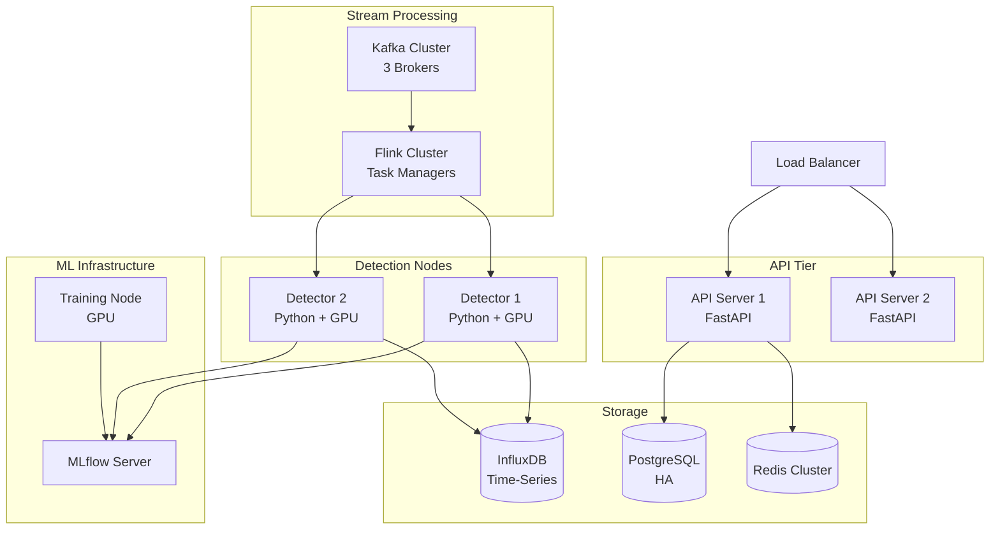
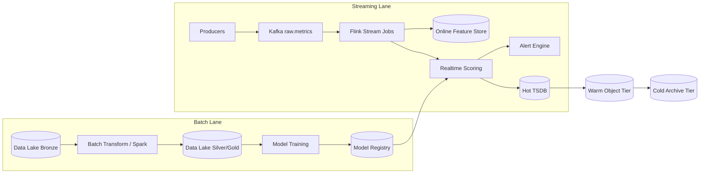

# Deployment Diagram - Anomaly Detection System


```mermaid
graph TB
    subgraph "Stream Processing"
        KAFKA[Kafka Cluster<br/>3 Brokers]
        FLINK[Flink Cluster<br/>Task Managers]
    end
    
    subgraph "Detection Nodes"
        DET1[Detector 1<br/>Python + GPU]
        DET2[Detector 2<br/>Python + GPU]
    end
    
    subgraph "API Tier"
        API1[API Server 1<br/>FastAPI]
        API2[API Server 2<br/>FastAPI]
    end
    
    subgraph "Storage"
        INFLUX[(InfluxDB<br/>Time-Series)]
        PG[(PostgreSQL<br/>HA)]
        REDIS[(Redis Cluster)]
    end
    
    subgraph "ML Infrastructure"
        MLFLOW[MLflow Server]
        TRAIN[Training Node<br/>GPU]
    end
    
    LB[Load Balancer] --> API1
    LB --> API2
    
    KAFKA --> FLINK
    FLINK --> DET1
    FLINK --> DET2
    
    DET1 --> INFLUX
    DET1 --> MLFLOW
    DET2 --> INFLUX
    DET2 --> MLFLOW
    
    API1 --> PG
    API1 --> REDIS
    
    TRAIN --> MLFLOW
```

## Kubernetes Deployment

```yaml
# Detection Worker with GPU
apiVersion: apps/v1
kind: Deployment
metadata:
  name: anomaly-detector
spec:
  replicas: 2
  template:
    spec:
      containers:
      - name: detector
        image: anomaly-detector:latest
        resources:
          requests:
            memory: "8Gi"
            cpu: "4"
            nvidia.com/gpu: 1
          limits:
            memory: "16Gi"
            nvidia.com/gpu: 1
        env:
        - name: MODEL_PATH
          value: "/models/production"
---
# Stream Processor
apiVersion: apps/v1
kind: Deployment
metadata:
  name: stream-processor
spec:
  replicas: 3
  template:
    spec:
      containers:
      - name: processor
        image: stream-processor:latest
        resources:
          requests:
            memory: "4Gi"
            cpu: "2"
```

## Node Specifications

| Service | CPU | RAM | GPU | Replicas |
|---------|-----|-----|-----|----------|
| API Server | 2 vCPU | 4GB | - | 2+ |
| Stream Processor | 4 vCPU | 8GB | - | 3+ |
| Anomaly Detector | 4 vCPU | 16GB | T4/V100 | 2+ |
| Training Node | 8 vCPU | 32GB | V100 | 1 |
| InfluxDB | 4 vCPU | 16GB | - | 3 (cluster) |
| PostgreSQL | 4 vCPU | 16GB | - | 2 (primary+replica) |
| Kafka Broker | 4 vCPU | 8GB | - | 3 |

## Purpose and Scope
Shows deployment units, environments, promotion gates, and rollback topology.

## Assumptions and Constraints
- Deployment artifacts are immutable and signed.
- Blue/green and canary paths are both supported where needed.
- Environment parity is maintained for critical dependencies.

### End-to-End Example with Realistic Data
`v2026.03.2` deployed to green stack, cache warmed, health checks pass for 30 minutes under mirrored load; traffic switch then proceeds gradually with switchback trigger at 0.5% error rate.

## Decision Rationale and Alternatives Considered
- Blue/green chosen for low-downtime and quick rollback.
- Rejected manual host-by-host deploy due inconsistency and recovery time.
- Added pre-switch synthetic checks to catch hidden dependency failures.

## Failure Modes and Recovery Behaviors
- New stack healthy but downstream incompatibility discovered -> instant switchback and compatibility patch rollout.
- Partial deployment drift across AZs -> orchestrator halts promotion and reconciles versions.

## Security and Compliance Implications
- Artifact signing and provenance verification required before deployment.
- Secrets are injected at runtime from managed vault, never baked into images.

## Operational Runbooks and Observability Notes
- Deployment dashboard tracks per-stage success and rollback latency.
- Runbook includes abort criteria and communications template for stakeholders.


## Streaming and Batch Pipeline Topology


```mermaid
graph LR
    subgraph Streaming Lane
      SRC[Producers] --> K1[Kafka raw.metrics]
      K1 --> FL[Flink Stream Jobs]
      FL --> OFS[(Online Feature Store)]
      FL --> SC[Realtime Scoring]
      SC --> AE[Alert Engine]
      SC --> HOT[(Hot TSDB)]
    end

    subgraph Batch Lane
      DL[(Data Lake Bronze)] --> ETL[Batch Transform / Spark]
      ETL --> SIL[(Data Lake Silver/Gold)]
      SIL --> TRAIN[Model Training]
      TRAIN --> REG[(Model Registry)]
      REG --> SC
    end

    HOT --> WARM[(Warm Object Tier)]
    WARM --> COLD[(Cold Archive Tier)]
```

- Streaming lane serves low-latency detection and alerting.
- Batch lane serves replay, long-horizon feature generation, and retraining.
- Shared contracts ensure point-in-time consistency between lanes.

## Storage Tiering Strategy

| Tier | Technology Pattern | Retention | Access Pattern | Cost Control |
|---|---|---|---|---|
| Hot | TSDB + Redis | 7-30 days | sub-second query + active scoring | strict TTL, high-cardinality guardrails |
| Warm | Object storage + compacted parquet | 3-12 months | analytics + retraining | compaction + lifecycle transitions |
| Cold | Archive object tier/glacier | 1-7 years | compliance/audit restore | restore-on-demand, checksum manifests |

## Model-Serving Deployment Patterns

| Pattern | When Used | Pros | Risks/Controls |
|---|---|---|---|
| Canary | New model with expected low risk | Fast signal with bounded blast radius | Auto-rollback on error/drift gates |
| Shadow | Major architecture/model change | Quality comparison without user impact | Extra infra cost; cap shadow duration |
| Blue/Green | Infrastructure/runtime migration | Fast cutover + clear rollback | Requires double capacity during window |
| Multi-armed routing | Cohort/tenant experimentation | Optimized performance by segment | Governance needed for fairness and bias |

## Scaling Policy

- **Ingestion/streaming autoscale** when Kafka consumer lag > 60s for 5m or CPU > 70% for 10m.
- **Scoring pods autoscale** on p95 latency (>180 ms for 5m) and request concurrency.
- **Feature store read replicas** scale when cache hit ratio < 92% or read p95 > 15 ms.
- **Cost safety cap**: max node/pod ceilings per environment with explicit incident override.

## Cost Controls (FinOps)

1. Scheduled downscaling for non-prod and shadow workloads outside test windows.
2. Spot/preemptible mix for non-critical batch training.
3. GPU right-sizing with model-specific profiles (quantized models on CPU where feasible).
4. Budget alarms on:
   - cost per million scored events,
   - cost per retrain run,
   - storage growth rate by tier.
5. Automatic cleanup of stale model artifacts and orphaned feature backfills.

## Disaster Recovery (DR) Design

| Scope | Target |
|---|---|
| Regional outage RTO | <= 30 minutes |
| Regional outage RPO | <= 5 minutes for metadata, <= 15 minutes for raw streams |
| Model serving continuity | Warm standby region with replicated registry + feature definitions |
| Data recovery | Cross-region replicated object storage and DB snapshots |

### DR Play Pattern
1. Detect regional failure via global health checks.
2. Freeze write promotion in failed region.
3. Route ingestion and scoring traffic to standby region.
4. Replay buffered stream offsets and validate checksum parity.
5. Execute controlled failback after stability window and audit signoff.
