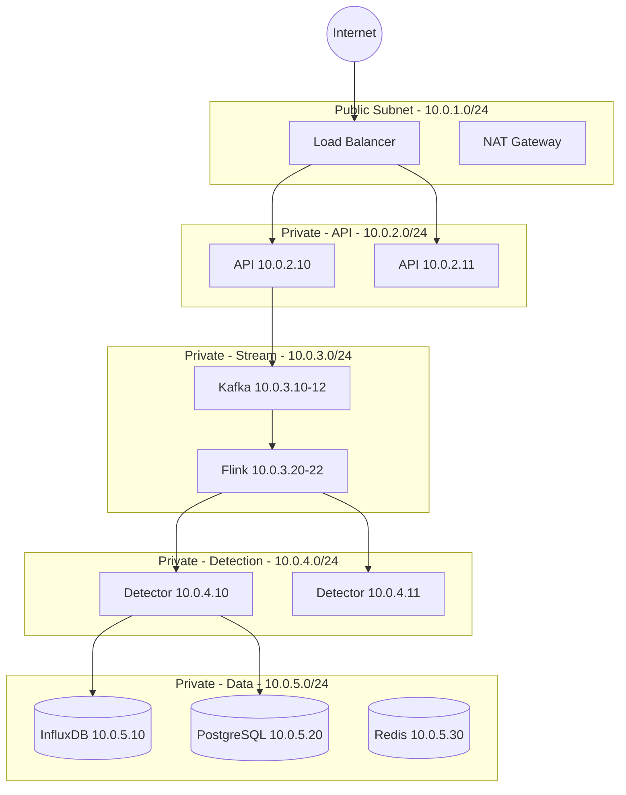

# Network / Infrastructure Diagram - Anomaly Detection System

## Firewall Rules

| From | To | Port | Protocol | Purpose |
|------|-----|------|----------|---------|
| Internet | LB | 443 | HTTPS | API access |
| LB | API | 8000 | HTTP | Internal routing |
| API | Kafka | 9092 | TCP | Publish data |
| Kafka | Flink | 8081 | TCP | Stream processing |
| Flink | Detectors | 5000 | HTTP | Detection requests |
| Detectors | InfluxDB | 8086 | HTTP | Write metrics |
| Detectors | PostgreSQL | 5432 | TCP | Store anomalies |
| All | Redis | 6379 | TCP | Caching |

**Security Zones**:
- **DMZ**: Load balancer only
- **Application**: API servers
- **Stream**: Kafka + Flink
- **Detection**: GPU nodes
- **Data**: Databases, cache
