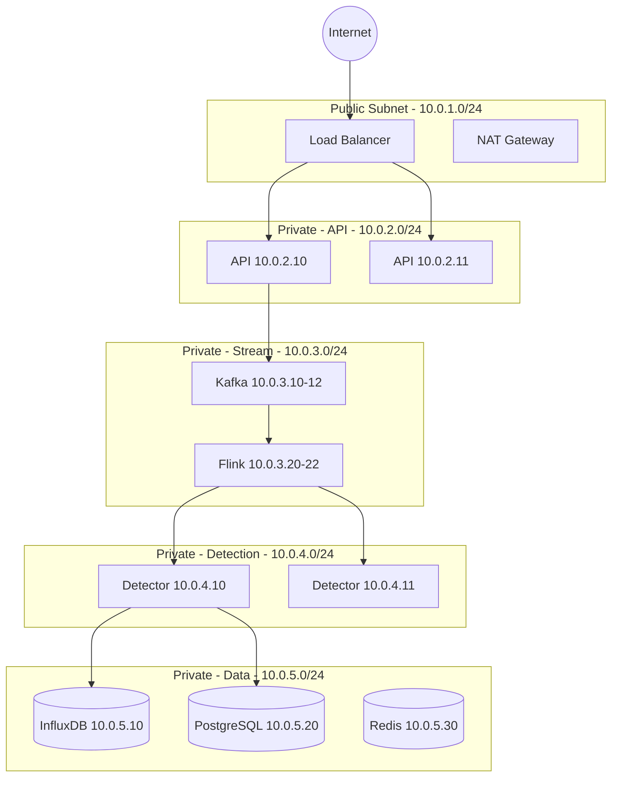

# Network / Infrastructure Diagram - Anomaly Detection System

```mermaid
graph TB
    subgraph "Public Subnet - 10.0.1.0/24"
        LB[Load Balancer]
        NAT[NAT Gateway]
    end
    
    subgraph "Private - API - 10.0.2.0/24"
        API1[API 10.0.2.10]
        API2[API 10.0.2.11]
    end
    
    subgraph "Private - Stream - 10.0.3.0/24"
        KAFKA[Kafka 10.0.3.10-12]
        FLINK[Flink 10.0.3.20-22]
    end
    
    subgraph "Private - Detection - 10.0.4.0/24"
        DET1[Detector 10.0.4.10]
        DET2[Detector 10.0.4.11]
    end
    
    subgraph "Private - Data - 10.0.5.0/24"
        INFLUX[(InfluxDB 10.0.5.10)]
        PG[(PostgreSQL 10.0.5.20)]
        REDIS[(Redis 10.0.5.30)]
    end
    
    INTERNET((Internet)) --> LB
    LB --> API1
    LB --> API2
    
    API1 --> KAFKA
    KAFKA --> FLINK
    FLINK --> DET1
    FLINK --> DET2
    
    DET1 --> INFLUX
    DET1 --> PG
```

## Firewall Rules

| From | To | Port | Protocol | Purpose |
|------|-----|------|----------|---------|
| Internet | LB | 443 | HTTPS | API access |
| LB | API | 8000 | HTTP | Internal routing |
| API | Kafka | 9092 | TCP | Publish data |
| Kafka | Flink | 8081 | TCP | Stream processing |
| Flink | Detectors | 5000 | HTTP | Detection requests |
| Detectors | InfluxDB | 8086 | HTTP | Write metrics |
| Detectors | PostgreSQL | 5432 | TCP | Store anomalies |
| All | Redis | 6379 | TCP | Caching |

**Security Zones**:
- **DMZ**: Load balancer only
- **Application**: API servers
- **Stream**: Kafka + Flink
- **Detection**: GPU nodes
- **Data**: Databases, cache

## Purpose and Scope
Specifies VPC/VNet layout, routing, security groups, service mesh, and ingress/egress controls.

## Assumptions and Constraints
- Default-deny network posture is enforced.
- Inter-service traffic uses mTLS identity, not IP allowlists alone.
- Private connectivity is preferred over public internet paths.

### End-to-End Example with Realistic Data
Producer VPC `10.42.0.0/16` sends via PrivateLink to detection VPC `10.80.0.0/16`; only ports 443 and 9092 allowed between specific security groups.

## Decision Rationale and Alternatives Considered
- Chose segmented subnets by trust zone to reduce lateral movement risk.
- Rejected flat network topology because blast radius was too large.
- Introduced egress proxy for controlled external dependencies.

## Failure Modes and Recovery Behaviors
- Route table drift opens unintended path -> policy scanner blocks apply and alerts network team.
- mTLS cert expiry -> automated rotation fallback and pre-expiry paging.

## Security and Compliance Implications
- Network docs include threat model assumptions and compensating controls.
- Flow logs retained and queryable for incident forensics.

## Operational Runbooks and Observability Notes
- Synthetic network probes validate critical paths continuously.
- Runbook includes step-by-step network isolation for active incident containment.
