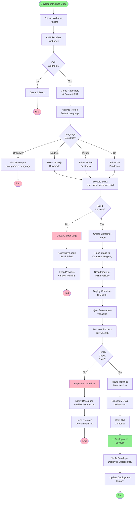
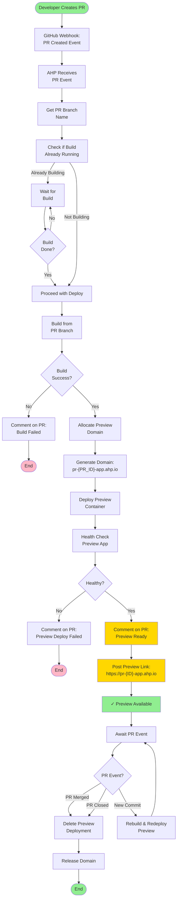
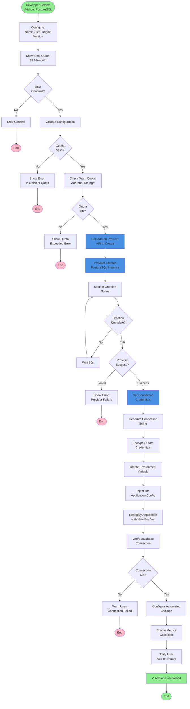

# Activity Diagrams & Business Process Flows

This document contains Mermaid flowchart representations of key business processes in the Application Hosting Platform.

## 1. Application Deployment Flow



**Key Decision Points:**
- Valid webhook signature verification
- Language detection (fallback to Dockerfile if unknown)
- Build success/failure
- Health check pass/fail
- Traffic routing to new version

---

## 2. Pull Request Preview Deployment Flow



**Key Features:**
- Auto-trigger on PR creation
- Unique preview domain per PR
- Auto-cleanup when PR merged/closed
- Rebuild on new commits to PR branch

---

## 3. Auto-Scaling Decision Flow

```mermaid
flowchart TD
    Start([Scaling Evaluation<br/>Every 60s]) --> CollectMetrics["Collect CPU Metrics<br/>from All Instances"]
    CollectMetrics --> CalcAvg["Calculate Average<br/>CPU Usage"]
    CalcAvg --> CheckRules["Check Scaling<br/>Rules"]
    
    CheckRules --> RuleLoop{"Rule<br/>Matches?"}
    RuleLoop -->|No Rules Match| NoAction["No Action"]
    NoAction --> End1([End Evaluation])
    
    RuleLoop -->|Rule Matches| GetRule["Get Rule:<br/>Condition, Duration,<br/>Action"]
    GetRule --> CheckDuration["Has Condition Been<br/>True for N Minutes?"]
    
    CheckDuration -->|No| NoAction
    
    CheckDuration -->|Yes| CheckCooldown["In Cooldown<br/>Period?"}
    CheckCooldown -->|Yes| Postpone["Postpone Decision<br/>until Cooldown Ends"]
    Postpone --> End2([End Evaluation])
    
    CheckCooldown -->|No| CheckQuota["Check Resource<br/>Quota"]
    CheckQuota --> QuotaOK{Quota<br/>Available?}
    
    QuotaOK -->|No| Alert["Alert Owner:<br/>Quota Exceeded"]
    Alert --> End3([End])
    
    QuotaOK -->|Yes| DecideAction{Action:<br/>Scale Up<br/>or Down?}
    
    DecideAction -->|Scale Up| Prov["Provision New<br/>Instances"]
    Prov --> Deploy["Deploy Containers"]
    Deploy --> HealthCheck["Health Check<br/>New Instances"]
    HealthCheck --> Register["Register with<br/>Load Balancer"]
    Register --> StartCooldown["Start Cooldown<br/>Period"]
    
    DecideAction -->|Scale Down| Drain["Gracefully Drain<br/>Connections"]
    Drain --> Stop["Stop Instance"]
    Stop --> Deregister["Deregister from<br/>Load Balancer"]
    Deregister --> StartCooldown
    
    StartCooldown --> LogEvent["Log Scaling Event"]
    LogEvent --> Notify["Notify Owner:<br/>Scaled to N Instances"]
    Notify --> End4([End Evaluation])
    
    style Start fill:#90EE90
    style End1 fill:#FFD700
    style End2 fill:#FFD700
    style End3 fill:#FFB6C6
    style End4 fill:#90EE90
    style Alert fill:#FFB6C6
    style CheckCooldown fill:#FFD700
```

**Key Control Points:**
- Metric evaluation every 60 seconds
- Duration check (condition must be true for N minutes)
- Cooldown period prevents rapid oscillations
- Quota enforcement
- Graceful drain on scale-down

---

## 4. Add-on Provisioning Flow



**Key Steps:**
- Configuration and cost estimation
- Quota validation
- Provider API call to create service
- Polling for completion
- Credential generation and injection
- Environment variable configuration
- Application redeployment
- Automated backup and metrics setup

---

## 5. Billing & Invoice Generation Flow

```mermaid
flowchart TD
    Start([Daily Usage<br/>Collection]) --> CollectUsage["Aggregate Resource<br/>Usage Metrics"]
    CollectUsage --> LogUsage["Log Usage Records:<br/>Compute Hours<br/>Bandwidth GB<br/>Storage GB"]
    LogUsage --> Accumulate["Accumulate to<br/>Current Month Total"]
    Accumulate --> Store["Store in<br/>Billing DB"]
    Store --> Daily["(Repeat Daily)")
    Daily --> End1["Continue"]
    
    Start2([First Day of<br/>Month]) --> CalcTotal["Calculate Total<br/>Month Charges"]
    CalcTotal --> ApplyDisc["Apply Discounts<br/>Credits"]
    ApplyDisc --> CalcTax["Calculate Tax<br/>by Region"]
    CalcTax --> GenInvoice["Generate Invoice<br/>Document"]
    GenInvoice --> InvoiceLogo["Add Logo, Terms<br/>Terms of Service"]
    InvoiceLogo --> SaveInvoice["Save Invoice<br/>to Database"]
    SaveInvoice --> SendEmail["Send Invoice<br/>Email to Owner"]
    SendEmail --> UpdateBilling["Update Billing<br/>Account"]
    UpdateBilling --> CheckAutoPay{AutoPay<br/>Enabled?}
    
    CheckAutoPay -->|No| AwaitPayment["Await Manual<br/>Payment"]
    AwaitPayment --> PaymentReceived["Payment Received<br/>Event"]
    
    CheckAutoPay -->|Yes| ChargeCard["Charge Credit<br/>Card via Stripe"]
    ChargeCard --> PaymentOK{Payment<br/>Success?}
    
    PaymentOK -->|No| PaymentFail["Payment Failed"]
    PaymentFail --> Retry["Retry Payment<br/>7 Days Later"]
    Retry --> End2([End])
    
    PaymentOK -->|Yes| PaymentReceived
    PaymentReceived --> RecordPayment["Record Payment<br/>on Invoice"]
    RecordPayment --> MarkPaid["Mark Invoice<br/>Paid"]
    MarkPaid --> SendReceipt["Send Receipt<br/>Email"]
    SendReceipt --> End3([End])
    
    style Start fill:#90EE90
    style Start2 fill:#FFD700
    style End1 fill:#FFD700
    style End2 fill:#FFB6C6
    style End3 fill:#90EE90
    style ChargeCard fill:#FF6B6B
    style PaymentFail fill:#FFB6C6
    style MarkPaid fill:#90EE90
```

**Process Tiers:**
- **Hourly**: Collect usage metrics (compute minutes, bandwidth, storage)
- **Daily**: Accumulate to running total
- **Monthly**: Generate invoice, apply discounts/tax, send to owner, attempt charge
- **Post-Payment**: Record payment, send receipt

---

**Document Version**: 1.0
**Last Updated**: 2024
