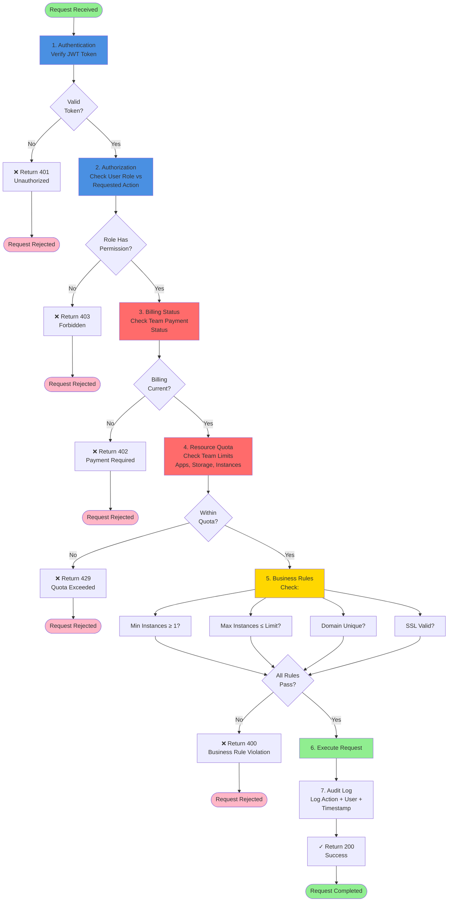

# Business Rules

## Enforceable Rules

The following rules are enforced by the AHP platform and cannot be bypassed by users or developers.

1. **Minimum Instance Requirement**: Every application must have at least 1 instance running at all times. Scaling down to zero instances is not permitted (scale-to-zero is a Phase 4 feature). This ensures applications remain responsive.

2. **Maximum Instance Per-Application Quota**: Each application cannot exceed 100 instances per region unless the team has an enterprise plan. Free and starter tier teams are limited to 10 instances maximum per application.

3. **SSL Certificate Lifecycle**: Every custom domain must have a valid SSL certificate. Certificates must be renewed at least 30 days before expiration. If a certificate expires, HTTPS access to that domain stops immediately and users receive "certificate expired" errors.

4. **Deployment Atomicity**: A deployment is atomic—either the entire deployment succeeds (new version serves traffic) or the previous version remains running. Partial deployments are not permitted; there is no state where some requests go to new version and some to old.

5. **Environment Variable Immutability After Deployment**: Environment variables injected at deployment time are immutable during that deployment's runtime. Changing environment variables requires a redeployment.

6. **Secret Access Logging**: Every read or write of a secret (is_secret=true) environment variable is logged with user attribution. Automated access (e.g., application reading from environment) is logged but not attributed to a user.

7. **Team Role-Based Access Control**: User permissions are strictly enforced per role:
   - **Owner**: Full access including deletion, team management, billing
   - **Admin**: Full access except billing and team management
   - **Developer**: Can deploy, scale, manage env vars; cannot delete resources or modify team settings
   - **Viewer**: Read-only access to applications, logs, metrics; no write access
   
   These permissions are enforced on every API call and cannot be overridden.

8. **Billing Enforcement**: If a team account has an unpaid invoice, no new resources can be provisioned (deployments, add-ons, scaling up are blocked). Existing resources continue running until 30 days past due, then the team is suspended.

9. **Add-on Credential Rotation**: All managed add-on credentials (database passwords, API keys) are automatically rotated every 90 days. Applications must handle connection drops during rotation (connection pooling and reconnection logic).

10. **Build Timeout Enforcement**: All builds have a maximum 10-minute timeout. If a build takes longer than 10 minutes, it is automatically terminated with a failure. This prevents resource exhaustion from stuck builds.

11. **Preview Deployment Cleanup**: Preview deployments created from pull requests are automatically deleted when the PR is merged or closed. If a preview deployment is manually created from a branch, it persists until manually deleted.

12. **Log Retention Policy**: Application logs are retained as follows:
    - Free tier: 7 days
    - Starter tier: 30 days
    - Professional/Enterprise: 90 days
    
    Logs older than the retention period are automatically deleted. This is not configurable per user.

13. **Health Check Requirement**: Every application must pass a health check (HTTP GET to /health or custom path) within 30 seconds of starting. If health checks fail, the instance is marked unhealthy and removed from load balancer traffic.

14. **Graceful Shutdown Enforcement**: When an instance is being removed (during scale-down or deployment), HTTP connections are gracefully drained for up to 30 seconds. After 30 seconds, remaining connections are forcefully closed.

15. **Custom Domain Uniqueness**: A custom domain (e.g., myapp.com) can only be assigned to one application per team. However, different teams can use the same domain (isolation enforced at DNS level via CNAME).

---

## Rule Evaluation Pipeline

## Exception and Override Handling

### Exceptions to Rules

#### Exception E1: Emergency Suspension Override
- **Rule Affected**: Billing Enforcement (Rule #8)
- **Condition**: Critical security issue requires immediate deployment
- **Process**: 
  1. Security team submits override request with incident ticket
  2. VP of Engineering approves
  3. Billing check is bypassed for this one deployment
  4. Audit log records override with justification
- **Limitations**: Override applies only to current deployment; future deployments require billing current

#### Exception E2: Build Timeout Extension
- **Rule Affected**: Build Timeout (Rule #10)
- **Condition**: Enterprise customer with special build requirements (large monorepo, heavy compilation)
- **Process**:
  1. Submitted via support ticket with application ID
  2. Build timeout extended to 20 minutes (max)
  3. Configuration stored per application
  4. All subsequent builds use extended timeout
- **Audit**: Logged per extended-timeout build

#### Exception E3: Log Retention Override
- **Rule Affected**: Log Retention Policy (Rule #12)
- **Condition**: Compliance requirement (audit, legal hold, incident investigation)
- **Process**:
  1. Team owner submits request with reason
  2. System administrator enables extended retention for application
  3. Logs retained until explicitly released
  4. Billing applies: $0.05 per GB per month for extended storage
- **Automatic Release**: 2 years maximum

#### Exception E4: Health Check Skip (Canary)
- **Rule Affected**: Health Check Requirement (Rule #13)
- **Condition**: Canary deployment where new version is only receiving 5% of traffic
- **Process**:
  1. Deployed with health check skip flag
  2. New version receives traffic despite health check failures
  3. If error rate exceeds threshold, canary is automatically rolled back
  4. Operator must explicitly acknowledge canary risk
- **Risk**: Canary can fail and impact 5% of users; monitored closely

### Override Request Process

1. **Submit Override Request**
   - Submit through support ticket or API
   - Include: rule being overridden, justification, requested duration
   
2. **Approval Workflow**
   - **Billing/Payment Override**: VP of Finance approval required
   - **Resource Quota Override**: VP of Engineering approval
   - **Health Check/Timeout Override**: Engineering Lead approval
   - **Security/Compliance Override**: CTO + VP of Security
   
3. **Audit Trail**
   - Override is logged with: who requested, who approved, justification, timestamp, duration
   - Audit logs retained 7 years for compliance
   
4. **Enforcement**
   - Override is time-limited (1 hour, 1 day, 1 week, permanent)
   - After expiration, rule reverts to normal enforcement
   - Override must be explicitly renewed

---

**Document Version**: 1.0
**Last Updated**: 2024
