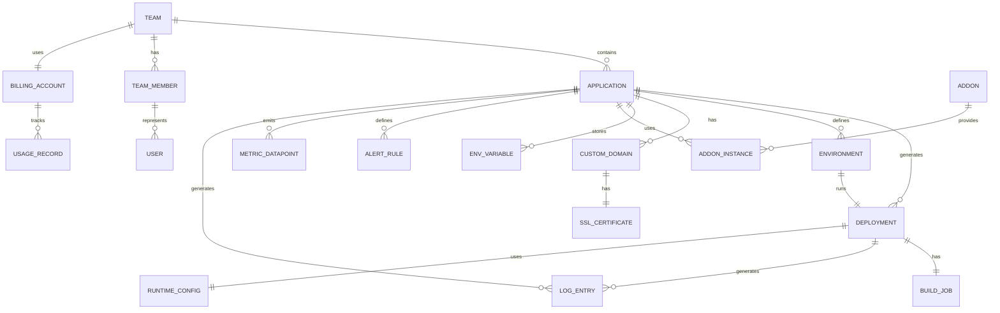

# Data Dictionary

## Core Entities

### 1. Application
Primary entity representing a deployable application.

| Field | Type | Constraints | Purpose |
|-------|------|-----------|---------|
| application_id | UUID | PK | Unique identifier |
| team_id | UUID | FK to Team | Team ownership |
| name | String(255) | NOT NULL, UNIQUE per team | Application name |
| description | Text | NULL | Application description |
| git_repo_url | String(2000) | NOT NULL | GitHub/GitLab repository URL |
| git_branch_default | String(255) | DEFAULT 'main' | Default branch to deploy |
| runtime_type | Enum | NOT NULL, (nodejs, python, go, ruby, java, php, static) | Application language/framework |
| is_active | Boolean | DEFAULT true | Soft delete flag |
| created_at | Timestamp | DEFAULT CURRENT_TIMESTAMP | Creation timestamp |
| updated_at | Timestamp | DEFAULT CURRENT_TIMESTAMP ON UPDATE | Last modification |
| created_by | UUID | FK to TeamMember | Creator |

**Relationships:**
- One Application has many Deployments
- One Application has many Environments
- One Application has many CustomDomains
- One Application has many AddOnInstances
- One Application has many AlertRules
- One Application belongs to one Team

---

### 2. Deployment
Represents a specific deployment instance of an application.

| Field | Type | Constraints | Purpose |
|-------|------|-----------|---------|
| deployment_id | UUID | PK | Unique deployment identifier |
| application_id | UUID | FK to Application | Which application was deployed |
| commit_sha | String(40) | NOT NULL | Git commit hash (SHA-1) |
| branch_name | String(255) | NOT NULL | Git branch name |
| status | Enum | NOT NULL, (queued, building, deploying, running, failed, rolled_back) | Current status |
| build_duration_seconds | Integer | NULL | Build time in seconds |
| total_duration_seconds | Integer | NULL | Total time from start to serving traffic |
| error_message | Text | NULL | Error details if failed |
| created_at | Timestamp | DEFAULT CURRENT_TIMESTAMP | Deployment start time |
| started_at | Timestamp | NULL | When build started |
| completed_at | Timestamp | NULL | When deployment completed |
| image_uri | String(1000) | NULL | Container registry image URI |
| triggered_by | Enum | NOT NULL, (webhook, manual, cli, rollback) | What triggered deployment |
| triggered_by_user | UUID | FK to TeamMember | User if triggered manually |
| image_digest | String(255) | NULL | Image digest for rollback reference |

**Relationships:**
- Many Deployments belong to one Application
- One Deployment has one BuildJob
- One Deployment has many LogEntries

---

### 3. BuildJob
Represents the build process for a deployment.

| Field | Type | Constraints | Purpose |
|-------|------|-----------|---------|
| build_job_id | UUID | PK | Unique build job identifier |
| deployment_id | UUID | FK to Deployment | Associated deployment |
| status | Enum | NOT NULL, (queued, running, succeeded, failed) | Build status |
| buildpack_type | String(100) | NOT NULL | Buildpack used (nodejs-v18, python-v3.11, etc.) |
| log_content | LongText | NULL | Full build logs (retained 7 days) |
| started_at | Timestamp | NULL | Build start time |
| completed_at | Timestamp | NULL | Build completion time |
| error_line_number | Integer | NULL | Line number where build failed |
| vulnerability_scan_status | Enum | (passed, failed, warning) | Image vulnerability scan result |

---

### 4. Environment
Represents deployment environments (staging, production, etc.) per application.

| Field | Type | Constraints | Purpose |
|-------|------|-----------|---------|
| environment_id | UUID | PK | Unique environment identifier |
| application_id | UUID | FK to Application | Associated application |
| environment_name | Enum | NOT NULL, (staging, production, preview) | Environment type |
| instance_count | Integer | NOT NULL, DEFAULT 1 | Current instance count |
| min_instances | Integer | NOT NULL, DEFAULT 1 | Minimum for auto-scaling |
| max_instances | Integer | NOT NULL, DEFAULT 10 | Maximum for auto-scaling |
| auto_scale_enabled | Boolean | DEFAULT false | Is auto-scaling active |
| current_deployment_id | UUID | FK to Deployment | Currently running deployment |
| updated_at | Timestamp | DEFAULT CURRENT_TIMESTAMP ON UPDATE | Last configuration change |

---

### 5. EnvVariable
Environment variables and secrets for applications.

| Field | Type | Constraints | Purpose |
|-------|------|-----------|---------|
| env_var_id | UUID | PK | Unique identifier |
| application_id | UUID | FK to Application | Associated application |
| environment_id | UUID | FK to Environment | Which environment (or NULL for all) |
| key | String(255) | NOT NULL | Variable name (e.g., DATABASE_URL) |
| value | Text | NOT NULL | Variable value (encrypted if secret) |
| is_secret | Boolean | DEFAULT false | Should be hidden/encrypted |
| source_type | Enum | NOT NULL, (manual, addon, system) | Where variable came from |
| created_at | Timestamp | DEFAULT CURRENT_TIMESTAMP | Creation time |
| last_rotated_at | Timestamp | NULL | Last rotation time (for add-on credentials) |
| updated_by | UUID | FK to TeamMember | Who last updated |

**Constraint:** (application_id, environment_id, key) UNIQUE

---

### 6. CustomDomain
Custom domains attached to applications.

| Field | Type | Constraints | Purpose |
|-------|------|-----------|---------|
| domain_id | UUID | PK | Unique identifier |
| application_id | UUID | FK to Application | Associated application |
| domain_name | String(255) | NOT NULL | Domain (e.g., myapp.com) |
| status | Enum | NOT NULL, (pending, dns_verified, cert_issued, active, failed) | Verification status |
| dns_verification_token | String(255) | NULL | CNAME/TXT token for verification |
| is_primary | Boolean | DEFAULT false | Primary domain for app |
| cname_target | String(500) | NOT NULL | AHP's CNAME target (myapp.ahp.io) |
| created_at | Timestamp | DEFAULT CURRENT_TIMESTAMP | Creation time |
| verified_at | Timestamp | NULL | DNS verification time |

---

### 7. SSLCertificate
SSL certificates for custom domains.

| Field | Type | Constraints | Purpose |
|-------|------|-----------|---------|
| ssl_cert_id | UUID | PK | Unique identifier |
| domain_id | UUID | FK to CustomDomain | Associated domain |
| issuer | Enum | NOT NULL, (letsencrypt, custom) | Certificate issuer |
| certificate_pem | LongText | NOT NULL | SSL certificate (encrypted) |
| private_key_pem | LongText | NOT NULL | Private key (encrypted) |
| issued_at | Timestamp | NOT NULL | Issue date |
| expires_at | Timestamp | NOT NULL | Expiration date |
| renewal_scheduled_at | Timestamp | NULL | Scheduled renewal date |
| status | Enum | NOT NULL, (active, expiring_soon, expired) | Status |

---

### 8. AddOn
Available add-on service definitions.

| Field | Type | Constraints | Purpose |
|-------|------|-----------|---------|
| addon_id | UUID | PK | Unique identifier |
| name | String(100) | NOT NULL, UNIQUE | Add-on name (postgresql, redis, etc.) |
| display_name | String(255) | NOT NULL | User-friendly name (PostgreSQL Database) |
| category | Enum | NOT NULL, (database, cache, storage, email, monitoring, other) | Add-on category |
| provider | String(100) | NOT NULL | Provider (aws-rds, redis-cloud, sendgrid, etc.) |
| description | Text | NOT NULL | Description |
| icon_url | String(500) | NULL | Icon URL |
| pricing_per_month | Decimal(10, 2) | NOT NULL | Base monthly price |
| supported_regions | JSON | NOT NULL | Available regions |
| documentation_url | String(500) | NOT NULL | Documentation link |

---

### 9. AddOnInstance
Provisioned instances of add-ons.

| Field | Type | Constraints | Purpose |
|-------|------|-----------|---------|
| addon_instance_id | UUID | PK | Unique identifier |
| addon_id | UUID | FK to AddOn | Which add-on type |
| application_id | UUID | FK to Application | Associated application |
| instance_name | String(255) | NOT NULL | User-defined name (mydb) |
| plan_tier | String(100) | NOT NULL | Size/tier (1gb, 10gb, 100gb for databases) |
| status | Enum | NOT NULL, (provisioning, active, deprovisioning, failed) | Current status |
| provider_instance_id | String(255) | NOT NULL | Provider's instance ID (RDS ARN, etc.) |
| connection_string | Text | NOT NULL | Encrypted connection string |
| created_at | Timestamp | DEFAULT CURRENT_TIMESTAMP | Provisioning start |
| ready_at | Timestamp | NULL | When ready for use |
| region | String(50) | NOT NULL | Cloud region |

---

### 10. Team
Teams for multi-user collaboration.

| Field | Type | Constraints | Purpose |
|-------|------|-----------|---------|
| team_id | UUID | PK | Unique identifier |
| name | String(255) | NOT NULL, UNIQUE | Team name |
| owner_id | UUID | FK to User | Team owner |
| billing_account_id | UUID | FK to BillingAccount | Associated billing account |
| created_at | Timestamp | DEFAULT CURRENT_TIMESTAMP | Creation time |
| settings_json | JSON | NULL | Team settings (notification preferences, etc.) |

---

### 11. TeamMember
Team membership with roles.

| Field | Type | Constraints | Purpose |
|-------|------|-----------|---------|
| team_member_id | UUID | PK | Unique identifier |
| team_id | UUID | FK to Team | Associated team |
| user_id | UUID | FK to User | Team member |
| role | Enum | NOT NULL, (owner, admin, developer, viewer) | Role/permissions |
| joined_at | Timestamp | DEFAULT CURRENT_TIMESTAMP | Join timestamp |
| invite_email | String(255) | NULL | Email if pending acceptance |

---

### 12. BillingAccount
Billing and payment information per team.

| Field | Type | Constraints | Purpose |
|-------|------|-----------|---------|
| billing_account_id | UUID | PK | Unique identifier |
| team_id | UUID | FK to Team | Associated team |
| payment_method_id | String(255) | NULL | Stripe payment method ID |
| billing_email | String(255) | NOT NULL | Invoice recipient email |
| billing_address | Text | NOT NULL | Billing address (for tax) |
| subscription_tier | Enum | NOT NULL, (free, starter, professional, enterprise) | Subscription level |
| status | Enum | NOT NULL, (active, past_due, suspended, cancelled) | Account status |
| next_billing_date | Date | NOT NULL | Next invoice date |

---

### 13. UsageRecord
Hourly resource usage tracking for billing.

| Field | Type | Constraints | Purpose |
|-------|------|-----------|---------|
| usage_record_id | UUID | PK | Unique identifier |
| billing_account_id | UUID | FK to BillingAccount | Associated account |
| application_id | UUID | FK to Application | Which application |
| resource_type | Enum | NOT NULL, (compute_instance_hours, bandwidth_gb, storage_gb, addon_instance) | Resource type |
| quantity | Decimal(12, 4) | NOT NULL | Quantity consumed |
| unit_price | Decimal(10, 4) | NOT NULL | Price per unit |
| total_amount | Decimal(12, 2) | NOT NULL | quantity × unit_price |
| recorded_at | Timestamp | NOT NULL | When usage was recorded |
| month | YearMonth | NOT NULL | Billing month (YYYY-MM) |

---

### 14. MetricDatapoint
Time series metrics for monitoring.

| Field | Type | Constraints | Purpose |
|-------|------|-----------|---------|
| metric_id | UUID | PK | Unique identifier |
| application_id | UUID | FK to Application | Associated application |
| deployment_id | UUID | FK to Deployment | Which deployment |
| metric_name | String(100) | NOT NULL, (cpu_usage, memory_usage, request_count, error_count, response_time_ms, active_connections) | Metric type |
| value | Decimal(12, 4) | NOT NULL | Metric value |
| unit | String(50) | NOT NULL | Unit (percent, bytes, count, ms) |
| timestamp | Timestamp | NOT NULL | Time of measurement |
| instance_id | String(255) | NOT NULL | Which instance/pod |

---

### 15. LogEntry
Application logs.

| Field | Type | Constraints | Purpose |
|-------|------|-----------|---------|
| log_id | UUID | PK | Unique identifier |
| application_id | UUID | FK to Application | Associated application |
| deployment_id | UUID | FK to Deployment | Which deployment emitted log |
| instance_id | String(255) | NOT NULL | Which instance/pod |
| log_level | Enum | NOT NULL, (debug, info, warn, error, fatal) | Log severity |
| message | Text | NOT NULL | Log message (no secrets) |
| timestamp | Timestamp | NOT NULL | When log was emitted |
| metadata_json | JSON | NULL | Additional context (request_id, user_id, etc.) |

---

### 16. AlertRule
Alert configuration.

| Field | Type | Constraints | Purpose |
|-------|------|-----------|---------|
| alert_rule_id | UUID | PK | Unique identifier |
| application_id | UUID | FK to Application | Associated application |
| name | String(255) | NOT NULL | Alert rule name |
| condition | String(500) | NOT NULL | Condition (metric > threshold, metric < value) |
| duration_minutes | Integer | NOT NULL | How long condition must be true |
| notification_channels | JSON | NOT NULL | Where to send (email, slack, webhook) |
| is_enabled | Boolean | DEFAULT true | Is rule active |
| created_at | Timestamp | DEFAULT CURRENT_TIMESTAMP | Creation time |
| created_by | UUID | FK to TeamMember | Creator |

---

### 17. RuntimeConfig
Application-specific runtime configuration.

| Field | Type | Constraints | Purpose |
|-------|------|-----------|---------|
| config_id | UUID | PK | Unique identifier |
| application_id | UUID | FK to Application | Associated application |
| buildpack_version | String(100) | NOT NULL | Buildpack version (nodejs-20.x, python-3.12, go-1.21) |
| start_command | String(500) | NOT NULL | Application start command |
| health_check_path | String(255) | NOT NULL, DEFAULT '/health' | HTTP health check endpoint |
| health_check_timeout_seconds | Integer | NOT NULL, DEFAULT 30 | Timeout for health checks |
| graceful_shutdown_timeout_seconds | Integer | NOT NULL, DEFAULT 30 | Time to drain connections on shutdown |

---

## Canonical Relationship Diagram

## Data Quality Controls

### Entity Validation Rules

| Entity | Field | Validation |
|--------|-------|-----------|
| Application | name | 1-255 chars, alphanumeric + hyphen, must be unique per team |
| Application | git_repo_url | Valid HTTPS GitHub/GitLab URL, must be accessible |
| Deployment | commit_sha | Valid 40-char hex string |
| Deployment | status | Must transition through valid states: queued → building → deploying → running (or failed) |
| EnvVariable | key | Valid environment variable name (alphanumeric, underscore), max 255 chars |
| CustomDomain | domain_name | Valid DNS domain name, no leading/trailing dots |
| AddOnInstance | plan_tier | Must be valid tier for addon_id |
| Team | name | 1-100 chars, unique globally |
| TeamMember | role | Must be one of: owner, admin, developer, viewer |

### Referential Integrity

- Foreign key constraints enforced at database level
- Soft deletes on Application preserve related records
- Hard delete on User cascades to TeamMember removal
- Hard delete on Team cascades to Application, TeamMember removal

### Temporal Constraints

- created_at ≤ updated_at (always)
- completed_at ≥ started_at (for deployments)
- expires_at > issued_at (for SSL certificates)
- renewal_scheduled_at < expires_at (for certificates)

### Business Rule Constraints

- max_instances ≥ min_instances (for Environment)
- instance_count ≥ 1 (no zero-instance applications)
- Monthly usage records must sum to monthly invoice total
- Alert rule condition must reference valid metric names

### Encryption & Secrets

- **Encrypted at rest**: EnvVariable.value (if is_secret=true), AddOnInstance.connection_string, SSLCertificate.private_key_pem, BillingAccount.payment_method_id
- **Encryption method**: AES-256-GCM with per-row key derivation
- **Key storage**: AWS Secrets Manager or HashiCorp Vault
- **Audit**: All secret access logged and monitored

---

**Document Version**: 1.0
**Last Updated**: 2024
