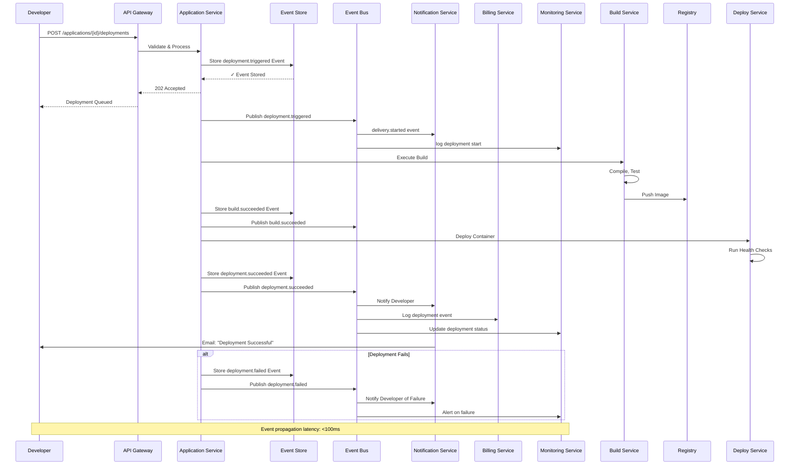

# Event Catalog & Domain Events

## Contract Conventions

### Event Naming Convention
- Format: `{domain}.{entity}.{action}` (e.g., `deployment.application.triggered`)
- Domains: `application`, `deployment`, `build`, `domain`, `ssl`, `addon`, `scaling`, `alert`, `billing`, `team`
- Actions: `created`, `deleted`, `triggered`, `started`, `succeeded`, `failed`, `updated`, `provisioned`, `deprovisioned`, `issued`, `renewed`, `verified`, `fired`

### Event Structure
Every event follows this canonical JSON structure:

```json
{
  "event_id": "UUID",
  "event_type": "deployment.application.triggered",
  "event_version": "1.0",
  "timestamp": "ISO-8601 timestamp",
  "source_system": "AHP API / Build Service / CLI",
  "aggregate_id": "application_id or deployment_id (root entity)",
  "aggregate_type": "Application / Deployment / etc.",
  "data": {
    "// Context-specific fields"
  },
  "metadata": {
    "user_id": "UUID or system",
    "team_id": "UUID",
    "request_id": "correlation ID",
    "region": "us-east-1",
    "environment": "production"
  },
  "correlation_id": "UUID (for tracing across events)",
  "causation_id": "UUID (parent event that caused this)"
}
```

### Event Ordering Guarantees
- Events for a single aggregate (application/deployment) are published in order
- Events across different aggregates are not guaranteed to be in global order
- Event stores use version numbers to detect missed events

### Immutability
- Once published, an event is immutable
- Corrections are handled via compensation events, not mutation
- Example: Instead of updating a deployment status, publish `deployment.application.rolled-back`

---

## Domain Events

### Application Lifecycle Events

#### application.created
Fired when a new application is created.

| Field | Type | Example |
|-------|------|---------|
| application_id | UUID | 550e8400-e29b-41d4-a716-446655440000 |
| team_id | UUID | 550e8400-e29b-41d4-a716-446655440001 |
| application_name | String | my-web-app |
| git_repo_url | String | https://github.com/acme/web-app |
| runtime_type | String | nodejs |
| created_by_user_id | UUID | 550e8400-e29b-41d4-a716-446655440002 |

#### application.deleted
Fired when application is deleted (soft-delete).

| Field | Type | Example |
|-------|------|---------|
| application_id | UUID | 550e8400-e29b-41d4-a716-446655440000 |
| team_id | UUID | 550e8400-e29b-41d4-a716-446655440001 |
| deleted_by_user_id | UUID | 550e8400-e29b-41d4-a716-446655440002 |

---

### Deployment Events

#### deployment.triggered
Fired when a deployment is initiated (either from webhook, manual trigger, or rollback).

| Field | Type | Example |
|-------|------|---------|
| deployment_id | UUID | 550e8400-e29b-41d4-a716-446655440000 |
| application_id | UUID | 550e8400-e29b-41d4-a716-446655440003 |
| git_commit_sha | String | abc123def456 |
| git_branch | String | main |
| triggered_by | Enum | webhook, manual, api, rollback |
| triggered_by_user_id | UUID | (null if webhook) |

#### deployment.started
Fired when the build process begins.

| Field | Type | Example |
|-------|------|---------|
| deployment_id | UUID | 550e8400-e29b-41d4-a716-446655440000 |
| application_id | UUID | 550e8400-e29b-41d4-a716-446655440003 |
| build_job_id | UUID | 550e8400-e29b-41d4-a716-446655440004 |
| buildpack_type | String | nodejs-20.x |

#### deployment.succeeded
Fired when deployment completes and health checks pass.

| Field | Type | Example |
|-------|------|---------|
| deployment_id | UUID | 550e8400-e29b-41d4-a716-446655440000 |
| application_id | UUID | 550e8400-e29b-41d4-a716-446655440003 |
| image_uri | String | registry.ahp.io/app:abc123 |
| duration_seconds | Integer | 95 |
| instance_count | Integer | 3 |

#### deployment.failed
Fired when deployment fails (build error, health check failure, etc.).

| Field | Type | Example |
|-------|------|---------|
| deployment_id | UUID | 550e8400-e29b-41d4-a716-446655440000 |
| application_id | UUID | 550e8400-e29b-41d4-a716-446655440003 |
| failure_reason | String | health_check_timeout |
| error_message | String | HTTP GET /health returned 503 |
| failed_at_stage | String | build, deploy, health_check |

#### deployment.rolled-back
Fired when deployment is rolled back to previous version.

| Field | Type | Example |
|-------|------|---------|
| deployment_id | UUID | 550e8400-e29b-41d4-a716-446655440000 |
| application_id | UUID | 550e8400-e29b-41d4-a716-446655440003 |
| rolled_back_to_deployment_id | UUID | 550e8400-e29b-41d4-a716-446655440005 |
| reason | String | health_check_failure, manual_request |
| rolled_back_by_user_id | UUID | (null if automatic) |

---

### Build Events

#### build.started
Fired when build container starts compiling code.

| Field | Type | Example |
|-------|------|---------|
| build_job_id | UUID | 550e8400-e29b-41d4-a716-446655440000 |
| deployment_id | UUID | 550e8400-e29b-41d4-a716-446655440001 |
| buildpack_type | String | python-3.12 |

#### build.succeeded
Fired when build completes successfully and image is pushed to registry.

| Field | Type | Example |
|-------|------|---------|
| build_job_id | UUID | 550e8400-e29b-41d4-a716-446655440000 |
| deployment_id | UUID | 550e8400-e29b-41d4-a716-446655440001 |
| image_uri | String | registry.ahp.io/app:build-123 |
| image_digest | String | sha256:abc123... |
| duration_seconds | Integer | 45 |

#### build.failed
Fired when build fails (compilation error, dependency missing, etc.).

| Field | Type | Example |
|-------|------|---------|
| build_job_id | UUID | 550e8400-e29b-41d4-a716-446655440000 |
| deployment_id | UUID | 550e8400-e29b-41d4-a716-446655440001 |
| error_message | String | npm ERR! 404 module not found |
| failing_command | String | npm install |
| failing_line_number | Integer | 45 |

---

### Custom Domain Events

#### domain.added
Fired when custom domain is added to application.

| Field | Type | Example |
|-------|------|---------|
| domain_id | UUID | 550e8400-e29b-41d4-a716-446655440000 |
| application_id | UUID | 550e8400-e29b-41d4-a716-446655440001 |
| domain_name | String | myapp.com |
| cname_target | String | myapp.ahp.io |

#### domain.verified
Fired when DNS CNAME record is verified and resolved.

| Field | Type | Example |
|-------|------|---------|
| domain_id | UUID | 550e8400-e29b-41d4-a716-446655440000 |
| application_id | UUID | 550e8400-e29b-41d4-a716-446655440001 |
| domain_name | String | myapp.com |
| verified_at | Timestamp | 2024-01-15T14:30:00Z |

---

### SSL Certificate Events

#### ssl.issued
Fired when SSL certificate is successfully issued for a domain.

| Field | Type | Example |
|-------|------|---------|
| ssl_cert_id | UUID | 550e8400-e29b-41d4-a716-446655440000 |
| domain_id | UUID | 550e8400-e29b-41d4-a716-446655440001 |
| domain_name | String | myapp.com |
| issuer | String | letsencrypt |
| expires_at | Timestamp | 2025-04-15T23:59:59Z |

#### ssl.renewed
Fired when SSL certificate is automatically renewed before expiration.

| Field | Type | Example |
|-------|------|---------|
| ssl_cert_id | UUID | 550e8400-e29b-41d4-a716-446655440000 |
| domain_id | UUID | 550e8400-e29b-41d4-a716-446655440001 |
| domain_name | String | myapp.com |
| previous_expires_at | Timestamp | 2025-04-15T23:59:59Z |
| new_expires_at | Timestamp | 2026-04-15T23:59:59Z |

---

### Add-on Events

#### addon.provisioned
Fired when managed add-on is successfully provisioned.

| Field | Type | Example |
|-------|------|---------|
| addon_instance_id | UUID | 550e8400-e29b-41d4-a716-446655440000 |
| application_id | UUID | 550e8400-e29b-41d4-a716-446655440001 |
| addon_type | String | postgresql |
| addon_plan | String | 1gb |
| provider_instance_id | String | arn:aws:rds:... |

#### addon.deprovisioned
Fired when add-on is deleted.

| Field | Type | Example |
|-------|------|---------|
| addon_instance_id | UUID | 550e8400-e29b-41d4-a716-446655440000 |
| application_id | UUID | 550e8400-e29b-41d4-a716-446655440001 |
| addon_type | String | postgresql |
| deprovisioned_by_user_id | UUID | 550e8400-e29b-41d4-a716-446655440002 |

---

### Scaling Events

#### scaling.triggered
Fired when scaling action (manual or auto) is initiated.

| Field | Type | Example |
|-------|------|---------|
| application_id | UUID | 550e8400-e29b-41d4-a716-446655440000 |
| old_instance_count | Integer | 3 |
| new_instance_count | Integer | 5 |
| scaling_reason | String | cpu_threshold_exceeded, manual_request |
| triggered_by_user_id | UUID | (null if auto) |
| triggered_by_rule_id | UUID | (if auto) |

---

### Alert Events

#### alert.fired
Fired when alert rule condition is met and alert is triggered.

| Field | Type | Example |
|-------|------|---------|
| alert_id | UUID | 550e8400-e29b-41d4-a716-446655440000 |
| application_id | UUID | 550e8400-e29b-41d4-a716-446655440001 |
| alert_rule_id | UUID | 550e8400-e29b-41d4-a716-446655440002 |
| alert_name | String | High Error Rate |
| condition_met | String | error_rate (5.2%) > 5% |
| severity | String | warning, critical |

---

### Billing Events

#### billing.invoice-generated
Fired when monthly invoice is created.

| Field | Type | Example |
|-------|------|---------|
| invoice_id | UUID | 550e8400-e29b-41d4-a716-446655440000 |
| billing_account_id | UUID | 550e8400-e29b-41d4-a716-446655440001 |
| team_id | UUID | 550e8400-e29b-41d4-a716-446655440002 |
| billing_period | String | 2024-01 |
| total_amount_cents | Integer | 9999 |
| currency | String | USD |

#### billing.payment-received
Fired when payment is received for an invoice.

| Field | Type | Example |
|-------|------|---------|
| invoice_id | UUID | 550e8400-e29b-41d4-a716-446655440000 |
| billing_account_id | UUID | 550e8400-e29b-41d4-a716-446655440001 |
| payment_method | String | credit_card, wire_transfer |
| amount_cents | Integer | 9999 |
| received_at | Timestamp | 2024-02-05T10:15:00Z |

---

### Team Events

#### team.member-invited
Fired when a team member is invited to join.

| Field | Type | Example |
|-------|------|---------|
| team_id | UUID | 550e8400-e29b-41d4-a716-446655440000 |
| invite_email | String | dev@acme.com |
| role | String | developer |
| invited_by_user_id | UUID | 550e8400-e29b-41d4-a716-446655440001 |
| invite_token | String | abc123xyz789 |

---

## Publish and Consumption Sequence



## Operational SLOs

### Event Publishing SLOs
- **Latency**: 99th percentile < 100ms from business logic to event store
- **Durability**: 99.999999999% (11 nines) — no events lost
- **Ordering**: All events for single aggregate published in order (per-partition guarantee)
- **Idempotency**: All event consumers handle duplicate delivery without side effects

### Event Consumption SLOs
- **Delivery Latency**: 99th percentile < 500ms from publish to first consumer delivery
- **Processing Guarantee**: At-least-once delivery (idempotent processing required)
- **Fanout**: All published events delivered to all subscribed consumers within SLO

### Specific Event SLOs
| Event | Max Latency | Example Impact |
|-------|------------|-----------------|
| deployment.triggered → deployment.started | 5 seconds | Build starts within 5 sec |
| build.succeeded → deployment.succeeded | 30 seconds | New version live within 30 sec |
| deployment.failed | 10 seconds | Developer notified within 10 sec |
| alert.fired | 60 seconds | On-call notified within 60 sec |
| billing.invoice-generated | 1 minute | Invoice appears in dashboard within 1 min |

---

**Document Version**: 1.0
**Last Updated**: 2024
**Total Domain Events**: 20+
