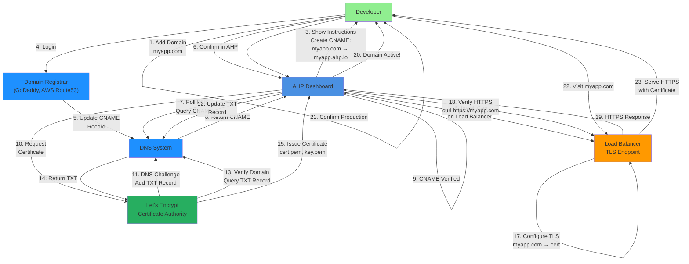
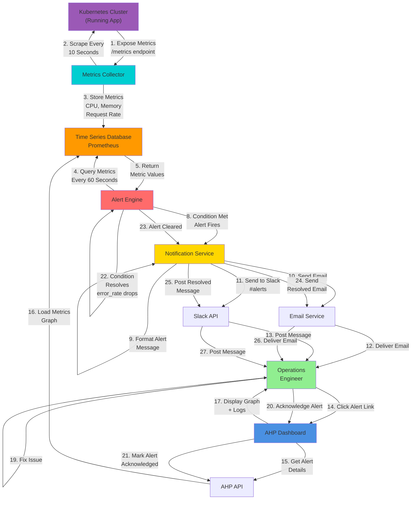

# Swimlane Diagrams: Cross-Functional Workflows

Swimlane diagrams show how different actors and systems interact across business processes.

## 1. Application Deployment Pipeline (Developer → Production)

```mermaid
flowchart TD
    Developer["Developer"]
    AHP_UI["AHP Platform"]
    Git["Git Provider<br/>GitHub/GitLab"]
    BuildService["Build Service"]
    Registry["Container Registry"]
    DeployService["Deploy Service"]
    K8s["Kubernetes Cluster"]
    LB["Load Balancer"]
    CDN["CDN"]
    
    Developer -->|1. Git Push| Git
    Git -->|2. Webhook| AHP_UI
    AHP_UI -->|3. Clone Repo| Git
    AHP_UI -->|4. Start Build| BuildService
    
    BuildService -->|5. Fetch Code| Git
    BuildService -->|6. Execute Build<br/>npm install<br/>npm run build| BuildService
    BuildService -->|7. Create Image| BuildService
    BuildService -->|8. Push Image| Registry
    
    AHP_UI -->|9. Pull Image| Registry
    AHP_UI -->|10. Create Deployment| DeployService
    
    DeployService -->|11. Schedule Pod| K8s
    K8s -->|12. Pull Image| Registry
    K8s -->|13. Start Container| K8s
    K8s -->|14. Run Health Check| K8s
    
    K8s -->|15. Register Instance| LB
    LB -->|16. Route Traffic| K8s
    K8s -->|17. Serve Traffic| LB
    LB -->|18. Cache & Distribute| CDN
    
    K8s -->|19. Stream Metrics| AHP_UI
    K8s -->|19b. Stream Logs| AHP_UI
    
    AHP_UI -->|20. Deployment Successful| Developer
    Developer -->|21. Verify Live| LB
    
    style Developer fill:#90EE90
    style AHP_UI fill:#4A90E2
    style Git fill:#333
    style BuildService fill:#FFD700
    style DeployService fill:#FF6B6B
    style K8s fill:#9B59B6
    style LB fill:#FF9900
    style CDN fill:#00CED1
```

**Swimlanes (Actors/Systems):**
1. **Developer**: Initiates deployment via git push
2. **Git Provider**: Hosts code, sends webhook
3. **AHP Platform**: Orchestrates entire flow
4. **Build Service**: Compiles and creates container image
5. **Container Registry**: Stores container images
6. **Deploy Service**: Manages Kubernetes deployments
7. **Kubernetes Cluster**: Runs containers, health checks
8. **Load Balancer**: Routes traffic to instances
9. **CDN**: Caches static content globally

**Key Handoff Points:**
- Git webhook to AHP (automation trigger)
- Build service to registry (artifact storage)
- Kubernetes to load balancer (traffic routing)
- Running app to AHP (metrics/logs collection)

---

## 2. Custom Domain Setup with SSL (Multi-Party)

**Swimlanes:**
1. **Developer**: Creates domain entry, updates DNS registrar
2. **AHP Dashboard**: Orchestrates domain setup and verification
3. **Domain Registrar**: Stores CNAME/DNS records
4. **DNS System**: Resolves domain names globally
5. **Let's Encrypt**: Issues SSL certificates via ACME
6. **Load Balancer**: Terminates TLS, serves HTTPS

**Critical Handoff Points:**
- DNS CNAME creation and verification
- Certificate issuance from Let's Encrypt
- TLS configuration on load balancer

---

## 3. Alert Detection & Notification (Ops Engineer)

**Swimlanes:**
1. **Kubernetes Cluster**: Emits metrics from running application
2. **Metrics Collector**: Scrapes and collects metrics
3. **Time Series Database**: Stores metrics with timestamps
4. **Alert Engine**: Evaluates rules and fires alerts
5. **Notification Service**: Routes alerts to channels
6. **Email & Slack**: Deliver notifications
7. **Operations Engineer**: Receives alert, investigates, responds

**Critical Paths:**
- Metric collection (every 10 seconds)
- Alert evaluation (every 60 seconds)
- Notification delivery (immediate)
- Resolution detection (automatic when condition clears)

---

**Document Version**: 1.0
**Last Updated**: 2024
