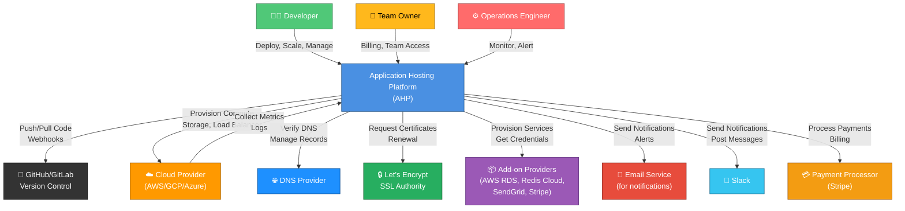

# System Context Diagram

The System Context diagram shows how the Application Hosting Platform (AHP) interacts with external actors and systems from a high level. This diagram establishes boundaries and integrations.

## High-Level System Context

## External System Integrations

### Version Control: GitHub & GitLab
- **Direction**: Bidirectional
- **Connection**: HTTPS webhooks + REST API
- **Purpose**: 
  - AHP receives webhook on push/PR
  - AHP clones repo for building
  - AHP posts deployment status on PR/commit
- **Failure Handling**: If GitHub is down, pending deployments queue and retry
- **Credentials**: OAuth token (scoped to repos only)

### Cloud Infrastructure Provider
- **Vendors**: AWS, Google Cloud, Azure
- **Direction**: Bidirectional
- **Connection**: Cloud provider APIs + direct resource access
- **Purpose**:
  - AHP provisions EC2/Compute instances for applications
  - AHP provisions managed services (RDS for databases, S3 for storage)
  - AHP configures load balancers, auto-scaling groups
  - AHP collects metrics via CloudWatch/Stackdriver
- **Failure Handling**: If cloud provider is down, running apps continue; new deployments queue
- **Credentials**: IAM role (AHP's deployment service)

### DNS Provider
- **Support**: Route 53 (AWS), Cloud DNS (GCP), Azure DNS, Cloudflare, etc.
- **Direction**: Bidirectional
- **Connection**: DNS API + DNS lookups
- **Purpose**:
  - AHP verifies DNS CNAME records (domain validation)
  - AHP may auto-manage DNS records (premium feature)
- **Failure Handling**: If DNS verification fails, domain activation is delayed

### SSL Certificate Authority: Let's Encrypt
- **Direction**: Bidirectional (ACME protocol)
- **Connection**: HTTPS API
- **Purpose**:
  - AHP requests certificates for custom domains
  - AHP handles automatic renewal 30 days before expiration
  - AHP verifies domain ownership via DNS-01 challenge
- **Failure Handling**: If LE is down, certificate renewal retries hourly; alerts sent if renewal fails

### Add-on Providers
- **Vendors**: AWS RDS (Postgres, MySQL), Redis Cloud, MongoDB Atlas, SendGrid, Stripe, AWS S3
- **Direction**: Bidirectional
- **Connection**: Provider's REST API
- **Purpose**:
  - AHP provisions managed services (databases, caches, email, payment processing)
  - AHP obtains connection credentials
  - AHP collects metrics and backups
- **Credentials**: Provider API keys (scoped per customer)

### Email Notification Service
- **Purpose**: Send deployment notifications, alerts, billing emails
- **Vendor**: AWS SES, SendGrid, or internal SMTP
- **Direction**: Unidirectional (AHP → email service)
- **Failure Handling**: If email service down, notifications are queued for retry

### Slack Integration
- **Purpose**: Real-time deployment, error, and alert notifications to Slack channels
- **Direction**: Unidirectional (AHP → Slack webhooks)
- **Connection**: Slack incoming webhooks + Slack API
- **Failure Handling**: If Slack unavailable, notification is logged as failed

### Payment Processor: Stripe
- **Purpose**: Process credit card payments for billing
- **Direction**: Bidirectional (AHP initiates charges, receives payment status)
- **Connection**: Stripe API
- **Credentials**: Stripe API key (restricted to charges and customers)
- **Failure Handling**: Failed payments retry with exponential backoff

## Data Flow Summary

### Inbound Data
- **Git Webhooks**: New commits trigger deployments (repo owner → GitHub → AHP)
- **Cloud Metrics**: CPU, memory, network metrics streamed from cloud provider
- **Health Checks**: Application health status from running containers
- **User Interactions**: API requests from web UI and CLI

### Outbound Data
- **Build Commands**: AHP instructs cloud provider to execute build steps
- **Deployment Artifacts**: Container images pushed to registry
- **Configuration**: AHP writes environment variables and configuration to deployed apps
- **Notifications**: Emails, Slack messages, webhooks to users
- **Billing Events**: Usage records sent to billing system

## Security Considerations

### Authentication
- Developer ↔ AHP: OAuth/JWT tokens
- AHP ↔ GitHub: OAuth tokens (repo access only)
- AHP ↔ Cloud Provider: IAM service account (least privilege)
- AHP ↔ Add-on Providers: API keys (scoped per service)

### Encryption
- All external communication over TLS 1.2+
- Credentials stored encrypted in database
- Secrets injected at runtime, never logged
- Add-on credentials rotated automatically every 90 days

### Isolation
- Applications in isolated containers with network policies
- Multi-tenant databases with row-level security
- Team-level resource quotas prevent resource hogging

---

**Document Version**: 1.0
**Last Updated**: 2024
