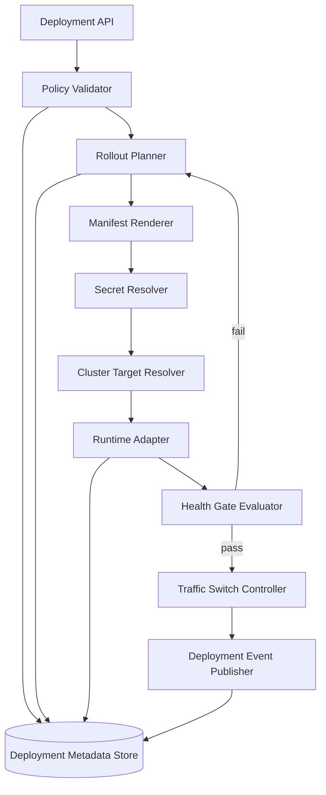
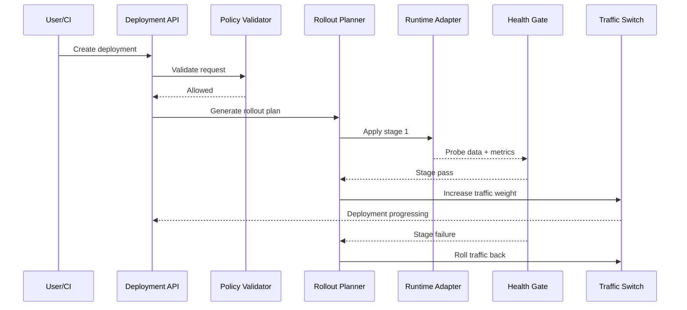

# C4 Component Diagram: Internal Service Architecture

## Traceability
- Requirements: [`../requirements/requirements.md`](../requirements/requirements.md)
- Service boundaries: [`./component-diagrams.md`](./component-diagrams.md)
- Build/deploy behavior: [`./deployment-engine-and-build-pipeline.md`](./deployment-engine-and-build-pipeline.md)
- Implementation roadmap: [`../implementation/implementation-guidelines.md`](../implementation/implementation-guidelines.md)

## Deploy Service Component View

## Component Responsibilities

| Component | Responsibility | Key inputs | Key outputs |
|---|---|---|---|
| Deployment API | Accept deploy, cancel, and rollback requests | actor identity, app ID, deployment parameters | normalized deployment command |
| Policy Validator | Enforce RBAC, quotas, runtime policy, release freezes | command, tenant policy, current app state | allow/deny decision with reasons |
| Rollout Planner | Select canary/rolling/blue-green strategy and rollback target | app policy, desired revision, prior deployment history | rollout plan with stages and guardrails |
| Manifest Renderer | Resolve runtime config into Kubernetes/service mesh manifests | image digest, env vars, probes, scaling policy | signed manifest bundle |
| Secret Resolver | Bind secret references to runtime-safe versions | app secret refs, environment scope | version-pinned secret set |
| Cluster Target Resolver | Pick region, cluster, namespace, and node pools | tenant placement policy, region health, quota headroom | target runtime placement |
| Runtime Adapter | Apply manifests and monitor Kubernetes/runtime APIs | manifest bundle, placement | rollout status, pod events |
| Health Gate Evaluator | Evaluate readiness, error budget burn, and synthetic checks | rollout telemetry, probe results | pass/fail/hold decision |
| Traffic Switch Controller | Shift traffic between revisions and enforce drain policy | health decisions, ingress/service mesh state | live traffic weights, drain completion |
| Deployment Event Publisher | Emit deployment lifecycle events for UI, audit, and alerting | state changes, errors, operator actions | event stream and audit entries |

## Rollout Control Path

## Component Invariants

- Only the runtime adapter may mutate cluster state; upstream components are decision and orchestration layers only.
- Secret material is referenced by versioned handle; raw secret values do not transit the event stream or metadata store.
- Health-gate failures always preserve enough context to execute rollback without recomputing prior state.

## Operational acceptance criteria

- Component ownership, alerts, and dashboards exist for each control-path component before GA.
- Failure injection tests validate that a fault in one component produces deterministic retry, hold, or rollback behavior.

---

**Document Version**: 2.0
**Last Updated**: 2026
