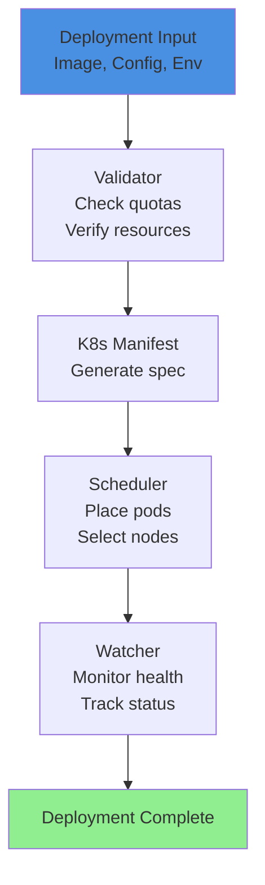

# C4 Component Diagram: Internal Service Architecture

## Deploy Engine Components

```mermaid
graph TB
    Input["Deployment Input<br/>Image, Config, Env"]
    Validator["Validator<br/>Check quotas<br/>Verify resources"]
    K8sManifest["K8s Manifest<br/>Generate spec"]
    Scheduler["Scheduler<br/>Place pods<br/>Select nodes"]
    Watcher["Watcher<br/>Monitor health<br/>Track status"]
    Output["Deployment Complete"]
    
    Input --> Validator
    Validator --> K8sManifest
    K8sManifest --> Scheduler
    Scheduler --> Watcher
    Watcher --> Output
    
    style Input fill:#4A90E2
    style Output fill:#90EE90
```

---

**Document Version**: 1.0
**Last Updated**: 2024
