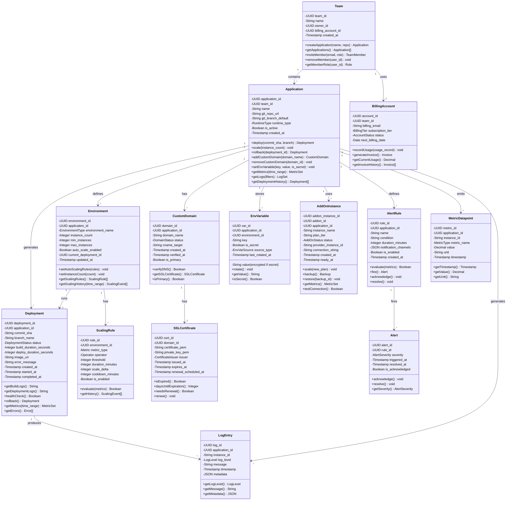

# Class Diagrams: Domain Classes

## Core Application Domain

```mermaid
classDiagram
    class Application {
        -UUID application_id
        -UUID team_id
        -String name
        -String git_repo_url
        -String git_branch_default
        -RuntimeType runtime_type
        -Boolean is_active
        -Timestamp created_at
        +deploy(commit_sha, branch) Deployment
        +scale(instance_count) void
        +rollback(deployment_id) Deployment
        +addCustomDomain(domain_name) CustomDomain
        +removeCustomDomain(domain_id) void
        +setEnvVariable(key, value, is_secret) void
        +getMetrics(time_range) MetricSet
        +getLogs(filters) LogSet
        +getDeploymentHistory() Deployment[]
    }
    
    class Deployment {
        -UUID deployment_id
        -UUID application_id
        -String commit_sha
        -String branch_name
        -DeploymentStatus status
        -Integer build_duration_seconds
        -Integer deploy_duration_seconds
        -String image_uri
        -String error_message
        -Timestamp created_at
        -Timestamp started_at
        -Timestamp completed_at
        +getBuildLogs() String
        +getDeploymentLogs() String
        +healthCheck() Boolean
        +rollback() Deployment
        +getMetrics(time_range) MetricSet
        +getErrors() Error[]
    }
    
    class Environment {
        -UUID environment_id
        -UUID application_id
        -EnvironmentType environment_name
        -Integer instance_count
        -Integer min_instances
        -Integer max_instances
        -Boolean auto_scale_enabled
        -UUID current_deployment_id
        -Timestamp updated_at
        +setAutoScalingRules(rules) void
        +setInstanceCount(count) void
        +getScalingRules() ScalingRule[]
        +getScalingHistory(time_range) ScalingEvent[]
    }
    
    class ScalingRule {
        -UUID rule_id
        -UUID environment_id
        -Metric metric_type
        -Operator operator
        -Integer threshold
        -Integer duration_minutes
        -Integer scale_delta
        -Integer cooldown_minutes
        -Boolean is_enabled
        +evaluate(metrics) Boolean
        +getHistory() ScalingEvent[]
    }
    
    class CustomDomain {
        -UUID domain_id
        -UUID application_id
        -String domain_name
        -DomainStatus status
        -String cname_target
        -Timestamp created_at
        -Timestamp verified_at
        -Boolean is_primary
        +verifyDNS() Boolean
        +getSSLCertificate() SSLCertificate
        +isPrimary() Boolean
    }
    
    class SSLCertificate {
        -UUID cert_id
        -UUID domain_id
        -String certificate_pem
        -String private_key_pem
        -CertificateIssuer issuer
        -Timestamp issued_at
        -Timestamp expires_at
        -Timestamp renewal_scheduled_at
        +isExpired() Boolean
        +daysUntilExpiration() Integer
        +needsRenewal() Boolean
        +renew() void
    }
    
    class AddOnInstance {
        -UUID addon_instance_id
        -UUID addon_id
        -UUID application_id
        -String instance_name
        -String plan_tier
        -AddOnStatus status
        -String provider_instance_id
        -String connection_string
        -Timestamp created_at
        -Timestamp ready_at
        +scale(new_plan) void
        +backup() Backup
        +restore(backup_id) void
        +getMetrics() MetricSet
        +testConnection() Boolean
    }
    
    class EnvVariable {
        -UUID var_id
        -UUID application_id
        -UUID environment_id
        -String key
        -String value (encrypted if secret)
        -Boolean is_secret
        -EnvVarSource source_type
        -Timestamp last_rotated_at
        +rotate() void
        +getValue() String
        +isSecret() Boolean
    }
    
    class MetricDatapoint {
        -UUID metric_id
        -UUID application_id
        -String instance_id
        -MetricType metric_name
        -Decimal value
        -String unit
        -Timestamp timestamp
        +getTimestamp() Timestamp
        +getValue() Decimal
        +getUnit() String
    }
    
    class LogEntry {
        -UUID log_id
        -UUID application_id
        -String instance_id
        -LogLevel log_level
        -String message
        -Timestamp timestamp
        -JSON metadata
        +getLogLevel() LogLevel
        +getMessage() String
        +getMetadata() JSON
    }
    
    class AlertRule {
        -UUID rule_id
        -UUID application_id
        -String name
        -String condition
        -Integer duration_minutes
        -JSON notification_channels
        -Boolean is_enabled
        -Timestamp created_at
        +evaluate(metrics) Boolean
        +fire() Alert
        +acknowledge() void
        +resolve() void
    }
    
    class Alert {
        -UUID alert_id
        -UUID rule_id
        -AlertSeverity severity
        -Timestamp triggered_at
        -Timestamp resolved_at
        -Boolean is_acknowledged
        +acknowledge() void
        +resolve() void
        +getSeverity() AlertSeverity
    }
    
    class Team {
        -UUID team_id
        -String name
        -UUID owner_id
        -UUID billing_account_id
        -Timestamp created_at
        +createApplication(name, repo) Application
        +getApplications() Application[]
        +inviteMember(email, role) TeamMember
        +removeMember(user_id) void
        +getMemberRole(user_id) Role
    }
    
    class BillingAccount {
        -UUID account_id
        -UUID team_id
        -String billing_email
        -BillingTier subscription_tier
        -AccountStatus status
        -Date next_billing_date
        +recordUsage(usage_record) void
        +generateInvoice() Invoice
        +getCurrentUsage() Decimal
        +getInvoiceHistory() Invoice[]
    }
    
    %% Relationships
    Team "1" --> "*" Application : contains
    Application "1" --> "*" Deployment : generates
    Application "1" --> "*" Environment : defines
    Application "1" --> "*" CustomDomain : has
    Application "1" --> "*" EnvVariable : stores
    Application "1" --> "*" AddOnInstance : uses
    Application "1" --> "*" AlertRule : defines
    Application "1" --> "*" MetricDatapoint : emits
    Application "1" --> "*" LogEntry : generates
    
    Deployment "1" --> "*" LogEntry : produces
    
    Environment "1" --> "1" Deployment : runs
    Environment "1" --> "*" ScalingRule : has
    
    CustomDomain "1" --> "1" SSLCertificate : has
    
    AlertRule "1" --> "*" Alert : fires
    
    Team "1" --> "1" BillingAccount : uses
```

## Enumerations & Value Objects

```mermaid
classDiagram
    class RuntimeType {
        NODEJS
        PYTHON
        GO
        JAVA
        RUBY
        PHP
        STATIC
    }
    
    class DeploymentStatus {
        QUEUED
        BUILDING
        DEPLOYING
        RUNNING
        FAILED
        ROLLED_BACK
    }
    
    class EnvironmentType {
        STAGING
        PRODUCTION
        PREVIEW
    }
    
    class DomainStatus {
        PENDING
        DNS_VERIFIED
        CERT_ISSUED
        ACTIVE
        FAILED
    }
    
    class AddOnStatus {
        PROVISIONING
        ACTIVE
        DEPROVISIONING
        FAILED
    }
    
    class LogLevel {
        DEBUG
        INFO
        WARN
        ERROR
        FATAL
    }
    
    class AlertSeverity {
        INFO
        WARNING
        CRITICAL
    }
    
    class BillingTier {
        FREE
        STARTER
        PROFESSIONAL
        ENTERPRISE
    }
    
    class AccountStatus {
        ACTIVE
        PAST_DUE
        SUSPENDED
        CANCELLED
    }
    
    class Role {
        OWNER
        ADMIN
        DEVELOPER
        VIEWER
    }
    
    class Metric {
        CPU_USAGE
        MEMORY_USAGE
        REQUEST_COUNT
        ERROR_COUNT
        RESPONSE_TIME
        ACTIVE_CONNECTIONS
    }
    
    class Operator {
        GREATER_THAN
        LESS_THAN
        EQUAL
        GREATER_EQUAL
        LESS_EQUAL
    }
```

---

**Document Version**: 1.0
**Last Updated**: 2024
