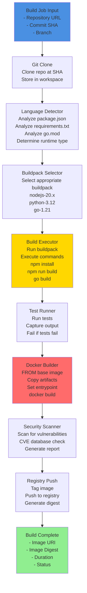
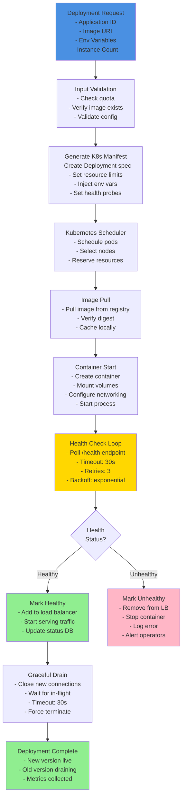

# Detailed Component Diagrams

## Build Service Components

The Build Service is responsible for detecting application language, compiling code, running tests, and creating container images.

### Internal Architecture

## Deploy Service Components

The Deploy Service orchestrates Kubernetes deployments, health checks, and traffic routing.

---

**Document Version**: 1.0
**Last Updated**: 2024
