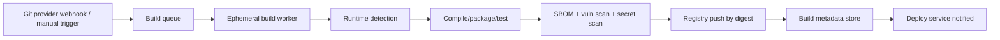
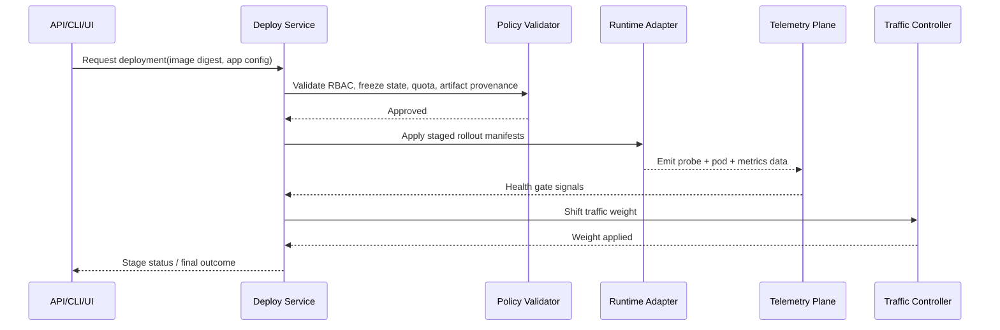

# Build Pipeline & Deployment Engine Technical Design

## Traceability
- Requirements baseline: [`../requirements/requirements.md`](../requirements/requirements.md)
- High-level architecture: [`../high-level-design/architecture-diagram.md`](../high-level-design/architecture-diagram.md)
- Component decomposition: [`./component-diagrams.md`](./component-diagrams.md), [`./c4-component-diagram.md`](./c4-component-diagram.md)
- Delivery policy: [`../implementation/implementation-guidelines.md`](../implementation/implementation-guidelines.md)

## 1) Build Pipeline Architecture

### Build Process Flow
1. Clone repository at commit SHA
2. Detect language/framework from project structure
3. Select appropriate buildpack (Node.js, Python, Go, Java, Ruby, PHP, static)
4. Execute build commands (npm install, python setup, go build, etc.)
5. Run tests if configured in Procfile or build config
6. Create optimized container image with final artifacts
7. Scan image for security vulnerabilities (CVE database)
8. Push image to container registry with unique tag/digest
9. Notify deployment service of build completion

### Build Caching Strategy
- Cache base image layers (saves ~30% build time)
- Cache dependency layers (node_modules, site-packages)
- Layer invalidation on dependency file changes
- 30-day TTL for cached layers
- Space limit: 100GB per build service instance

### Build Resource Constraints
- Timeout: 10 minutes (fails if exceeded)
- Memory: 2GB per build
- CPU: 2 cores per build
- Disk: 10GB per build
- Concurrency: 5 parallel builds per service instance

### Build output contract

| Field | Description | Required for deploy eligibility |
|---|---|---|
| `build_id` | Unique immutable build execution identifier | Yes |
| `source_revision` | Git SHA or uploaded artifact digest | Yes |
| `runtime_profile` | Selected buildpack/runtime version | Yes |
| `image_digest` | Registry digest for produced image | Yes |
| `sbom_uri` | SBOM document location | Yes |
| `scan_summary` | SAST/secret/CVE decision record | Yes |
| `build_log_uri` | Immutable log bundle | Yes |
| `provenance_attestation` | Signed provenance statement | Yes |

### Invariants
- Builds are reproducible by source revision, runtime profile, and environment-independent build inputs.
- Deployment promotion is blocked if build provenance or security attestations are missing.

### Operational acceptance criteria
- Build telemetry exposes queue time, execution time, cache-hit ratio, and failure classification.
- Support tooling can reconstruct any production artifact from build metadata without guessing mutable tags.

## 2) Deployment Engine Design

### Deployment Workflow
1. Receive deployment request with app config and image URI
2. Validate input (check quotas, permissions, image exists)
3. Generate Kubernetes Deployment manifest with specs
4. Apply manifest to cluster (K8s creates pods)
5. Monitor pod startup and health checks
6. On success: register with load balancer, route traffic
7. On failure: preserve previous version, alert user
8. Drain old version connections gracefully (30s timeout)

### Health Check Mechanism
- Endpoint: GET /health (customizable path)
- Timeout: 30 seconds per check
- Retries: 3 attempts with exponential backoff
- Success: HTTP 200-299 status code
- Failure: Non-2xx response triggers rollback

### Zero-Downtime Updates
- New instances start in parallel with old
- Connection draining: close new connections, allow in-flight to complete
- Load balancer connection pooling for stateful apps
- Graceful SIGTERM with 30-second grace period
- Automatic SIGKILL if process doesn't shut down

### Rollback Strategy
- Retain previous 10 deployments for quick rollback
- One-click revert to any previous successful deployment
- Automatic rollback on health check failures
- Rollback creates audit trail entry for compliance
- Previous version becomes "active" again

### Rollout strategies

| Strategy | When used | Guardrails |
|---|---|---|
| Rolling update | default for stateless apps | surge/unavailable bounds, readiness gates |
| Canary | risky changes or large tenant impact | staged traffic weights, automated KPI comparison |
| Blue-green | config/runtime changes with strict cutover control | full parallel environment, controlled switch + fast revert |
| Recreate | only for singleton/non-HA workloads | explicit warning, maintenance window required |

### Failure classification

| Failure class | Example | Primary response |
|---|---|---|
| Validation failure | quota exceeded, unsigned artifact, missing secret | reject before runtime mutation |
| Provisioning failure | image pull error, insufficient capacity | retry or re-place before traffic shift |
| Health-gate failure | readiness probe fails, latency spike | halt rollout, auto-rollback if threshold crossed |
| Post-cutover regression | error-budget burn after traffic shift | revert traffic and open incident |

### Invariants
- Runtime mutation only happens after policy, quota, and provenance checks succeed.
- Any traffic shift is reversible to the last known-good revision without rebuilding artifacts.
- Deployment events are ordered and idempotent per application/environment pair.

### Operational acceptance criteria
- Canary analysis decisions are reproducible from retained metrics and event logs.
- Rollback from any non-destructive failure class completes within the target recovery objective.

## 3) Artifact Promotion and Provenance

### Promotion rules
1. Only image digests may be promoted; mutable tags are metadata aliases only.
2. Promotion requires successful build, attestation, SBOM generation, and policy scan.
3. Production deploys must reference the same digest validated in staging.

### Provenance chain
- Source revision signed or traceable to authenticated actor.
- Build worker identity recorded in attestation.
- Registry digest recorded in metadata store.
- Deployment event links the live revision to build and approval evidence.

## 4) Build and Deploy Control Interfaces

| Interface | Purpose | Idempotency key |
|---|---|---|
| `POST /applications/{id}/deployments` | create deployment request | app + environment + source revision |
| `POST /builds/{id}/cancel` | stop pending/running build | build_id |
| `POST /deployments/{id}/rollback` | revert to prior eligible revision | deployment_id + target revision |
| deployment event stream | UI/CLI status propagation | event_id |

## 5) Operational Safeguards

- Freeze windows block risky deploys during incidents or billing migrations.
- Build-worker pools are isolated from runtime clusters to reduce blast radius.
- Every rollout emits audit entries for actor, target environment, revision, policy checks, and traffic changes.
- Garbage collection never deletes artifacts still referenced by an eligible rollback target.

---

**Document Version**: 2.0
**Last Updated**: 2026
