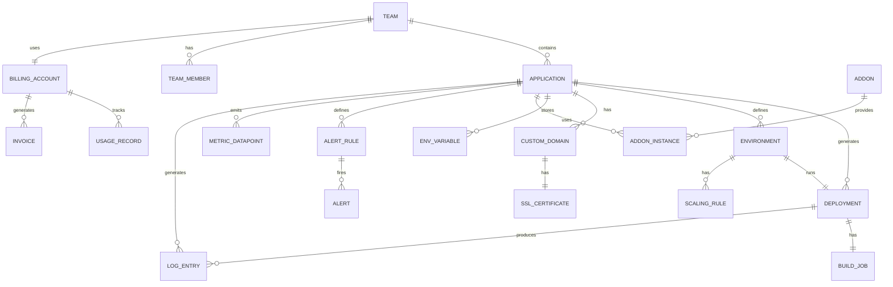

# Database Schema: Entity Relationship Diagram and Detailed Design

## Entity Relationship Diagram



## Table Schemas

### teams
```sql
CREATE TABLE teams (
    team_id UUID PRIMARY KEY,
    name VARCHAR(255) NOT NULL UNIQUE,
    owner_id UUID NOT NULL REFERENCES users(user_id),
    billing_account_id UUID UNIQUE REFERENCES billing_accounts(billing_account_id),
    settings_json JSONB,
    created_at TIMESTAMP DEFAULT CURRENT_TIMESTAMP,
    updated_at TIMESTAMP DEFAULT CURRENT_TIMESTAMP,
    is_active BOOLEAN DEFAULT true
);
CREATE INDEX idx_teams_owner ON teams(owner_id);
```

### applications
```sql
CREATE TABLE applications (
    application_id UUID PRIMARY KEY,
    team_id UUID NOT NULL REFERENCES teams(team_id) ON DELETE CASCADE,
    name VARCHAR(255) NOT NULL,
    description TEXT,
    git_repo_url VARCHAR(2000) NOT NULL,
    git_branch_default VARCHAR(255) DEFAULT 'main',
    runtime_type ENUM('nodejs', 'python', 'go', 'ruby', 'java', 'php', 'static') NOT NULL,
    is_active BOOLEAN DEFAULT true,
    created_at TIMESTAMP DEFAULT CURRENT_TIMESTAMP,
    updated_at TIMESTAMP DEFAULT CURRENT_TIMESTAMP,
    created_by UUID REFERENCES users(user_id),
    UNIQUE(team_id, name)
);
CREATE INDEX idx_applications_team ON applications(team_id);
CREATE INDEX idx_applications_is_active ON applications(is_active);
```

### deployments
```sql
CREATE TABLE deployments (
    deployment_id UUID PRIMARY KEY,
    application_id UUID NOT NULL REFERENCES applications(application_id),
    commit_sha VARCHAR(40) NOT NULL,
    branch_name VARCHAR(255) NOT NULL,
    status ENUM('queued', 'building', 'deploying', 'running', 'failed', 'rolled_back') NOT NULL,
    build_duration_seconds INTEGER,
    total_duration_seconds INTEGER,
    error_message TEXT,
    image_uri VARCHAR(1000),
    image_digest VARCHAR(255),
    triggered_by ENUM('webhook', 'manual', 'cli', 'rollback') NOT NULL,
    triggered_by_user UUID REFERENCES users(user_id),
    created_at TIMESTAMP DEFAULT CURRENT_TIMESTAMP,
    started_at TIMESTAMP,
    completed_at TIMESTAMP
);
CREATE INDEX idx_deployments_application ON deployments(application_id);
CREATE INDEX idx_deployments_status ON deployments(status);
CREATE INDEX idx_deployments_created ON deployments(created_at DESC);
```

### environments
```sql
CREATE TABLE environments (
    environment_id UUID PRIMARY KEY,
    application_id UUID NOT NULL REFERENCES applications(application_id),
    environment_name ENUM('staging', 'production', 'preview') NOT NULL,
    instance_count INTEGER NOT NULL DEFAULT 1,
    min_instances INTEGER NOT NULL DEFAULT 1,
    max_instances INTEGER NOT NULL DEFAULT 10,
    auto_scale_enabled BOOLEAN DEFAULT false,
    current_deployment_id UUID REFERENCES deployments(deployment_id),
    updated_at TIMESTAMP DEFAULT CURRENT_TIMESTAMP,
    UNIQUE(application_id, environment_name)
);
CREATE INDEX idx_environments_application ON environments(application_id);
```

### custom_domains
```sql
CREATE TABLE custom_domains (
    domain_id UUID PRIMARY KEY,
    application_id UUID NOT NULL REFERENCES applications(application_id),
    domain_name VARCHAR(255) NOT NULL,
    status ENUM('pending', 'dns_verified', 'cert_issued', 'active', 'failed') NOT NULL,
    dns_verification_token VARCHAR(255),
    cname_target VARCHAR(500) NOT NULL,
    is_primary BOOLEAN DEFAULT false,
    created_at TIMESTAMP DEFAULT CURRENT_TIMESTAMP,
    verified_at TIMESTAMP,
    UNIQUE(domain_name)
);
CREATE INDEX idx_domains_application ON custom_domains(application_id);
CREATE INDEX idx_domains_status ON custom_domains(status);
```

### ssl_certificates
```sql
CREATE TABLE ssl_certificates (
    ssl_cert_id UUID PRIMARY KEY,
    domain_id UUID NOT NULL REFERENCES custom_domains(domain_id) ON DELETE CASCADE,
    issuer ENUM('letsencrypt', 'custom') NOT NULL,
    certificate_pem TEXT NOT NULL,
    private_key_pem TEXT NOT NULL,
    issued_at TIMESTAMP NOT NULL,
    expires_at TIMESTAMP NOT NULL,
    renewal_scheduled_at TIMESTAMP,
    status ENUM('active', 'expiring_soon', 'expired') NOT NULL,
    created_at TIMESTAMP DEFAULT CURRENT_TIMESTAMP
);
CREATE INDEX idx_certs_expires ON ssl_certificates(expires_at);
CREATE INDEX idx_certs_status ON ssl_certificates(status);
```

### env_variables
```sql
CREATE TABLE env_variables (
    env_var_id UUID PRIMARY KEY,
    application_id UUID NOT NULL REFERENCES applications(application_id),
    environment_id UUID REFERENCES environments(environment_id),
    key VARCHAR(255) NOT NULL,
    value TEXT NOT NULL,
    is_secret BOOLEAN DEFAULT false,
    source_type ENUM('manual', 'addon', 'system') NOT NULL,
    created_at TIMESTAMP DEFAULT CURRENT_TIMESTAMP,
    updated_at TIMESTAMP DEFAULT CURRENT_TIMESTAMP,
    updated_by UUID REFERENCES users(user_id),
    last_rotated_at TIMESTAMP,
    UNIQUE(application_id, environment_id, key)
);
CREATE INDEX idx_env_vars_application ON env_variables(application_id);
```

### addon_instances
```sql
CREATE TABLE addon_instances (
    addon_instance_id UUID PRIMARY KEY,
    addon_id UUID NOT NULL REFERENCES addons(addon_id),
    application_id UUID NOT NULL REFERENCES applications(application_id),
    instance_name VARCHAR(255) NOT NULL,
    plan_tier VARCHAR(100) NOT NULL,
    status ENUM('provisioning', 'active', 'deprovisioning', 'failed') NOT NULL,
    provider_instance_id VARCHAR(255) NOT NULL,
    connection_string TEXT NOT NULL,
    region VARCHAR(50) NOT NULL,
    created_at TIMESTAMP DEFAULT CURRENT_TIMESTAMP,
    ready_at TIMESTAMP,
    UNIQUE(application_id, instance_name)
);
CREATE INDEX idx_addon_instances_application ON addon_instances(application_id);
CREATE INDEX idx_addon_instances_status ON addon_instances(status);
```

### metrics_datapoints
```sql
CREATE TABLE metrics_datapoints (
    metric_id UUID PRIMARY KEY DEFAULT gen_random_uuid(),
    application_id UUID NOT NULL REFERENCES applications(application_id),
    deployment_id UUID REFERENCES deployments(deployment_id),
    metric_name VARCHAR(100) NOT NULL,
    value DECIMAL(12, 4) NOT NULL,
    unit VARCHAR(50) NOT NULL,
    instance_id VARCHAR(255) NOT NULL,
    timestamp TIMESTAMP NOT NULL DEFAULT CURRENT_TIMESTAMP
);
CREATE INDEX idx_metrics_app_time ON metrics_datapoints(application_id, timestamp DESC);
CREATE INDEX idx_metrics_metric_time ON metrics_datapoints(metric_name, timestamp DESC);
```

### log_entries
```sql
CREATE TABLE log_entries (
    log_id UUID PRIMARY KEY DEFAULT gen_random_uuid(),
    application_id UUID NOT NULL REFERENCES applications(application_id),
    deployment_id UUID REFERENCES deployments(deployment_id),
    instance_id VARCHAR(255) NOT NULL,
    log_level ENUM('debug', 'info', 'warn', 'error', 'fatal') NOT NULL,
    message TEXT NOT NULL,
    metadata_json JSONB,
    timestamp TIMESTAMP NOT NULL DEFAULT CURRENT_TIMESTAMP
);
CREATE INDEX idx_logs_app_time ON log_entries(application_id, timestamp DESC);
CREATE INDEX idx_logs_level_time ON log_entries(log_level, timestamp DESC);
```

### alert_rules
```sql
CREATE TABLE alert_rules (
    alert_rule_id UUID PRIMARY KEY,
    application_id UUID NOT NULL REFERENCES applications(application_id),
    name VARCHAR(255) NOT NULL,
    condition VARCHAR(500) NOT NULL,
    duration_minutes INTEGER NOT NULL,
    notification_channels JSONB NOT NULL,
    is_enabled BOOLEAN DEFAULT true,
    created_at TIMESTAMP DEFAULT CURRENT_TIMESTAMP,
    created_by UUID REFERENCES users(user_id),
    UNIQUE(application_id, name)
);
CREATE INDEX idx_alert_rules_application ON alert_rules(application_id);
```

### billing_accounts
```sql
CREATE TABLE billing_accounts (
    billing_account_id UUID PRIMARY KEY,
    team_id UUID NOT NULL UNIQUE REFERENCES teams(team_id),
    payment_method_id VARCHAR(255),
    billing_email VARCHAR(255) NOT NULL,
    billing_address TEXT NOT NULL,
    subscription_tier ENUM('free', 'starter', 'professional', 'enterprise') NOT NULL DEFAULT 'free',
    status ENUM('active', 'past_due', 'suspended', 'cancelled') NOT NULL DEFAULT 'active',
    next_billing_date DATE NOT NULL,
    created_at TIMESTAMP DEFAULT CURRENT_TIMESTAMP,
    updated_at TIMESTAMP DEFAULT CURRENT_TIMESTAMP
);
CREATE INDEX idx_billing_status ON billing_accounts(status);
```

### usage_records
```sql
CREATE TABLE usage_records (
    usage_record_id UUID PRIMARY KEY,
    billing_account_id UUID NOT NULL REFERENCES billing_accounts(billing_account_id),
    application_id UUID REFERENCES applications(application_id),
    resource_type ENUM('compute_instance_hours', 'bandwidth_gb', 'storage_gb', 'addon_instance') NOT NULL,
    quantity DECIMAL(12, 4) NOT NULL,
    unit_price DECIMAL(10, 4) NOT NULL,
    total_amount DECIMAL(12, 2) NOT NULL,
    month CHAR(7) NOT NULL,
    recorded_at TIMESTAMP DEFAULT CURRENT_TIMESTAMP
);
CREATE INDEX idx_usage_account_month ON usage_records(billing_account_id, month);
CREATE INDEX idx_usage_application ON usage_records(application_id);
```

## Constraints & Triggers

### Deployment Status Transition Validation
```sql
CREATE TRIGGER validate_deployment_status
BEFORE UPDATE ON deployments
FOR EACH ROW
WHEN (OLD.status IS DISTINCT FROM NEW.status)
EXECUTE FUNCTION validate_deployment_status_transition();
```

Valid transitions:
- queued → building, failed
- building → deploying, failed
- deploying → running, failed
- running → (unchanged), rolled_back
- failed, rolled_back → (no transitions)

### Auto-Rotation of Add-on Credentials
```sql
CREATE FUNCTION rotate_addon_credentials()
RETURNS void AS $$
UPDATE env_variables
SET last_rotated_at = CURRENT_TIMESTAMP
WHERE source_type = 'addon' AND (last_rotated_at IS NULL OR last_rotated_at < NOW() - INTERVAL '90 days');
$$ LANGUAGE SQL;

CREATE TRIGGER rotate_addon_creds_daily
AFTER INSERT OR UPDATE ON addon_instances
FOR EACH DAY
EXECUTE FUNCTION rotate_addon_credentials();
```

### Cascade Soft-Delete of Applications
```sql
CREATE FUNCTION soft_delete_application()
RETURNS void AS $$
UPDATE applications SET is_active = false WHERE application_id = NEW.application_id;
$$ LANGUAGE SQL;
```

---

**Document Version**: 1.0
**Last Updated**: 2024
