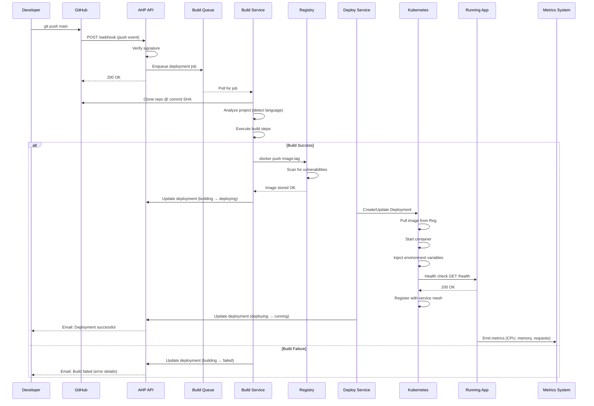
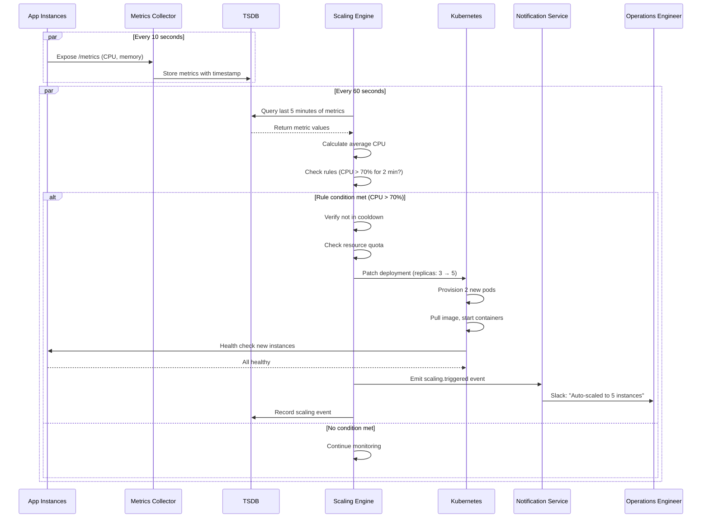
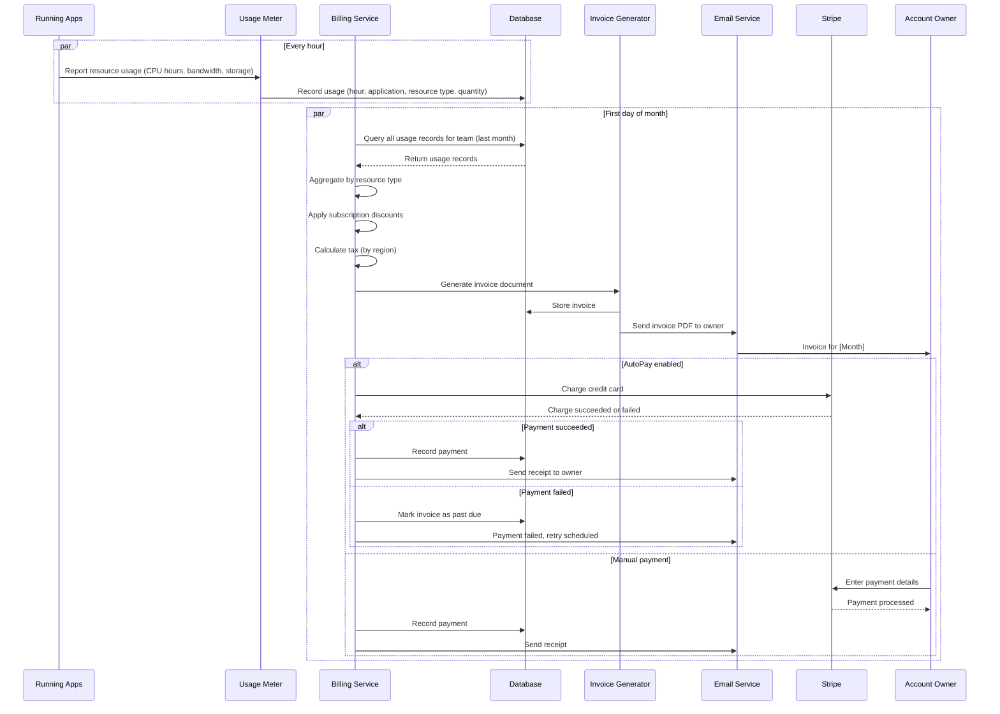

# Detailed Sequence Diagrams

## Full Deployment Lifecycle Sequence

```mermaid
sequenceDiagram
    participant Dev as Developer
    participant Git as GitHub
    participant AHP as AHP API
    participant Queue as Build Queue
    participant Builder as Build Service
    participant Reg as Registry
    participant Deploy as Deploy Service
    participant K8s as Kubernetes
    participant App as Running App
    participant Monitor as Metrics System
    
    Dev->>Git: git push main
    Git->>AHP: POST /webhook (push event)
    AHP->>AHP: Verify signature
    AHP->>Queue: Enqueue deployment job
    AHP-->>Git: 200 OK
    
    Queue-->>Builder: Poll for job
    Builder->>Git: Clone repo @ commit SHA
    Builder->>Builder: Analyze project (detect language)
    Builder->>Builder: Execute build steps
    
    alt Build Success
        Builder->>Reg: docker push image:tag
        Reg->>Reg: Scan for vulnerabilities
        Reg-->>Builder: Image stored OK
        
        Builder->>AHP: Update deployment (building → deploying)
        
        Deploy->>K8s: Create/Update Deployment
        K8s->>K8s: Pull image from Reg
        K8s->>K8s: Start container
        K8s->>K8s: Inject environment variables
        
        K8s->>App: Health check GET /health
        App-->>K8s: 200 OK
        
        K8s->>K8s: Register with service mesh
        
        Deploy->>AHP: Update deployment (deploying → running)
        AHP-->>Dev: Email: Deployment successful
        
        App->>Monitor: Emit metrics (CPU, memory, requests)
    else Build Failure
        Builder->>AHP: Update deployment (building → failed)
        AHP-->>Dev: Email: Build failed (error details)
    end
```

## Auto-Scaling Decision Sequence

```mermaid
sequenceDiagram
    participant App as App Instances
    participant Collect as Metrics Collector
    participant DB as TSDB
    participant Scale as Scaling Engine
    participant K8s as Kubernetes
    participant Notify as Notification Service
    participant Ops as Operations Engineer
    
    par Every 10 seconds
        App->>Collect: Expose /metrics (CPU, memory)
        Collect->>DB: Store metrics with timestamp
    end
    
    par Every 60 seconds
        Scale->>DB: Query last 5 minutes of metrics
        DB-->>Scale: Return metric values
        
        Scale->>Scale: Calculate average CPU
        Scale->>Scale: Check rules (CPU > 70% for 2 min?)
        
        alt Rule condition met (CPU > 70%)
            Scale->>Scale: Verify not in cooldown
            Scale->>Scale: Check resource quota
            
            Scale->>K8s: Patch deployment (replicas: 3 → 5)
            K8s->>K8s: Provision 2 new pods
            K8s->>K8s: Pull image, start containers
            K8s->>App: Health check new instances
            App-->>K8s: All healthy
            
            Scale->>Notify: Emit scaling.triggered event
            Notify->>Ops: Slack: "Auto-scaled to 5 instances"
            
            Scale->>DB: Record scaling event
        else No condition met
            Scale->>Scale: Continue monitoring
        end
    end
```

## Billing Cycle Sequence

```mermaid
sequenceDiagram
    participant App as Running Apps
    participant Meter as Usage Meter
    participant Bill as Billing Service
    participant DB as Database
    participant Invoice as Invoice Generator
    participant Email as Email Service
    participant Payment as Stripe
    participant Owner as Account Owner
    
    par Every hour
        App->>Meter: Report resource usage (CPU hours, bandwidth, storage)
        Meter->>DB: Record usage (hour, application, resource type, quantity)
    end
    
    par First day of month
        Bill->>DB: Query all usage records for team (last month)
        DB-->>Bill: Return usage records
        
        Bill->>Bill: Aggregate by resource type
        Bill->>Bill: Apply subscription discounts
        Bill->>Bill: Calculate tax (by region)
        
        Bill->>Invoice: Generate invoice document
        Invoice->>DB: Store invoice
        
        Invoice->>Email: Send invoice PDF to owner
        Email->>Owner: Invoice for [Month]
        
        alt AutoPay enabled
            Bill->>Payment: Charge credit card
            Payment-->>Bill: Charge succeeded or failed
            
            alt Payment succeeded
                Bill->>DB: Record payment
                Bill->>Email: Send receipt to owner
            else Payment failed
                Bill->>DB: Mark invoice as past due
                Bill->>Email: Payment failed, retry scheduled
            end
        else Manual payment
            Owner->>Payment: Enter payment details
            Payment-->>Owner: Payment processed
            Bill->>DB: Record payment
            Bill->>Email: Send receipt
        end
    end
```

---

**Document Version**: 1.0
**Last Updated**: 2024
