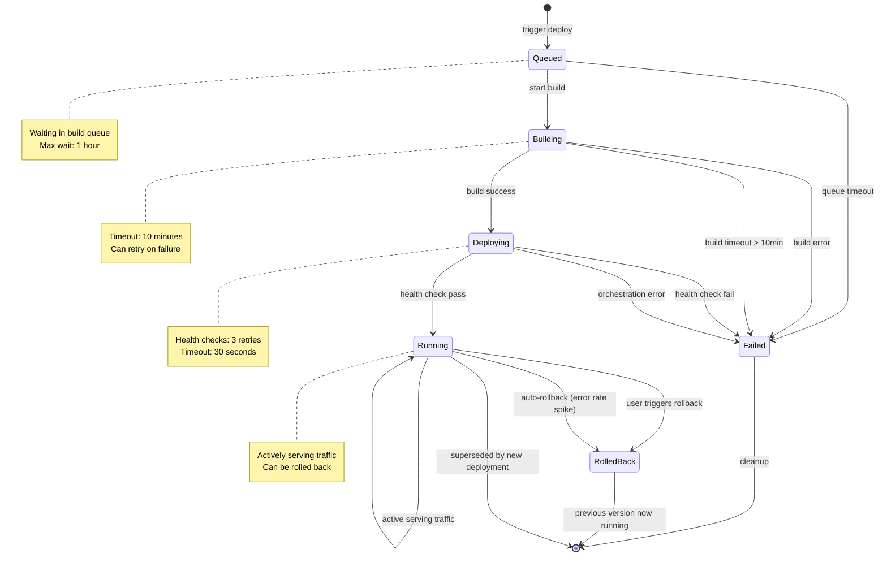
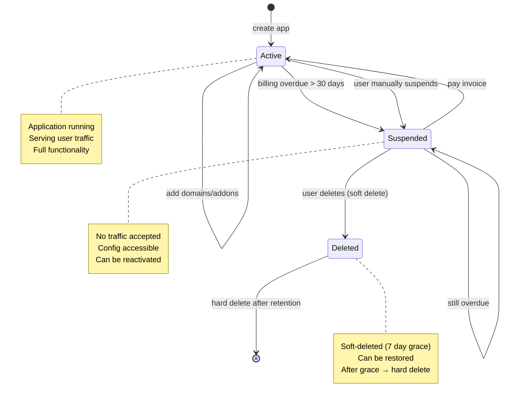
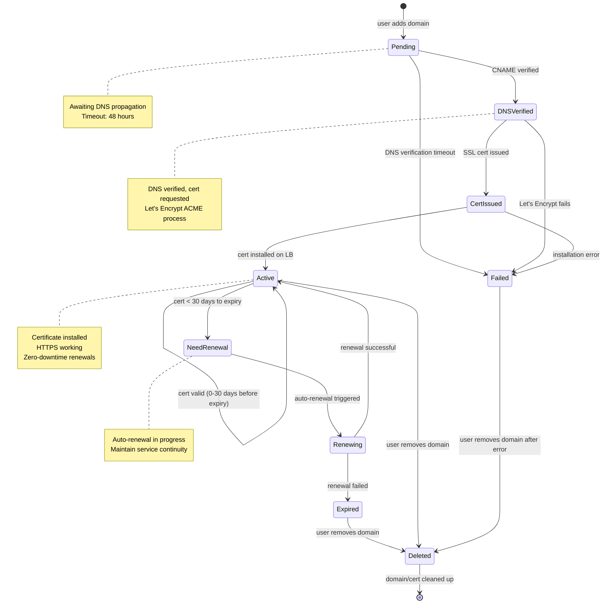
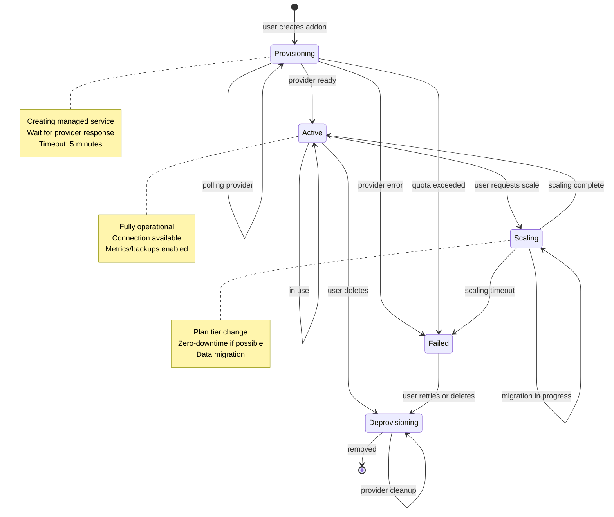

# State Machine Diagrams

## Deployment State Machine

## Application Lifecycle State Machine

## Custom Domain SSL Certificate Lifecycle

## Add-on Instance Lifecycle

---

**Document Version**: 1.0
**Last Updated**: 2024
