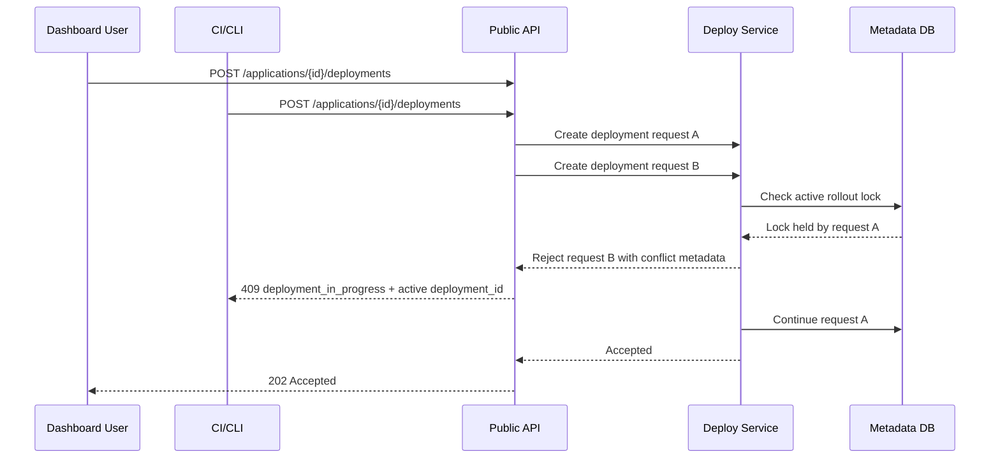
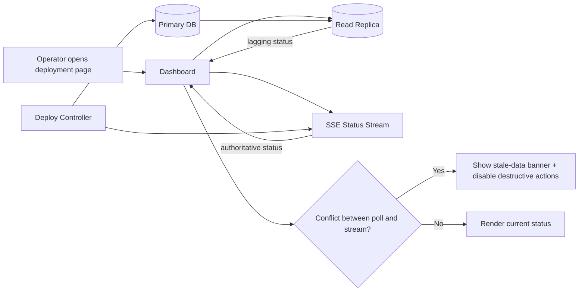
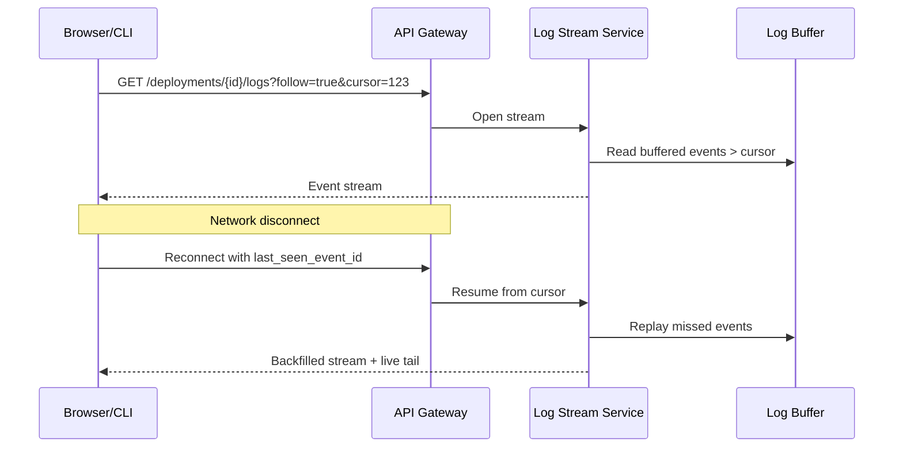
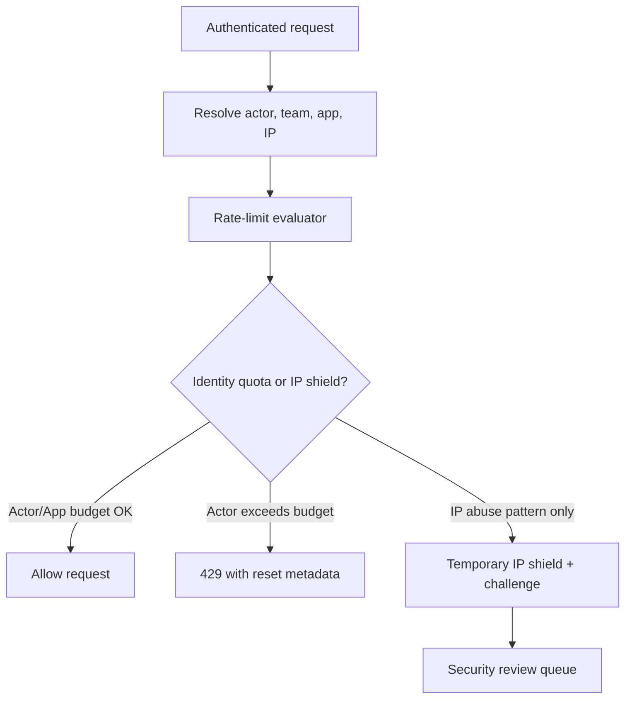
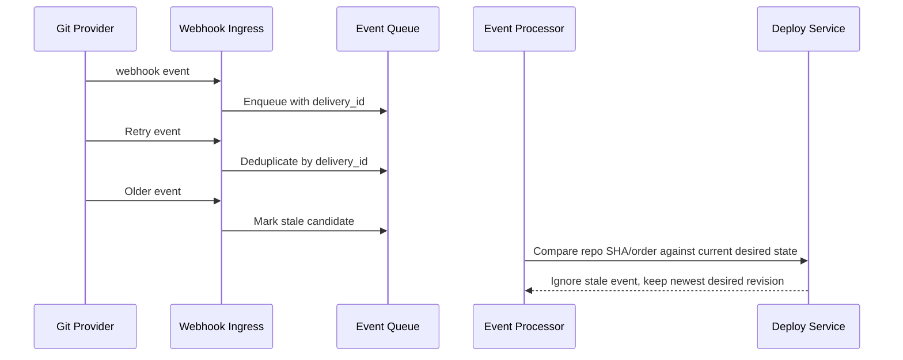

# Edge Cases: API and UI

## Traceability
- Requirements: [`../requirements/requirements.md`](../requirements/requirements.md)
- API contracts: [`../detailed-design/api-design.md`](../detailed-design/api-design.md)
- Delivery workflow: [`../implementation/implementation-guidelines.md`](../implementation/implementation-guidelines.md)

## Scenario Set A: Concurrent Deployment Trigger from UI and CLI

### Trigger
A developer clicks **Deploy latest commit** in the web UI while an automation job triggers `ahp deploy` for the same application and environment within the same minute.

### Invariants
- Only one mutable rollout may target the same application and environment at a time.
- Rejected duplicate requests return the active `deployment_id` so clients can resume tracking instead of retrying blindly.

### Operational acceptance criteria
- Conflict response must be deterministic across web UI, CLI, and API clients.
- Audit log must show which actor acquired the rollout lock and which actor was rejected.

## Scenario Set B: Stale Dashboard State During Progressive Rollout

### Trigger
The dashboard polls deployment state from a lagging read replica while rollout decisions are written to the primary metadata store.

### Invariants
- Streaming rollout state is authoritative over eventually consistent list/poll endpoints.
- UI must suppress destructive actions such as rollback or cancel when state sources disagree.

### Operational acceptance criteria
- Replica lag greater than 5 seconds surfaces an explicit UI warning.
- Operators can still access raw deployment events and request IDs for support escalation.

## Scenario Set C: Deployment Log Stream Disconnect

### Trigger
Browser or CLI log stream disconnects during a build because of proxy timeout, browser tab suspension, or network blip.

### Invariants
- Log events have monotonically increasing sequence IDs per deployment.
- Reconnect flow must be loss-aware; clients are never told “up to date” without replaying missed buffered events first.

### Operational acceptance criteria
- Buffered replay covers at least the last 15 minutes of deployment events.
- CLI and dashboard both expose reconnection status and whether any events were dropped.

## Scenario Set D: API Rate Limit Misclassification for Shared NAT or CI Runners

### Trigger
Multiple legitimate developers or CI jobs share a source IP and hit per-IP rate limits despite separate identities and applications.

### Invariants
- Primary rate-limit key is actor/team/app, not IP alone.
- Abuse protections may consider IP reputation, but must not collapse tenant isolation or cause cross-tenant throttling.

### Operational acceptance criteria
- Every 429 response includes `retry_after`, policy ID, and support correlation ID.
- Security analytics can distinguish abusive bot traffic from bursty but valid CI activity.

## Scenario Set E: Webhook Delivery Duplicate or Out-of-Order

### Trigger
Git provider retries a webhook after a transient timeout, resulting in duplicated or out-of-order delivery for push and pull-request events.

### Invariants
- Webhook processing is idempotent on provider delivery ID and repository revision.
- Late events cannot roll desired state backward once a newer revision is accepted.

### Operational acceptance criteria
- Duplicate suppression metrics are exposed per integration provider.
- Support tooling can reconstruct why a webhook was processed, ignored, or classified as stale.

---

**Status**: Complete  
**Document Version**: 2.0
