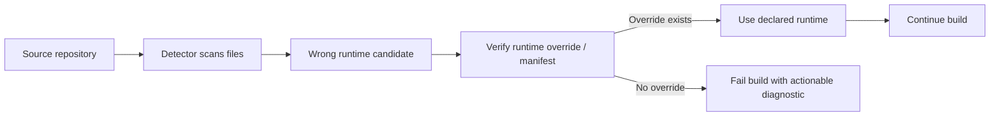
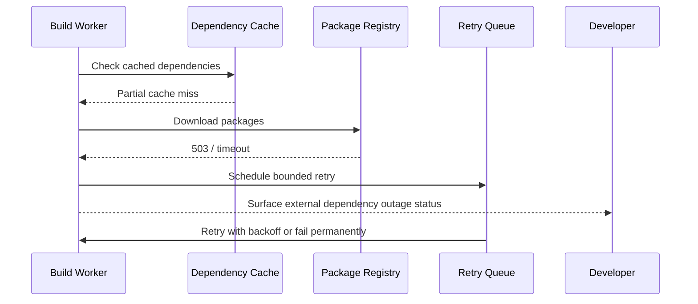
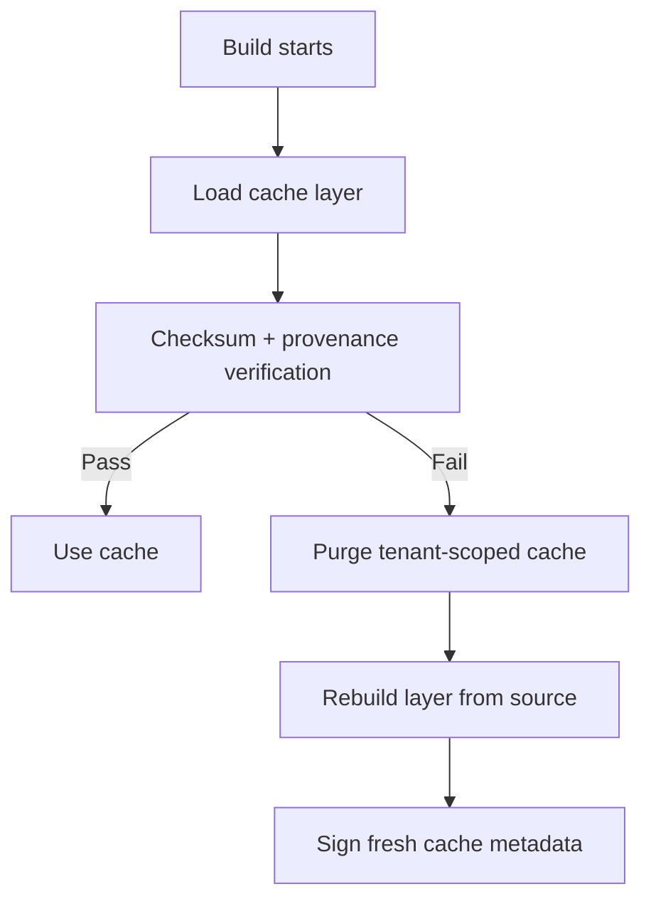
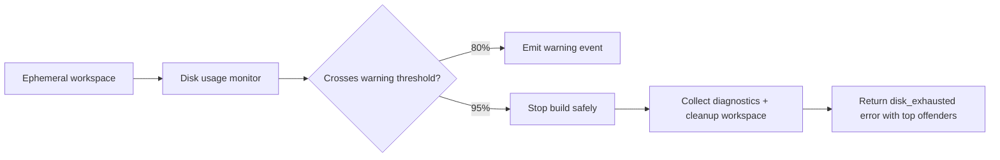
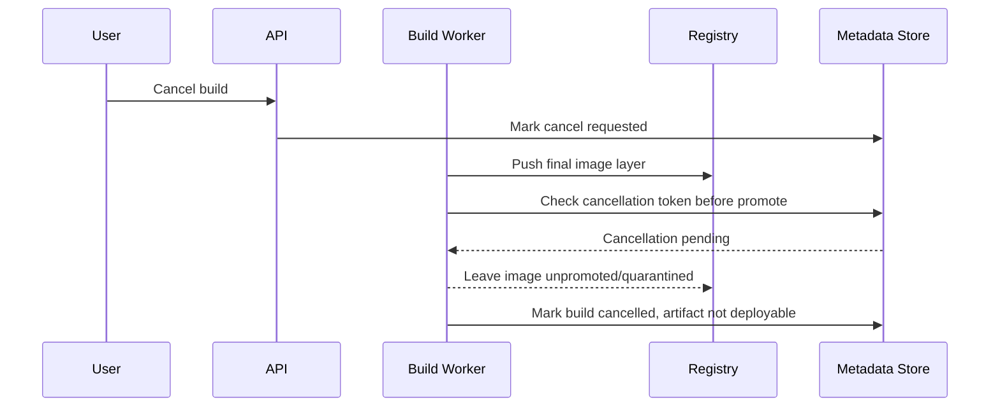

# Edge Cases: Build Pipeline Errors

## Traceability
- Requirements: [`../requirements/requirements.md`](../requirements/requirements.md)
- Build/deploy design: [`../detailed-design/deployment-engine-and-build-pipeline.md`](../detailed-design/deployment-engine-and-build-pipeline.md)
- Execution controls: [`../implementation/implementation-guidelines.md`](../implementation/implementation-guidelines.md)

## Scenario Set A: Buildpack Detection Picks the Wrong Runtime

### Trigger
A polyglot repository contains both `package.json` and `go.mod`, but the intended runtime is Go while the detector selects the Node.js buildpack first.

### Invariants
- Explicit runtime declaration always overrides heuristic detection.
- Detector decisions are logged with evidence so support can explain the chosen runtime.

### Operational acceptance criteria
- Failed detection response names the files considered and the override field to use.
- Less than 1% of successful builds require manual support intervention for runtime selection.

## Scenario Set B: Dependency Registry Outage During Build

### Trigger
Public or private package registry is slow, unavailable, or returns partial artifacts during dependency installation.

### Invariants
- Registry outages are classified separately from application build errors.
- Retries are bounded to prevent build-worker starvation and quota exhaustion.

### Operational acceptance criteria
- Build output clearly distinguishes transient upstream failures from user code issues.
- Package registry incidents are visible in platform-wide health dashboards within 2 minutes.

## Scenario Set C: Corrupted or Poisoned Build Cache

### Trigger
A cached dependency layer contains stale binaries, partial writes, or maliciously injected content from a prior failed build.

### Invariants
- Cache entries are tenant-scoped and content-addressed.
- Failed integrity verification causes purge-and-rebuild, never silent fallback to untrusted cache.

### Operational acceptance criteria
- Cache corruption event records affected tenants, layer digests, and purge action.
- Rebuilt cache cannot be promoted until integrity metadata is re-signed.

## Scenario Set D: Ephemeral Build Disk Exhaustion

### Trigger
Large monorepo, Docker layer expansion, or artifact explosion fills the temporary workspace volume before image creation completes.

### Invariants
- Worker must fail safely before host-level disk pressure impacts unrelated builds.
- Cleanup always runs, even for failed builds, to protect multi-tenant worker pools.

### Operational acceptance criteria
- Error output identifies largest directories/files and recommended remediation.
- Worker pool recovers usable disk capacity automatically after termination.

## Scenario Set E: Race Between Cancelled Build and Artifact Promotion

### Trigger
A user cancels a build just as the artifact upload and promotion step starts, creating ambiguity over whether the image is usable.

### Invariants
- Upload completion does not imply promotion eligibility.
- Cancellation tokens are rechecked before artifact promotion and rollout registration.

### Operational acceptance criteria
- Cancelled builds never appear as selectable deployment revisions.
- Quarantined artifacts are garbage-collected on policy-defined retention windows.

---

**Status**: Complete  
**Document Version**: 2.0
