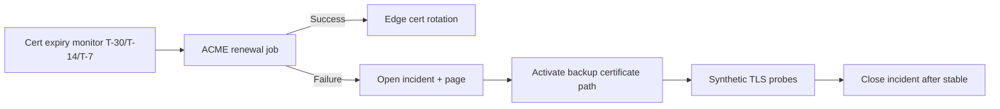

# Edge Cases: Custom Domains and SSL

## Traceability
- Requirements: [`../requirements/requirements.md`](../requirements/requirements.md)
- Infrastructure edge path: [`../infrastructure/network-infrastructure.md`](../infrastructure/network-infrastructure.md)
- Operations policy: [`../implementation/implementation-guidelines.md`](../implementation/implementation-guidelines.md)

## Scenario Set: Certificate Expiration

### Trigger
Auto-renewal fails repeatedly and certificate reaches critical expiration threshold.

### Invariants
- No active production certificate may drop below 7 days without a P1 incident.
- Certificate private keys remain in managed key boundary and are never exported.

### Operational acceptance criteria
- TLS monitoring detects expiry risk within 1 hour of threshold crossing.
- Rotation completion is validated across all edge POPs before incident closure.

---

**Status**: Complete  
**Document Version**: 2.0
