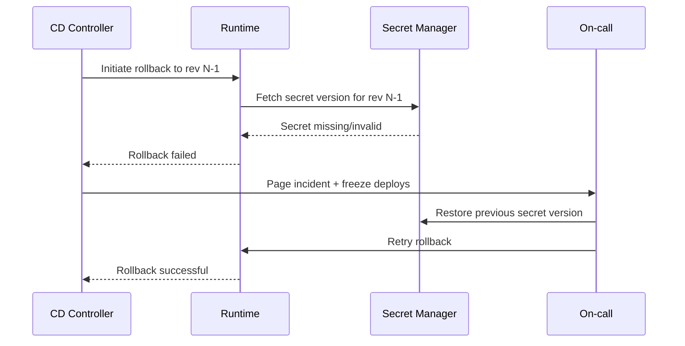

# Edge Cases: Deployment Failures

## Traceability
- Requirements: [`../requirements/requirements.md`](../requirements/requirements.md)
- Deployment design: [`../detailed-design/sequence-diagrams.md`](../detailed-design/sequence-diagrams.md)
- Execution controls: [`../implementation/implementation-guidelines.md`](../implementation/implementation-guidelines.md)

## Scenario Set: Deployment Rollback Failure

### Trigger
Rollback starts after canary regression, but previous revision cannot start due to missing config/secret mismatch.

### Invariants
- Rollback candidate must include immutable config+secret version references.
- Rollback cannot proceed if safety checks detect incompatible schema state.

### Operational acceptance criteria
- Failed rollback automatically freezes subsequent deployments for impacted app.
- Incident timeline captures revision IDs, secret versions, and operator actions.
- Runbook exercise proves recovery in < 15 minutes.

---

**Status**: Complete  
**Document Version**: 2.0
