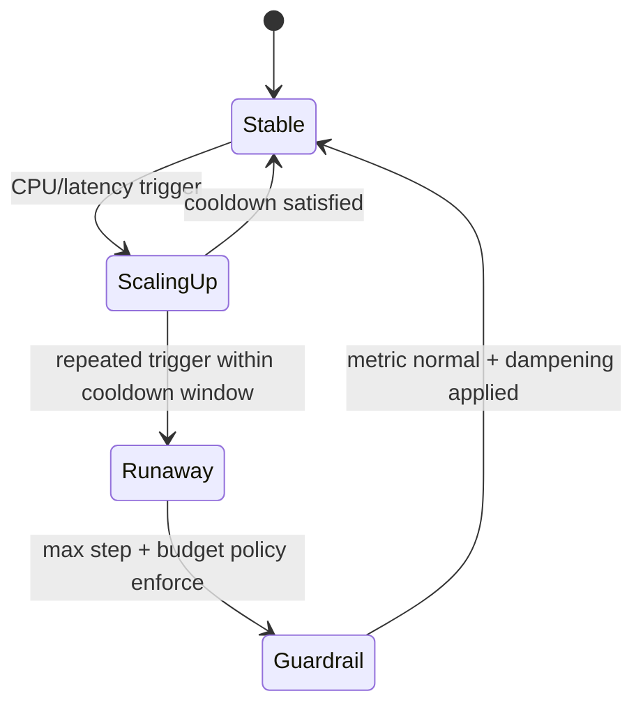
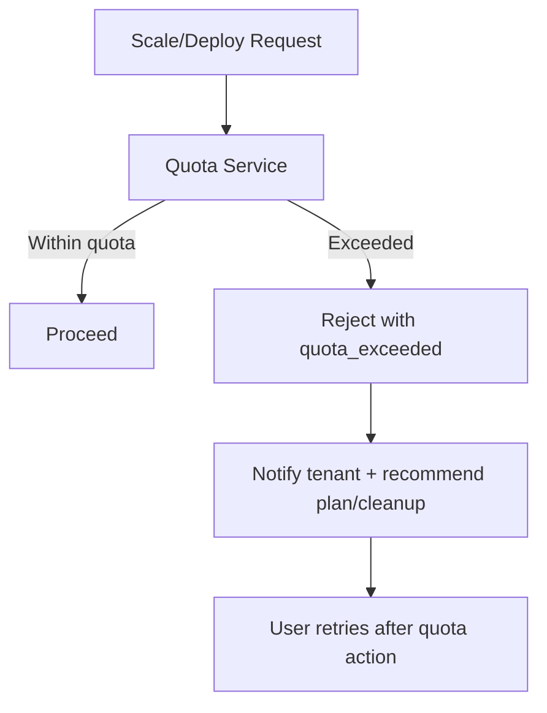

# Edge Cases: Scaling and Resource Limits

## Traceability
- Requirements: [`../requirements/requirements.md`](../requirements/requirements.md)
- Runtime design: [`../detailed-design/state-machine-diagrams.md`](../detailed-design/state-machine-diagrams.md)
- Execution controls: [`../implementation/implementation-guidelines.md`](../implementation/implementation-guidelines.md)

## Scenario Set A: Autoscaling Runaway

### Trigger
Bad metric input or thrashing policy causes rapid repeated scale-up actions.

### Invariants
- Scaling decisions require cooldown and dampening window.
- Hard cap on instance count per app, namespace, and tenant budget.

### Operational acceptance criteria
- Runaway detection alert fires within 2 minutes.
- Guardrail policies cap spend and capacity without control-plane crash.

## Scenario Set B: Quota Exhaustion

### Trigger
Tenant exceeds compute, storage, or build-minute quota during peak deploy window.

### Invariants
- Quota checks are authoritative and must run before scheduling.
- Quota denial responses are deterministic and auditable.

### Operational acceptance criteria
- 100% of quota denials include actionable remediation metadata.
- Quota counters converge within 60 seconds of billing events.

---

**Status**: Complete  
**Document Version**: 2.0
