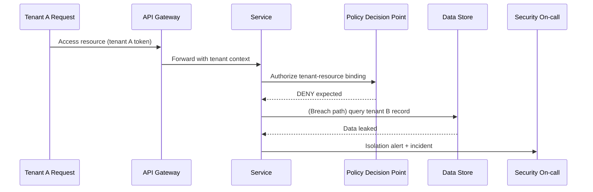

# Edge Cases: Security and Compliance

## Traceability
- Requirements: [`../requirements/requirements.md`](../requirements/requirements.md)
- Network and security controls: [`../infrastructure/network-infrastructure.md`](../infrastructure/network-infrastructure.md)
- Detailed service contracts: [`../detailed-design/api-design.md`](../detailed-design/api-design.md)

## Scenario Set: Tenant Isolation Breach

### Trigger
Misconfigured policy allows cross-tenant data access path.

### Invariants
- Tenant context is mandatory and immutable through request chain.
- Data access layer enforces tenant predicates server-side (not client-provided only).
- Any cross-tenant read/write mismatch triggers immediate incident.

### Operational acceptance criteria
- Automated policy tests cover cross-tenant negative cases on every release.
- Breach detection creates high-severity incident and temporary access controls within 5 minutes.
- Forensic logs preserve full request lineage (`request_id`, `tenant_id`, `subject_id`).

---

**Status**: Complete  
**Document Version**: 2.0
