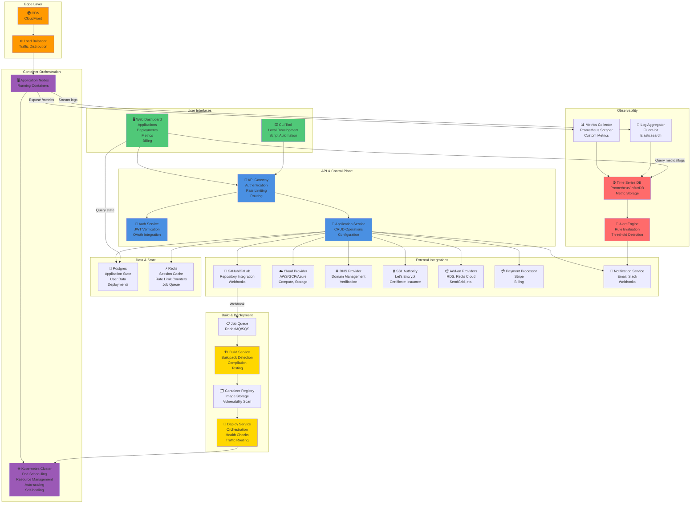

# Platform Architecture Diagram

## System Architecture Overview

## Key System Components

### Edge Layer
- **CDN**: Caches static assets globally (images, CSS, JS)
- **Load Balancer**: Distributes incoming requests across API gateway and application instances

### API & Control Plane
- **API Gateway**: Single entry point for all API calls, authentication, rate limiting, routing
- **Auth Service**: JWT verification, OAuth token handling, multi-factor authentication
- **Application Service**: Business logic for applications, deployments, scaling, configuration

### Build & Deployment
- **Job Queue**: Asynchronous build/deployment requests (RabbitMQ or AWS SQS)
- **Build Service**: Detects language, selects buildpack, compiles code, runs tests, creates container image
- **Container Registry**: Stores container images, scans for vulnerabilities, manages image lifecycle
- **Deploy Service**: Orchestrates Kubernetes deployments, health checks, traffic routing, rollbacks

### Container Orchestration
- **Kubernetes Cluster**: Orchestrates container scheduling, resource management, auto-scaling
- **Application Nodes**: Worker nodes running containerized applications

### Data & State
- **Primary Database (Postgres)**: Application state, deployments, configurations, user data
- **Cache Layer (Redis)**: Session cache, rate limit counters, job queue backing

### Observability
- **Metrics Collector**: Scrapes /metrics endpoint from running containers (Prometheus-compatible)
- **Log Aggregator**: Ships logs from containers to centralized storage (Fluent-bit)
- **Time Series Database**: Stores metrics and logs with timestamps for querying and alerting
- **Alert Engine**: Evaluates alert rules continuously, fires alerts when conditions are met

### External Integrations
- **Git Providers**: GitHub/GitLab for code repos, webhooks for deployment triggers
- **Cloud Provider**: AWS/GCP/Azure for compute, storage, networking services
- **DNS Provider**: Domain management, CNAME verification
- **SSL Authority**: Let's Encrypt for automatic certificate issuance and renewal
- **Add-on Providers**: Third-party services (databases, caching, email, etc.)
- **Payment Processor**: Stripe for billing and payment processing
- **Notification Service**: Email, Slack, webhooks for alerts and notifications

### User Interfaces
- **Web Dashboard**: Application management, deployment history, metrics, billing
- **CLI Tool**: Local development, automation, scripting

## Data Flow Patterns

### Synchronous Request Path
1. User/CLI → API Gateway → Auth Service → Application Service → Database/Cache
2. Response returned directly to user

### Asynchronous Deployment Path
1. Webhook/Manual trigger → Job Queue
2. Build Service picks up job → Builds → Pushes to registry
3. Deploy Service pulls from registry → Creates Kubernetes deployment
4. Status updates published to event bus, users notified

### Observability Path
1. Running containers → Metrics Collector / Log Aggregator
2. Data → Time Series Database / Log Storage
3. Alert Engine continuously evaluates rules
4. Alert fires → Notification Service → Users (email/Slack)

---

**Document Version**: 1.0
**Last Updated**: 2024

## Cross-Phase Traceability Links
- Source requirements: [`../requirements/requirements.md`](../requirements/requirements.md)
- Downstream detailed design: [`../detailed-design/component-diagrams.md`](../detailed-design/component-diagrams.md), [`../detailed-design/sequence-diagrams.md`](../detailed-design/sequence-diagrams.md)
- Implementation execution: [`../implementation/implementation-guidelines.md`](../implementation/implementation-guidelines.md)

