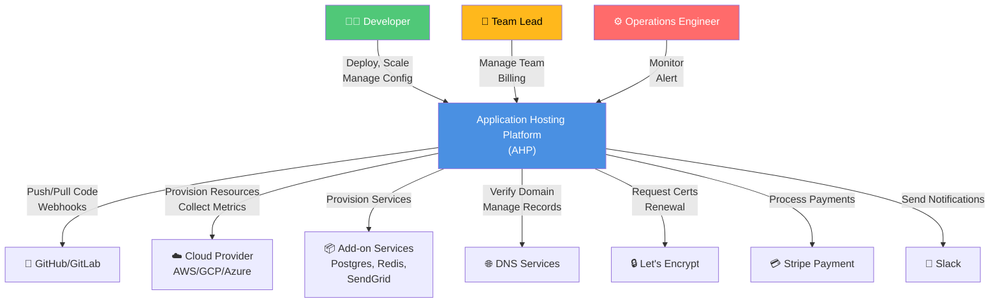
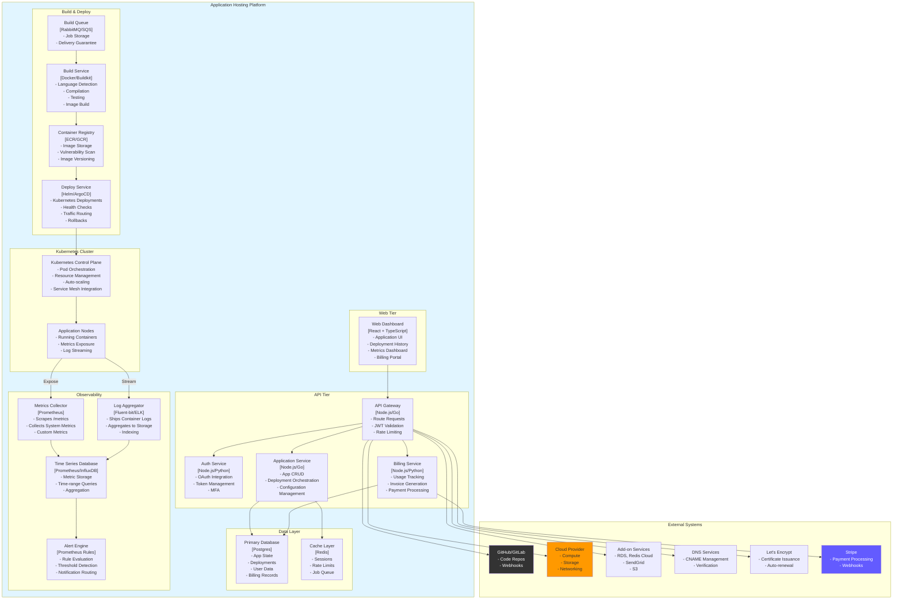
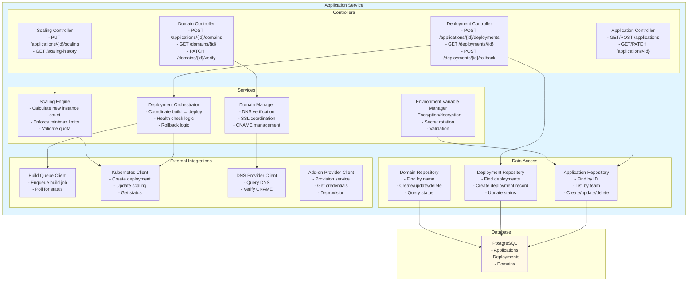

# C4 Architecture Diagrams

## Level 1: System Context Diagram

Shows Application Hosting Platform in relation to external systems and users.

## Level 2: Container Diagram

Shows major containers (services, databases, external systems) within AHP.

**Containers:**
- **Web Dashboard**: Single-page application for user interactions
- **API Gateway**: Central routing and authentication layer
- **Auth Service**: JWT and OAuth token management
- **Application Service**: Core business logic for deployments and apps
- **Billing Service**: Usage tracking and invoice generation
- **Build Queue**: Asynchronous job queue (RabbitMQ/SQS)
- **Build Service**: Language-specific compilation and image creation
- **Container Registry**: Image storage and vulnerability scanning
- **Deploy Service**: Kubernetes deployment orchestration
- **Primary Database**: Transactional data storage
- **Cache Layer**: Session and rate limit storage
- **Metrics Collector**: Prometheus-compatible metrics scraper
- **Log Aggregator**: Centralized log shipping
- **Time Series Database**: Metrics and logs storage
- **Alert Engine**: Rule evaluation and notification routing
- **Kubernetes Cluster**: Container orchestration

---

## Level 3: Component Diagram (API & Application Service)

Shows internal components of the Application Service.

---

**Document Version**: 1.0
**Last Updated**: 2024
