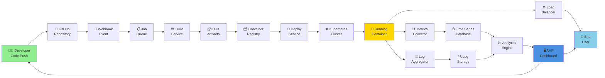
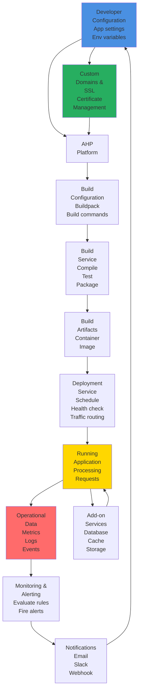
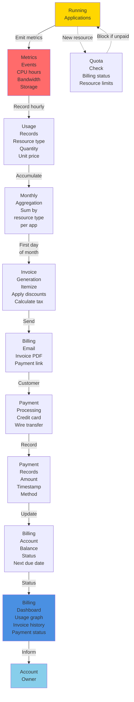
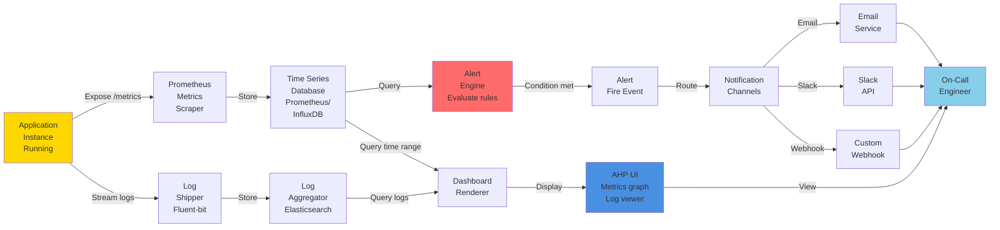

# Data Flow Diagrams

## End-to-End Data Flow: Code to Running Application

**Data Flow Steps:**
1. Developer pushes code to GitHub (commit + branch)
2. GitHub sends webhook to AHP
3. AHP enqueues build job
4. Build service clones, builds, creates image
5. Image pushed to registry (artifact storage)
6. Deploy service pulls image, creates deployment
7. Kubernetes schedules and starts container
8. Container serves traffic via load balancer
9. Running container emits metrics and logs
10. Metrics aggregated to time series DB
11. Logs aggregated to log storage
12. Dashboard queries both for visualization
13. Developer and end users access via AHP UI

---

## Application Deployment Cycle (Circular Data Flow)

**Cycles:**
1. **Configuration → Build → Deploy → Run**: Application lifecycle
2. **Run → Monitor → Notify → Adjust**: Operational feedback loop
3. **Add-ons ↔ Running App**: Bidirectional data and connection management
4. **Domains/SSL ↔ Platform**: Network-layer configuration

---

## Billing Data Flow (Usage to Invoice)

**Billing Cycle:**
1. **Hourly**: Record resource usage (CPU hours, bandwidth, storage consumed)
2. **Daily**: Accumulate usage to daily total
3. **Monthly**: Generate invoice with line items and tax
4. **Monthly**: Send invoice via email
5. **Ongoing**: Process payments
6. **Real-time**: Block new resources if account is unpaid

---

## Monitoring & Alert Data Flow

**Observation Paths:**
1. **Metrics Path**: App → Scraper → TSDB → Alert Engine & Dashboard
2. **Logs Path**: App → Shipper → Log Aggregator → Dashboard
3. **Alert Path**: Metrics → Rule Evaluation → Notification → On-Call

---

**Document Version**: 1.0
**Last Updated**: 2024
