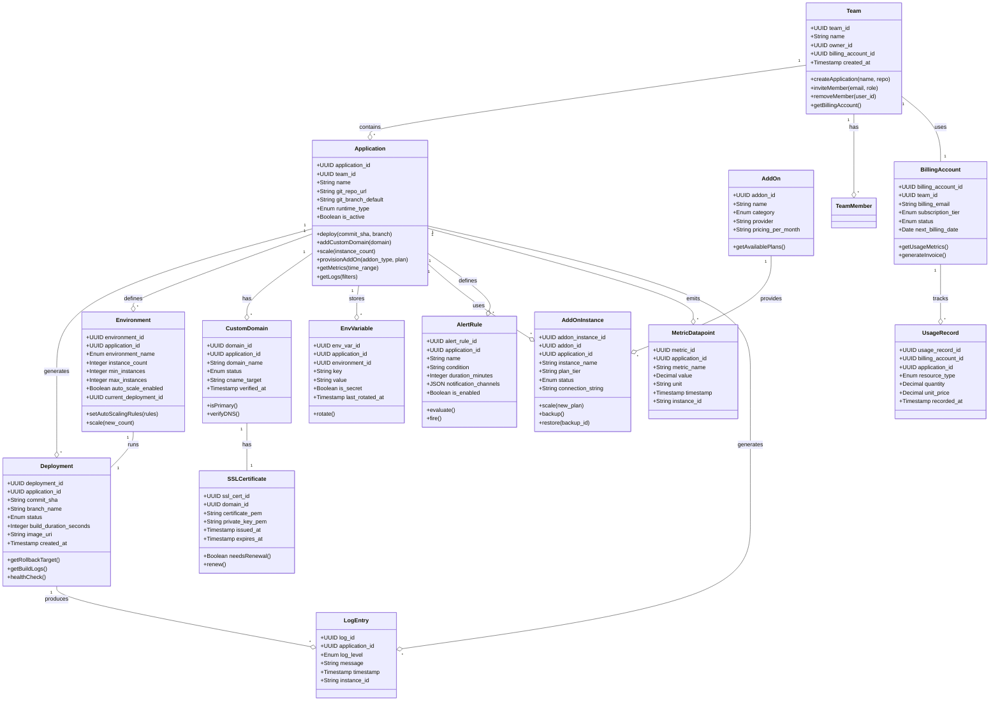

# Domain Model

The domain model represents the core business entities and their relationships in the Application Hosting Platform.

## Class Diagram

## Entity Responsibilities

### Team
- **Responsibility**: Group users and manage shared access to applications
- **State**: Name, owner, billing account
- **Behaviors**: Member management, application CRUD, billing configuration

### Application
- **Responsibility**: Represent deployable artifact; orchestrate deployments, scaling, monitoring
- **State**: Name, Git repo, current deployments, connected add-ons, custom domains
- **Behaviors**: Deploy, scale, configure domains, manage secrets, collect metrics

### Deployment
- **Responsibility**: Track specific deployment instance with full lifecycle
- **State**: Status (queued, building, deploying, running, failed), build/deploy duration, image reference
- **Behaviors**: Health check, rollback, stream logs, get metrics

### Environment
- **Responsibility**: Represent logical environment (staging, production, preview) with scaling config
- **State**: Instance count, min/max limits, current running deployment, auto-scale rules
- **Behaviors**: Manual scale, auto-scale, update rules

### CustomDomain
- **Responsibility**: Map user domain to application, track verification status
- **State**: Domain name, CNAME target, verification token, status
- **Behaviors**: Verify DNS, issue SSL cert, display status

### SSLCertificate
- **Responsibility**: Manage TLS certificate lifecycle
- **State**: Certificate PEM, private key (encrypted), issuance/expiration dates
- **Behaviors**: Check renewal needed, renew automatically, install on LB

### AddOn & AddOnInstance
- **Responsibility**: Add-on catalog and provisioned instances
- **State**: Add-on type, plan tier, status, provider ID, connection credentials
- **Behaviors**: Provision, scale, backup, restore, connect (inject env var)

### EnvVariable
- **Responsibility**: Store and manage configuration/secrets
- **State**: Key-value pair, encryption flag, source (manual/addon/system)
- **Behaviors**: Rotate (especially for add-on credentials), inject at deploy time

### MetricDatapoint & LogEntry
- **Responsibility**: Store observability data
- **State**: Metric/log value, timestamp, instance source
- **Behaviors**: Query by time range, filter by instance, aggregate

### AlertRule
- **Responsibility**: Define alerting conditions and notifications
- **State**: Condition formula, duration, notification channels, enabled status
- **Behaviors**: Evaluate metrics, fire alert, send notifications

### BillingAccount & UsageRecord
- **Responsibility**: Track resource consumption and generate invoices
- **State**: Billing tier, payment method, usage records per resource type
- **Behaviors**: Record usage hourly, generate monthly invoices, process payments

---

**Document Version**: 1.0
**Last Updated**: 2024
