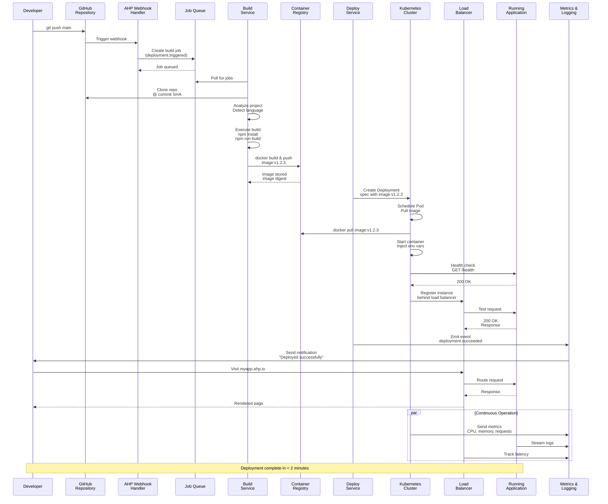
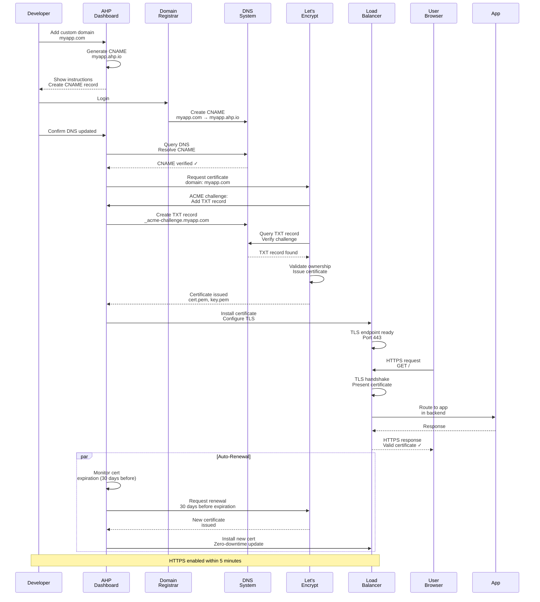
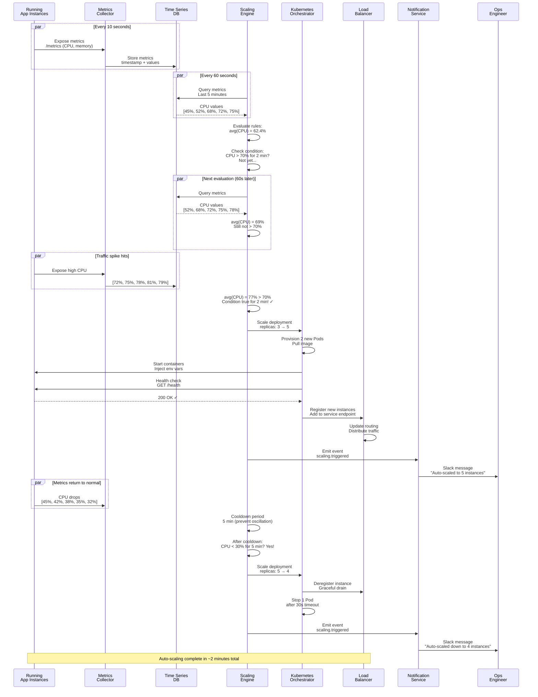

# High-Level System Design: Sequence Diagrams

## Scenario 1: Complete Deployment from Git Push to Live

This sequence shows the entire flow from a developer pushing code to the application being live and serving traffic.

**Key Decision Points:**
1. **At GitHub**: Does commit match webhook signature?
2. **At Builder**: Is language detected? Is build successful?
3. **At K8s**: Do health checks pass?
4. **At LB**: Is instance healthy? Route traffic

**Failure Paths:**
- Build fails → Keep old version running, notify developer
- Health check fails → Roll back to previous version, keep serving
- Registry unavailable → Queue retries, other deployments proceed

---

## Scenario 2: Custom Domain with SSL Certificate Provisioning

This sequence shows how a custom domain is connected and HTTPS is automatically provisioned.

**Key Verification Points:**
1. CNAME DNS propagation (poll until confirmed)
2. ACME TXT record ownership verification
3. Certificate installation on load balancer

---

## Scenario 3: Auto-Scaling Based on CPU Threshold

This sequence shows how metrics are collected, evaluated, and auto-scaling is triggered.

**Key Thresholds:**
- Metric collection: 10-second intervals
- Rule evaluation: 60-second intervals
- Duration check: N consecutive true evaluations
- Cooldown: Prevents rapid scale oscillations

---

**Document Version**: 1.0
**Last Updated**: 2024
