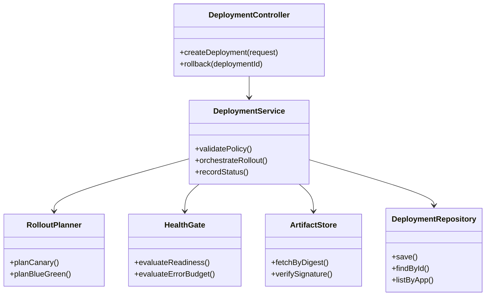
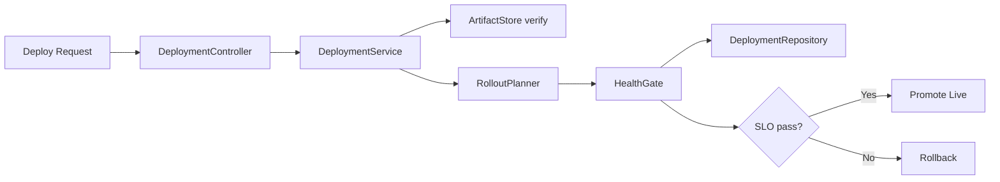

# C4 Code Diagram (Deployment Domain)

## Traceability
- Requirements: [`../requirements/requirements.md`](../requirements/requirements.md)
- High-level architecture: [`../high-level-design/c4-diagrams.md`](../high-level-design/c4-diagrams.md)
- Detailed deployment design: [`../detailed-design/deployment-engine-and-build-pipeline.md`](../detailed-design/deployment-engine-and-build-pipeline.md)
- Execution workflow: [`./implementation-guidelines.md`](./implementation-guidelines.md)

## Deployment Workflow

### Invariants
- Controller layer is policy-only; it cannot mutate cluster state directly.
- Artifact verification must succeed before rollout planning.

### Operational acceptance criteria
- Code-level architecture lint checks enforce dependency direction.
- Rollback path is covered by automated integration tests.

---

**Status**: Complete  
**Document Version**: 2.0
