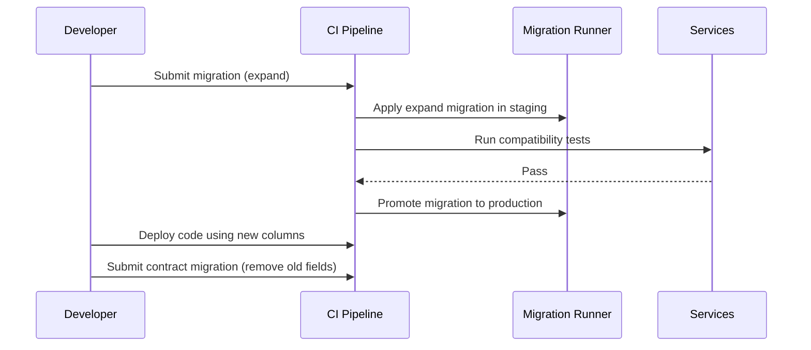
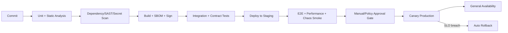

# Implementation Roadmap & Execution Policy

This document defines service/module decomposition, delivery workflow, release policy, data migration strategy, and rollback controls.

## Traceability
- Requirements baseline: [`../requirements/requirements.md`](../requirements/requirements.md)
- High-level architecture: [`../high-level-design/architecture-diagram.md`](../high-level-design/architecture-diagram.md)
- Detailed contracts: [`../detailed-design/api-design.md`](../detailed-design/api-design.md), [`../detailed-design/erd-database-schema.md`](../detailed-design/erd-database-schema.md)
- Infra dependencies: [`../infrastructure/network-infrastructure.md`](../infrastructure/network-infrastructure.md), [`../infrastructure/deployment-diagram.md`](../infrastructure/deployment-diagram.md)

## 1) Service and Module Breakdown

| Domain | Service | Core modules | Owned data |
|---|---|---|---|
| Identity | auth-service | oauth, session, mfa, audit | users, sessions |
| App lifecycle | app-service | app-config, env-vars, domain-mgmt | applications, domains |
| Build/deploy | deploy-service | build-orchestrator, rollout, rollback, health-gate | deployments, artifacts |
| Runtime mgmt | runtime-controller | scaler, quota-enforcer, scheduler-adapter | runtime policies |
| Billing/quota | billing-service | metering, invoice, usage-aggregator, budget-alerts | usage records, invoices |
| Observability | obs-gateway | logs, metrics, traces, alert-rules | alert configs |

### Invariants
- A single service owns writes for each table group; cross-service writes use APIs/events.
- Breaking changes in shared contracts require versioned endpoints and compatibility window.

### Operational acceptance criteria
- Each service has SLOs, runbooks, and on-call ownership before production readiness.

## 2) API Contracts and Versioning

```mermaid
flowchart LR
  Client[Web/CLI/API Client] --> GW[API Gateway]
  GW --> V1[/v1 stable APIs]
  GW --> V2[/v2 beta APIs]
  V1 --> APP[app-service]
  V1 --> DEP[deploy-service]
  V1 --> BIL[billing-service]
  V2 --> APP
  V2 --> DEP
```

### Contract policy
- **Semantic versioning** for APIs and SDKs.
- **Backward compatibility**: v1 endpoints supported for minimum 12 months after v2 GA.
- **Deprecation path**: announce, dual-serve, enforce migration, retire.

### Invariants
- API error model is consistent (`code`, `message`, `request_id`, `details`).
- Every write endpoint supports idempotency keys.

### Operational acceptance criteria
- Contract tests must pass against both current and previous minor versions.

## 3) Data Schema Evolution and Migration Workflow



### Strategy
- Use **expand-contract** pattern for zero-downtime migrations.
- Avoid destructive DDL in same release as application code dependency.
- Backfill jobs are resumable and throttled.

### Invariants
- No release may require a lock-heavy migration during peak hours.
- Schema version is recorded in deployment metadata for traceability.

### Operational acceptance criteria
- Migration rehearsals succeed in production-like staging datasets.
- Roll-forward and roll-backward procedures validated before production promotion.

## 4) Release, Promotion, and Rollback Policy

### Release/versioning
- Service artifacts use `MAJOR.MINOR.PATCH+buildmetadata`.
- Container images are immutable by digest; mutable tags are forbidden in production manifests.
- Release train cadence: weekly minor, emergency patch on-demand.

### Rollback strategy
- Primary strategy: progressive rollout with automatic halt on error budget burn.
- Secondary strategy: fast traffic rollback to previous stable revision.
- Data rollback: forward-fix preferred; restore snapshots only under incident commander approval.

### Invariants
- Rollback must be executable without rebuilding artifacts.
- Rollout controller always keeps at least one known-good revision.

### Operational acceptance criteria
- Every production release includes proven rollback command sequence.
- Mean time to rollback (MTTRb) is < 10 minutes for stateless services.

## 5) CI/CD Stages, Quality Gates, and Artifact Promotion Rules



### Quality gates
- Lint/test coverage thresholds (minimum 80% critical-path coverage).
- Security scan: no critical vulnerabilities, no leaked secrets.
- Contract test gate: zero breaking changes unless new major version.
- Performance gate: p95 latency regression ≤ 10% vs baseline.

### Artifact promotion rules
- Promote by **digest** only, never by branch name/tag alias.
- Stage-to-prod promotion requires unchanged digest and signed provenance.
- Rollback may only target artifacts previously promoted to production.

### Invariants
- Production deploys come only from the controlled promotion pipeline.
- Manual hotfixes require incident ticket and retroactive pipeline attestation.

### Operational acceptance criteria
- Audit log can reconstruct who approved every production artifact.
- Pipeline SLO: median lead time commit-to-prod < 60 minutes for standard changes.

---

**Status**: Complete  
**Document Version**: 2.0

## Cross-Phase Traceability Links
- Requirements baseline: [`../requirements/requirements.md`](../requirements/requirements.md)
- Architecture baseline: [`../high-level-design/architecture-diagram.md`](../high-level-design/architecture-diagram.md)
- Detailed design inputs: [`../detailed-design/component-diagrams.md`](../detailed-design/component-diagrams.md), [`../detailed-design/api-design.md`](../detailed-design/api-design.md)

