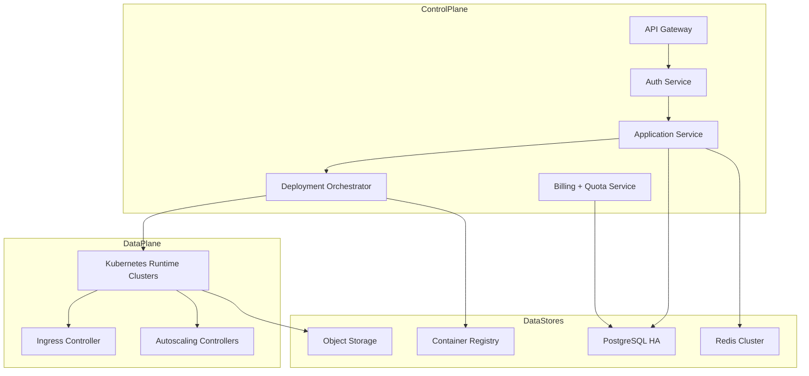

# Cloud Native Architecture

Production architecture for control plane, data plane, and platform services.

## Traceability
- Requirements baseline: [`../requirements/requirements.md`](../requirements/requirements.md)
- High-level architecture: [`../high-level-design/architecture-diagram.md`](../high-level-design/architecture-diagram.md)
- Detailed components: [`../detailed-design/component-diagrams.md`](../detailed-design/component-diagrams.md)
- Implementation controls: [`../implementation/implementation-guidelines.md`](../implementation/implementation-guidelines.md)

## Service Topology

### Invariants
- Control plane failure must not immediately terminate customer workloads.
- Deploy orchestration is idempotent by deployment_id and target_revision.

### Operational acceptance criteria
- Control plane can sustain one service outage without violating 99.9% API availability.
- Data plane node loss in one AZ does not reduce healthy capacity below configured minimum replica count.

## Platform Security Layers
- Identity: SSO/OIDC + workload identity for service accounts.
- Network: private clusters, policy-based east-west segmentation, encrypted intra-cluster traffic.
- Supply chain: signed container artifacts, vulnerability gating in CI and promotion.
- Runtime: admission controls reject privileged containers and mutable tags.

## Shared Services
- **Configuration management**: GitOps-managed manifests and environment overlays.
- **Feature flags**: progressive delivery controls for risky features.
- **Cost controls**: per-tenant quotas and budget alert policies.

---

**Status**: Complete  
**Document Version**: 2.0
