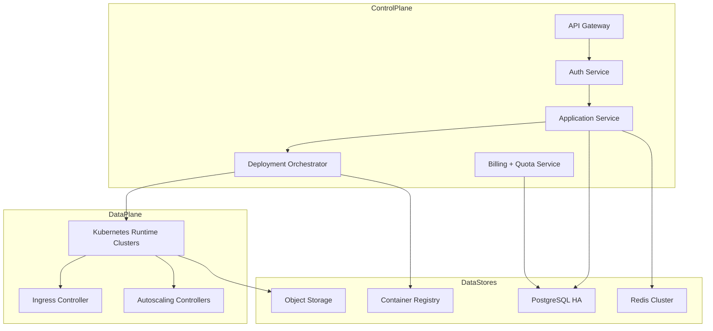
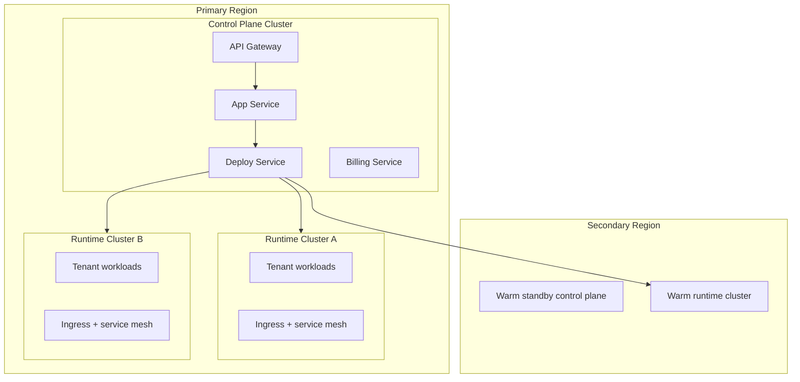

# Cloud Native Architecture

Production architecture for control plane, data plane, and platform services.

## Traceability
- Requirements baseline: [`../requirements/requirements.md`](../requirements/requirements.md)
- High-level architecture: [`../high-level-design/architecture-diagram.md`](../high-level-design/architecture-diagram.md)
- Detailed components: [`../detailed-design/component-diagrams.md`](../detailed-design/component-diagrams.md)
- Implementation controls: [`../implementation/implementation-guidelines.md`](../implementation/implementation-guidelines.md)

## Service Topology

## Control Plane and Data Plane Separation

| Plane | Core responsibilities | Failure impact | Isolation strategy |
|---|---|---|---|
| Control plane | auth, app metadata, builds, deploy orchestration, billing, API/UI | new changes may pause; existing workloads should continue | separate clusters/namespaces, independent autoscaling, dedicated database path |
| Data plane | running customer applications, ingress, service mesh, autoscaling | customer traffic affected if unhealthy | per-region runtime clusters, tenant quotas, workload isolation policies |
| Shared platform services | registry, object storage, observability, secrets | both planes degrade if unavailable | multi-AZ managed services with strict access boundaries |

### Invariants
- Control plane failure must not immediately terminate customer workloads.
- Deploy orchestration is idempotent by deployment_id and target_revision.

### Operational acceptance criteria
- Control plane can sustain one service outage without violating 99.9% API availability.
- Data plane node loss in one AZ does not reduce healthy capacity below configured minimum replica count.

## Regional and Cluster Layout

### Placement strategy
- Small tenants are bin-packed by workload class and isolation tier.
- Enterprise or regulated tenants may receive dedicated namespaces, node pools, or full clusters.
- Background workers and build workers use separate pools from latency-sensitive ingress workloads.

## Platform Security Layers
- Identity: SSO/OIDC + workload identity for service accounts.
- Network: private clusters, policy-based east-west segmentation, encrypted intra-cluster traffic.
- Supply chain: signed container artifacts, vulnerability gating in CI and promotion.
- Runtime: admission controls reject privileged containers and mutable tags.

## Storage and Data Services

| Data store | Purpose | Availability model | Key protection controls |
|---|---|---|---|
| PostgreSQL HA | metadata, app config, domains, deployment state, billing records | multi-AZ writer + replicas | PITR, schema migration controls, fenced failover |
| Redis Cluster | session cache, short-lived rollout coordination, rate limits | replicated shards | eviction policy controls, tenant-aware key prefixes |
| Object Storage | build artifacts, logs, backups, SBOMs | regional with cross-region replication | immutable buckets for compliance artifacts |
| Container Registry | promoted images by digest | regional primary + mirror | signed pushes only, retention with rollback exceptions |

## Autoscaling and Capacity Model

- Control plane services scale on request rate, queue depth, and p95 latency.
- Runtime clusters scale on aggregate pod pressure, node saturation, and reserved tenant headroom.
- Build-worker pools scale independently based on queued builds and expected runtime mix.
- Reserved emergency capacity is held for rollback, failover, and high-priority enterprise tenants.

## Tenancy and Isolation Model

1. **Application isolation**: each app deployment runs in its own namespace or namespace partition with scoped service accounts.
2. **Network isolation**: default-deny policies prevent direct cross-tenant pod communication.
3. **Secret isolation**: secret references are resolved per environment and tenant boundary.
4. **Billing isolation**: usage meters record tenant, app, environment, and resource class for every billable action.

## Shared Services
- **Configuration management**: GitOps-managed manifests and environment overlays.
- **Feature flags**: progressive delivery controls for risky features.
- **Cost controls**: per-tenant quotas and budget alert policies.

## Resilience and DR Expectations

- Secondary region maintains warm capacity for control plane APIs and critical tenant workloads.
- Metadata backups are encrypted, immutable, and tested through restore rehearsals.
- Control plane services degrade to read-only or support mode where possible instead of failing unpredictably.
- Region failover prioritizes domain routing, metadata recovery, and restoration of rollback-eligible revisions.

---

**Status**: Complete  
**Document Version**: 2.1
