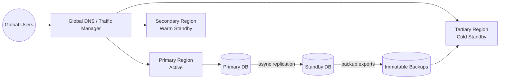
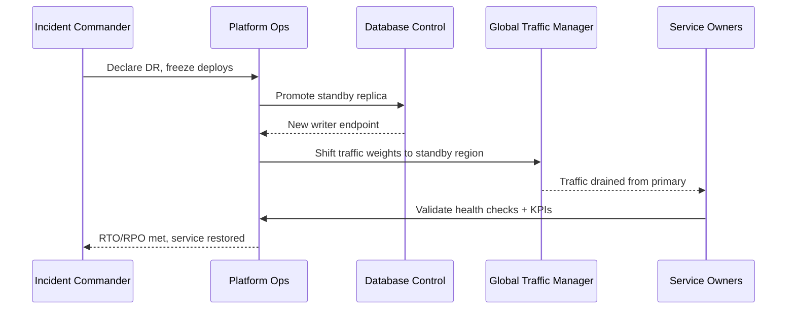

# Multi-Region Deployment Topology

Defines failure domains, regional placement, and disaster recovery runbook targets.

## Traceability
- Requirements baseline: [`../requirements/requirements.md`](../requirements/requirements.md)
- High-level architecture: [`../high-level-design/architecture-diagram.md`](../high-level-design/architecture-diagram.md)
- Detailed deployment behavior: [`../detailed-design/sequence-diagrams.md`](../detailed-design/sequence-diagrams.md)
- Execution policy: [`../implementation/implementation-guidelines.md`](../implementation/implementation-guidelines.md)

## Failure-Domain Mapping (AZ/Region)

| Domain | Role | Services | Failure Impact | Mitigation |
|---|---|---|---|---|
| AZ-a / AZ-b / AZ-c in primary region | Active-active | Runtime, ingress, cache replicas, DB writer+replicas | Single AZ loss | Cross-AZ load balancing + quorum-aware DB failover |
| Secondary region | Warm standby | Runtime baseline capacity, DB async replica, registry mirror | Primary region outage | DNS/traffic manager failover to standby |
| Tertiary region | Cold standby | IaC-defined environment, backup restore only | Dual-region disaster | Restore-from-backup + controlled scale-up |

## Regional Routing and Failover

### Invariants
- No single AZ outage causes total regional unavailability.
- Standby region lag alarm threshold: replication lag < 60 seconds under normal operations.

### Operational acceptance criteria
- Quarterly game-day validates regional failover within target RTO.
- Monthly AZ evacuation drill proves zero data corruption and controlled recovery.

## Disaster Recovery Runbook

### DR objectives
- **RTO** (region-level): **45 minutes**
- **RPO** (metadata and control-plane state): **≤ 5 minutes**
- **RTO** (single-AZ event): **15 minutes**
- **RPO** (single-AZ event): **0-1 minute**

### Trigger conditions
- Regional control-plane API SLO violation > 15 minutes.
- Data-store unavailability with no safe in-region recovery path.
- Security event requiring full-region isolation.

### Procedure
1. Incident commander declares DR event and freezes non-essential deploys.
2. Promote secondary database replica to writer; rotate connection endpoints.
3. Flip global traffic manager weights to standby region.
4. Rehydrate queues/caches from persistent state and replay idempotent events.
5. Validate synthetic checks, business KPIs, and tenant traffic health.
6. Announce recovery and begin root-cause + region restoration plan.

### DR acceptance criteria
- Runbook rehearsal evidence retained for every quarter.
- Post-DR checksum validation confirms no schema drift and no orphaned jobs.
- Customer-facing status page updated within 10 minutes of declaration.

---

**Status**: Complete  
**Document Version**: 2.0
