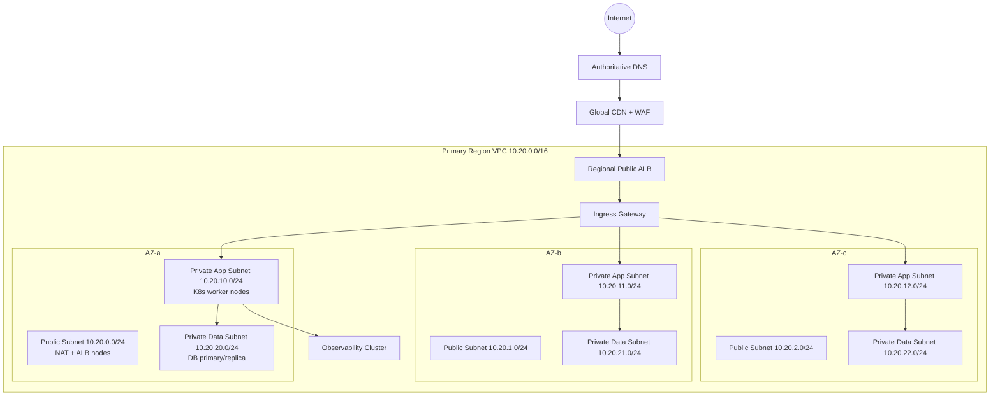
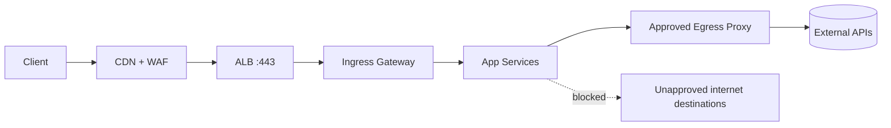
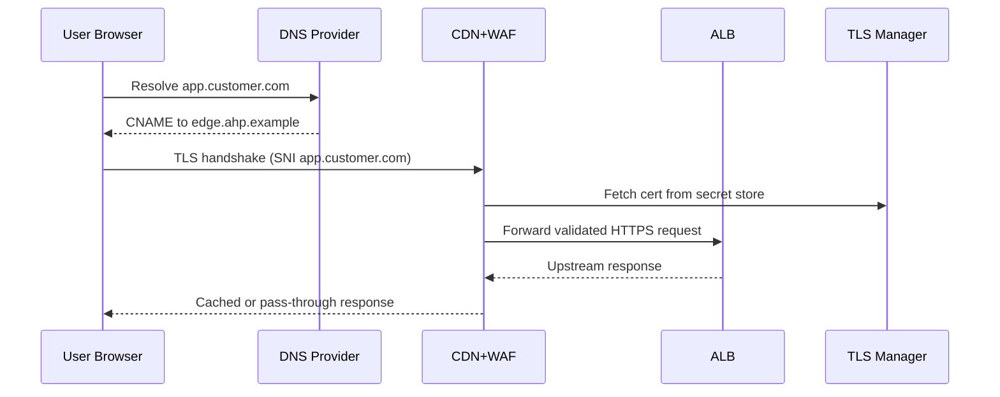
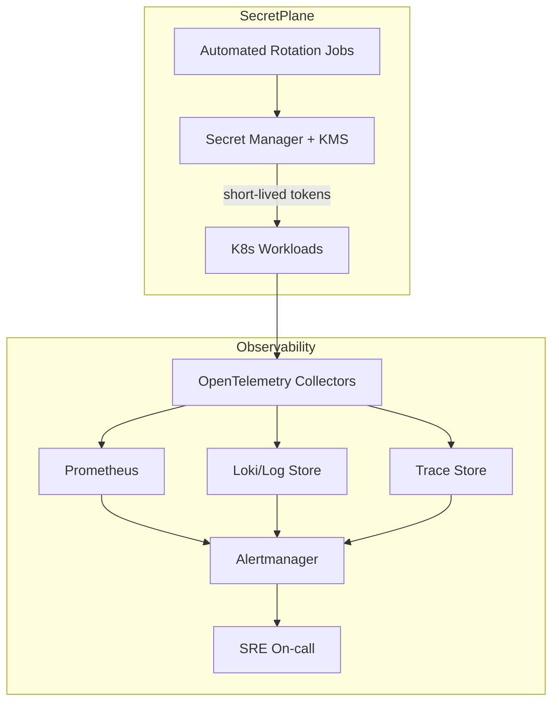

# Network Infrastructure & Security

This document defines the production network topology, ingress/egress policy, edge security, TLS lifecycle, secret-management boundaries, and observability data paths.

## Traceability
- Requirements baseline: [`../requirements/requirements.md`](../requirements/requirements.md)
- Architecture context: [`../high-level-design/architecture-diagram.md`](../high-level-design/architecture-diagram.md)
- Component contracts: [`../detailed-design/component-diagrams.md`](../detailed-design/component-diagrams.md)
- Execution policy: [`../implementation/implementation-guidelines.md`](../implementation/implementation-guidelines.md)

## 1) VPC and Subnet Layout

### Invariants
- No workload pod gets a public IP.
- Data subnets accept only app-tier security-group traffic on approved ports.
- Ingress is centralized through CDN/WAF and regional ALB; direct node ingress is denied.

### Operational acceptance criteria
- NACL/security-group regression tests pass before change approval.
- Quarterly network reachability tests prove denied east-west paths remain denied.
- Drift detection reconciles all subnet route tables within 15 minutes.

## 2) Ingress and Egress Policy

### Policy controls
- **Ingress allowlist**: 443/TCP only, with WAF managed rules + custom tenant signatures.
- **mTLS internal traffic**: service mesh enforces mTLS for service-to-service calls.
- **Egress control**: default deny; explicit allow via egress proxy + DNS policy.
- **Admin access**: SSO + short-lived privileged sessions through bastionless access proxy.

### Invariants
- Default-deny egress and east-west traffic for all namespaces.
- Every cross-service request carries tenant and trace identity headers.

### Operational acceptance criteria
- Daily WAF signature update job completes with zero stale rule packs.
- Monthly egress audit shows 100% destination coverage by approved policy IDs.

## 3) WAF/CDN Path, DNS, and TLS Lifecycle

### TLS lifecycle
1. Domain verification via TXT/CNAME challenge.
2. ACME issuance and keypair generation in managed KMS/HSM.
3. Certificate + private key stored in secret manager (versioned).
4. Auto-renew at T-30 days; deploy at edge via zero-downtime rotation.
5. Expiry SLO: no certificate under 14-day lifetime without active renewal ticket.

### Invariants
- Private keys are non-exportable from managed key boundary.
- DNS, certificate, and edge configuration changes are fully audited.

### Operational acceptance criteria
- Synthetic HTTPS checks pass from at least 6 global probes every minute.
- Renewal failure raises page within 5 minutes and opens an incident automatically.

## 4) Secret Management and Observability Stack

### Invariants
- Secrets are consumed via workload identity; static long-lived credentials are prohibited.
- Metrics/log/trace streams include tenant_id and deployment_id labels.

### Operational acceptance criteria
- 100% of production secrets rotate at or before policy TTL.
- Golden signals (latency, traffic, errors, saturation) available within 60 seconds.

---

**Status**: Complete  
**Document Version**: 2.0
