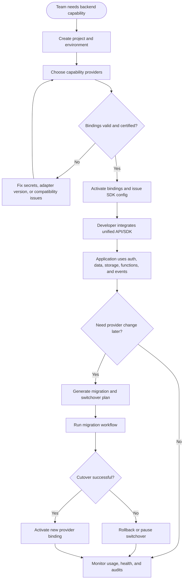

# Activity Diagram - Backend as a Service Platform

## Project Setup to Provider Switchover Flow

```mermaid
flowchart TD
    start([Team needs backend capability]) --> create[Create project and environment]
    create --> choose[Choose capability providers]
    choose --> validate{Bindings valid and certified?}
    validate -- No --> fix[Fix secrets, adapter version, or compatibility issues]
    fix --> choose
    validate -- Yes --> activate[Activate bindings and issue SDK config]
    activate --> build[Developer integrates unified API/SDK]
    build --> run[Application uses auth, data, storage, functions, and events]
    run --> change{Need provider change later?}
    change -- No --> monitor[Monitor usage, health, and audits]
    change -- Yes --> plan[Generate migration and switchover plan]
    plan --> migrate[Run migration workflow]
    migrate --> cutover{Cutover successful?}
    cutover -- No --> rollback[Rollback or pause switchover]
    rollback --> monitor
    cutover -- Yes --> activate2[Activate new provider binding]
    activate2 --> monitor
```
