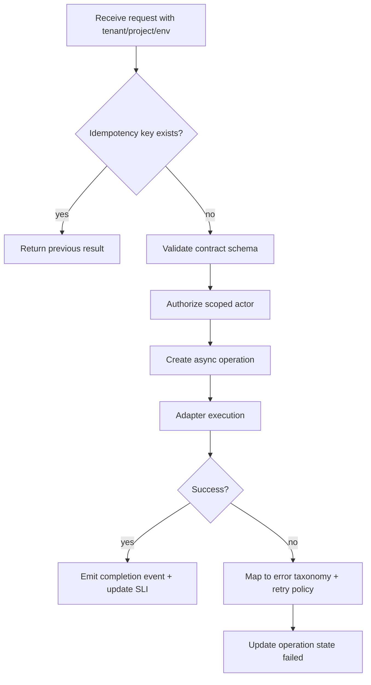

# Activity Diagram - Backend as a Service Platform

## Project Setup to Provider Switchover Flow

```mermaid
flowchart TD
    start([Team needs backend capability]) --> create[Create project and environment]
    create --> choose[Choose capability providers]
    choose --> validate{Bindings valid and certified?}
    validate -- No --> fix[Fix secrets, adapter version, or compatibility issues]
    fix --> choose
    validate -- Yes --> activate[Activate bindings and issue SDK config]
    activate --> build[Developer integrates unified API/SDK]
    build --> run[Application uses auth, data, storage, functions, and events]
    run --> change{Need provider change later?}
    change -- No --> monitor[Monitor usage, health, and audits]
    change -- Yes --> plan[Generate migration and switchover plan]
    plan --> migrate[Run migration workflow]
    migrate --> cutover{Cutover successful?}
    cutover -- No --> rollback[Rollback or pause switchover]
    rollback --> monitor
    cutover -- Yes --> activate2[Activate new provider binding]
    activate2 --> monitor
```

## Expanded Activity Flow (Provision + Bind + Verify)

```mermaid
flowchart TD
    A[Receive request with tenant/project/env] --> B{Idempotency key exists?}
    B -- yes --> C[Return previous result]
    B -- no --> D[Validate contract schema]
    D --> E[Authorize scoped actor]
    E --> F[Create async operation]
    F --> G[Adapter execution]
    G --> H{Success?}
    H -- yes --> I[Emit completion event + update SLI]
    H -- no --> J[Map to error taxonomy + retry policy]
    J --> K[Update operation state failed]
```
