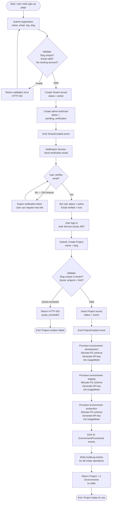
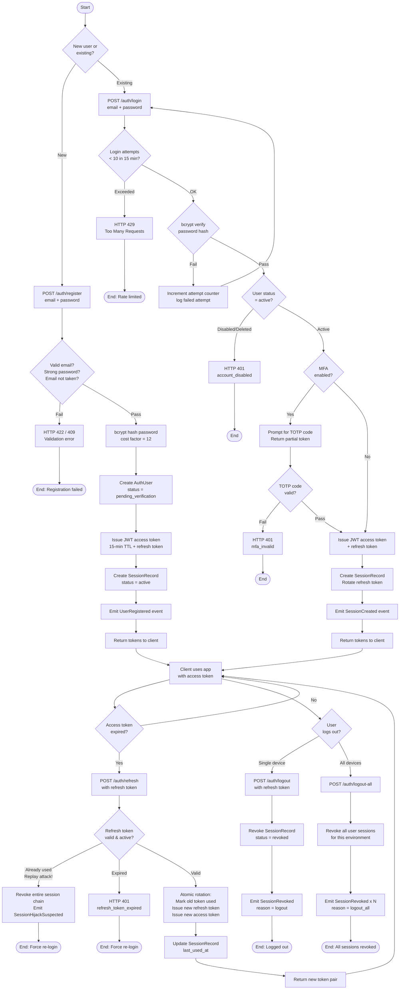

# Activity Diagrams — Backend as a Service (BaaS) Platform

**Version:** 1.0  
**Status:** Approved  
**Last Updated:** 2025-01-01  

---

## 1. Tenant Onboarding and Project Provisioning

This diagram shows the end-to-end flow from a new user signing up to a fully provisioned project with three environments.

---

## 2. Auth Session Lifecycle

This diagram covers the complete lifecycle: registration → login → token refresh → session revocation.

---

## 3. Schema Migration Promotion (Dev → Staging → Prod)

This diagram shows the lifecycle of a database migration from creation to production deployment.

```mermaid
flowchart TD
    Start([Start: Developer creates migration]) --> UploadMig[Upload migration:\nup.sql + down.sql\nversion tag + description]
    UploadMig --> ValidateSQL{Validate SQL\nsyntax for both\nup and down scripts?}
    ValidateSQL -->|Invalid| SQLError[HTTP 422\nInvalid SQL syntax\nReturn error details]
    SQLError --> End1([End: Migration rejected])
    ValidateSQL -->|Valid| CheckDestructive{Contains\ndestructive operations?\nDROP COLUMN / DROP TABLE?}
    CheckDestructive -->|Yes| RequireFlag{destructive_acknowledged\nflag = true?}
    RequireFlag -->|No| DestructiveError[HTTP 422\nDestructive migration requires\nexplicit acknowledgement]
    DestructiveError --> End2([End])
    RequireFlag -->|Yes| CreateMigration
    CheckDestructive -->|No| CreateMigration[Create MigrationRecord\nstatus = pending\nEmit MigrationQueued event]

    %% Apply to Development
    CreateMigration --> ApplyDev[Apply migration to\nDEVELOPMENT environment]
    ApplyDev --> ExecUpDev{Execute\nup.sql in dev PG\nschema?}
    ExecUpDev -->|Error| DevFail[Mark migration failed\nStore error details\nEmit MigrationFailed]
    DevFail --> End3([End: Fix migration and re-upload])
    ExecUpDev -->|Success| DevApplied[Mark migration applied in DEV\nEmit MigrationApplied\nenvironment=development]

    %% Promote to Staging
    DevApplied --> DevTests{Run automated\ntests against\ndev schema?}
    DevTests -->|Fail| TestFail[Block staging promotion\nNotify developer]
    TestFail --> DevTests
    DevTests -->|Pass| RequestStaging[Developer requests\npromotion to STAGING]
    RequestStaging --> ApplyStaging[Apply migration to\nSTAGING environment]
    ApplyStaging --> ExecUpStaging{Execute\nup.sql in staging\nPG schema?}
    ExecUpStaging -->|Error| StagingFail[Mark migration failed in staging\nEmit MigrationFailed]
    StagingFail --> End4([End: Migration must be fixed])
    ExecUpStaging -->|Success| StagingApplied[Mark migration applied in STAGING\nEmit MigrationApplied\nenvironment=staging]

    %% Gate check for Production
    StagingApplied --> StagingTests{Automated\ntests pass in staging?}
    StagingTests -->|Fail| BlockProd[Block production promotion\nNotify developer]
    BlockProd --> End5([End: Fix tests])
    StagingTests -->|Pass| RequestApproval[Developer submits\nproduction promotion request]
    RequestApproval --> ApproverReview{Authorized approver\nreviews and approves?}
    ApproverReview -->|Denied| DeniedEnd([End: Promotion denied])
    ApproverReview -->|Approved| GateCheck{All promotion gates\npassed?\nStaging applied + tests + approver}
    GateCheck -->|No| GateFail[HTTP 409\nReturn failed gate details]
    GateFail --> End6([End])
    GateCheck -->|Yes| ApplyProd[Apply migration to\nPRODUCTION environment]
    ApplyProd --> ExecUpProd{Execute up.sql\nin production\nPG schema?}
    ExecUpProd -->|Error| ProdFail[CRITICAL: Migration failed in prod\nAlert on-call team\nEmit MigrationFailed]
    ProdFail --> Rollback[Execute down.sql\nto roll back]
    Rollback --> End7([End: Rollback applied — investigate])
    ExecUpProd -->|Success| ProdApplied[Mark migration applied in PROD\nEmit MigrationApplied\nenvironment=production]
    ProdApplied --> WriteAudit[Write Audit Log entry\nfor production migration]
    WriteAudit --> End8([End: Migration successfully promoted])
```

---

## 4. Function Deployment and Invocation

This diagram covers function creation, deployment via the provider adapter, and both HTTP-triggered and cron-scheduled invocation paths.

```mermaid
flowchart TD
    Start([Start: Developer deploys function]) --> SubmitFn[POST /functions\nZIP artifact + runtime + triggers\n+ secret env var mappings]
    SubmitFn --> ValidateFn{Valid runtime?\nArtifact ≤ 250MB?\nTrigger config valid?}
    ValidateFn -->|Invalid| FnError[HTTP 422\nValidation error]
    FnError --> End1([End])
    ValidateFn -->|Valid| StoreArtifact[Store ZIP in internal\nartifact storage\nCompute SHA-256 checksum]
    StoreArtifact --> InsertFnDef[Create FunctionDefinition\nstatus = deploying]
    InsertFnDef --> EmitDeployed[Emit FunctionDeployed event]
    EmitDeployed --> ProviderDeploy[Provider Adapter receives event\nDeploys to Lambda / Cloud Functions\nConfigures memory, timeout]
    ProviderDeploy --> DeployResult{Provider\ndeployment\nsuccessful?}
    DeployResult -->|Fail| DeployFail[Set status = error\nNotify developer\nEmit DeploymentFailed]
    DeployFail --> End2([End: Fix and redeploy])
    DeployResult -->|Success| SetActive[Set FunctionDefinition\nstatus = active]
    SetActive --> Ready([Function ready for invocation])

    %% HTTP Invocation Path
    Ready --> InvokeHTTP{Invocation\ntrigger?}
    InvokeHTTP -->|HTTP request| CheckConc{Check concurrency\nsemaphore in Redis\nCount < max_concurrency?}
    CheckConc -->|Exceeded - queue mode| EnqueueInvoke[Enqueue invocation\nwait up to 60s]
    CheckConc -->|Exceeded - reject mode| RejectHTTP[HTTP 429\nconcurrency_limit_exceeded]
    RejectHTTP --> End3([End])
    EnqueueInvoke --> CheckConc
    CheckConc -->|OK| IncrSemaphore[Increment semaphore\nCreate ExecutionRecord\nstatus = queued]
    IncrSemaphore --> EmitTriggered[Emit ExecutionTriggered\ntrigger_type = http]

    %% Cron Invocation Path
    InvokeHTTP -->|Cron schedule fires| CronTrigger[Scheduler emits\nCronScheduleTriggered\nwith idempotency_key]
    CronTrigger --> DedupeCheck{idempotency_key\nalready exists for\nthis function?}
    DedupeCheck -->|Duplicate| DropDuplicate[Drop duplicate invocation\nLog deduplication]
    DropDuplicate --> End4([End: Deduplicated])
    DedupeCheck -->|New| IncrSemaphore

    %% Worker Execution
    EmitTriggered --> WorkerPickup[Worker picks up ExecutionRecord\nSet status = running\nSet started_at]
    WorkerPickup --> ResolveSecrets{Resolve all\nSecretRefs to\nactual values}
    ResolveSecrets -->|Resolution fails| SecretFail[Set status = failed\nerror_code = secret_resolution_failed\nDecrement semaphore\nEmit ExecutionFailed]
    SecretFail --> End5([End])
    ResolveSecrets -->|OK| SetEnvVars[Build execution environment\nwith resolved secrets + static vars]
    SetEnvVars --> StartTimer[Start timeout timer\nT = timeout_seconds]
    StartTimer --> RunFunction[Execute function in provider\nCapture stdout/stderr stream]

    %% Execution outcomes
    RunFunction --> ExecOutcome{Execution\noutcome?}
    ExecOutcome -->|Completes before timeout| StoreOutput[Set status = completed\nduration_ms, exit_code, response_status\nDecrement semaphore]
    StoreOutput --> UploadLogs[Upload logs to object storage\nSet log_storage_key in record]
    UploadLogs --> EmitCompleted[Emit ExecutionCompleted]
    EmitCompleted --> IncrUsage[Increment UsageMeter:\nfunction_invocations + 1\ncompute_minutes += duration]
    IncrUsage --> End6([End: Execution successful])

    ExecOutcome -->|Timeout| SigTerm[SIGTERM the process\nWait 5 seconds]
    SigTerm --> StillRunning{Process\nstill running?}
    StillRunning -->|Yes| SigKill[SIGKILL process]
    StillRunning -->|No| TimeoutRecord
    SigKill --> TimeoutRecord[Set status = timeout\nerror_code = execution_timeout\nDecrement semaphore]
    TimeoutRecord --> EmitTimeout[Emit ExecutionFailed\nstatus = timeout]
    EmitTimeout --> End7([End: HTTP 504 returned to caller])

    ExecOutcome -->|Process error| FailRecord[Set status = failed\nexit_code, error_message\nDecrement semaphore]
    FailRecord --> EmitFailed[Emit ExecutionFailed]
    EmitFailed --> End8([End: HTTP 502 returned to caller])
```

---

## 5. Provider Switchover and Rollback

This diagram covers the full orchestration of a provider switchover including safety gates, data copy, and rollback paths.

```mermaid
flowchart TD
    Start([Start: Owner creates SwitchoverPlan]) --> CreatePlan[Create SwitchoverPlan\nstatus = draft\nsource + target bindings]
    CreatePlan --> ValidatePlan{Both bindings\nactive?\nSame capability?}
    ValidatePlan -->|Invalid| PlanError[HTTP 422\nValidation error]
    PlanError --> End1([End])
    ValidatePlan -->|Valid| PlanDraft[Plan in DRAFT state]

    PlanDraft --> OwnerReady[Owner advances to READY\nPATCH status=ready]
    OwnerReady --> PreflightGates[Run safety gates\nin parallel]

    PreflightGates --> QuiesceCheck{Gate 1: Quiesce\nNo in-flight ops on\nsource provider?}
    PreflightGates --> ConnCheck{Gate 2: Target\nconnectivity check\npasses?}

    QuiesceCheck -->|In-flight ops present| WaitQuiesce[Wait up to 5 minutes\nfor ops to drain]
    WaitQuiesce --> QuiesceTimeout{Quiesced\nwithin 5 min?}
    QuiesceTimeout -->|No| AbortPlan[Abort plan\nNotify owner\nReturn to READY]
    AbortPlan --> End2([End: Retry when traffic is lower])
    QuiesceTimeout -->|Yes| QuiesceOK[Gate 1: PASS]
    QuiesceCheck -->|No in-flight ops| QuiesceOK

    ConnCheck -->|Fails| ConnFail[Gate 2: FAIL\nAbort plan]
    ConnFail --> End3([End: Fix target binding])
    ConnCheck -->|Passes| ConnOK[Gate 2: PASS]

    QuiesceOK --> AllGatesPassed{All gates\npassed?}
    ConnOK --> AllGatesPassed
    AllGatesPassed -->|No| GateFail[HTTP 423\nSafety gate failed]
    GateFail --> End4([End])
    AllGatesPassed -->|Yes| StartExecution[Transition to IN_PROGRESS\nEmit SwitchoverStarted]

    StartExecution --> WriteThroughMode[Enable write-through:\nNew writes go to BOTH\nsource and target providers]
    WriteThroughMode --> CopyData[Copy all existing objects\nfrom source to target\nUpdate progress_pct every 30s]
    CopyData --> CopyComplete{Copy\ncompleted\nsuccessfully?}
    CopyComplete -->|Provider unreachable| PauseSwitch[Pause switchover\nEmit SwitchoverPaused]
    PauseSwitch --> WaitRestore{Connectivity\nrestored within\n1 hour?}
    WaitRestore -->|No| AutoRollback
    WaitRestore -->|Yes| CopyData

    CopyComplete -->|Success| ComputeChecksum[Compute SHA-256 checksum\nof ALL objects on source]
    ComputeChecksum --> ComputeTargetChecksum[Compute SHA-256 checksum\nof ALL objects on target]
    ComputeTargetChecksum --> ChecksumMatch{Source checksum\n== Target checksum?}
    ChecksumMatch -->|Mismatch| AutoRollback[Trigger automatic rollback\nrollback_reason = checksum_mismatch]

    %% Completion path
    ChecksumMatch -->|Match| PromoteTarget[Set target as PRIMARY\nDemote source to SECONDARY\nWrite-through disabled]
    PromoteTarget --> UpdateBindings[Update CapabilityBinding\nrecords atomically]
    UpdateBindings --> SetCompleted[Plan status = COMPLETED\nEmit SwitchoverCompleted]
    SetCompleted --> GracePeriod[24-hour grace period\nSource provider available\nas read-only fallback]
    GracePeriod --> OwnerDeactivate[Owner may deactivate\nsource binding after grace period]
    OwnerDeactivate --> WriteAudit[Write Audit Log entries]
    WriteAudit --> End5([End: Switchover complete])

    %% Rollback path
    AutoRollback --> RestoreSource[Restore source as PRIMARY\nDisable write-through to target]
    RestoreSource --> SetRolledBack[Plan status = ROLLED_BACK\nEmit SwitchoverRolledBack]
    SetRolledBack --> NotifyOwner[Notify owner\nwith rollback reason]
    NotifyOwner --> End6([End: Rolled back — source provider active])

    %% Manual rollback
    StartExecution --> ManualAbort{Owner requests\nmanual rollback?}
    ManualAbort -->|Yes| ManualRollback[PATCH status=rolled_back\nwith reason]
    ManualRollback --> RestoreSource
    ManualAbort -->|No| CopyData
```

