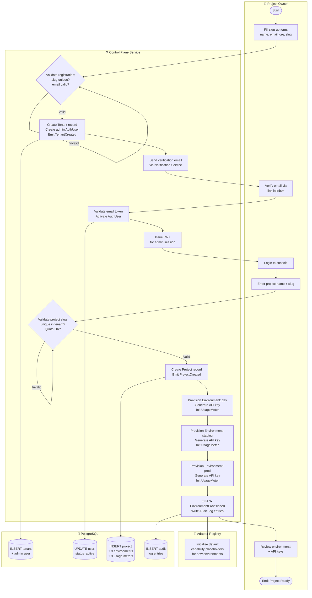
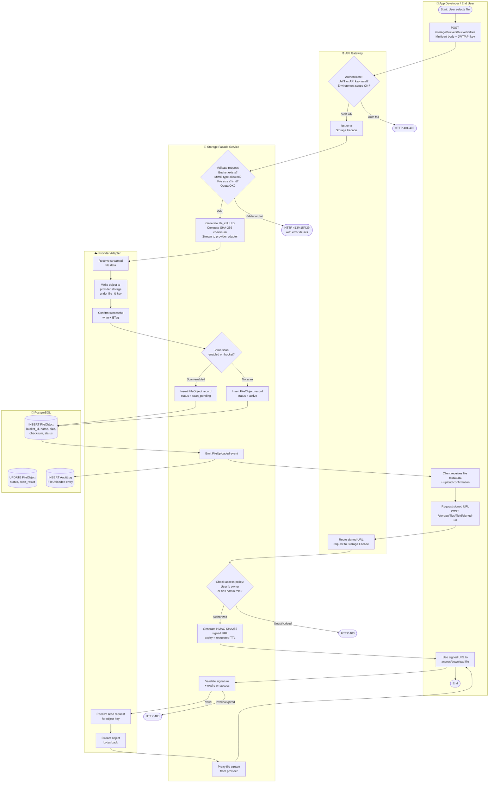
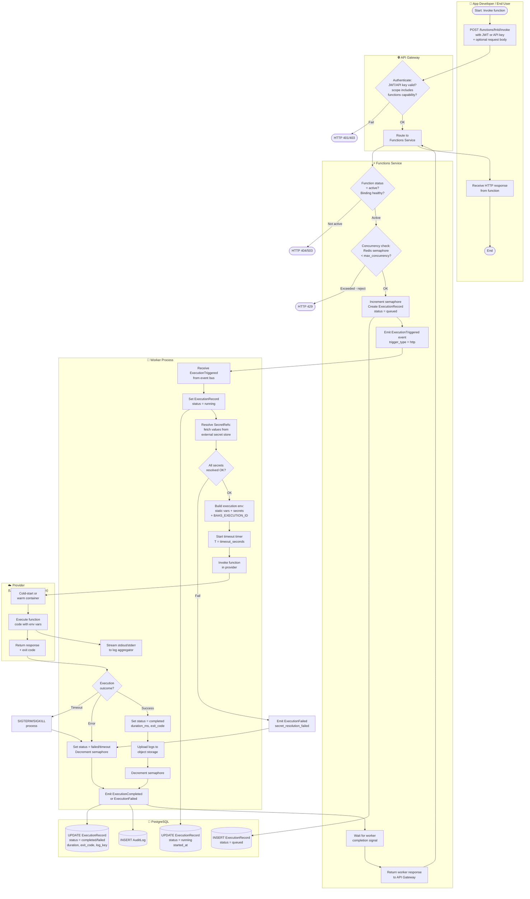
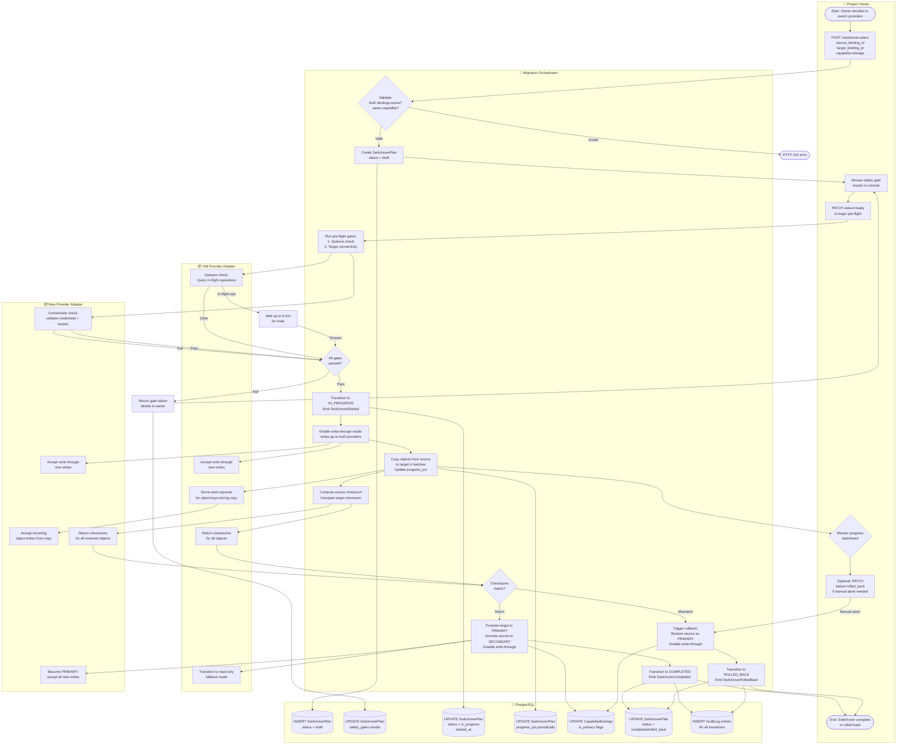

# BPMN Swimlane Diagrams — Backend as a Service (BaaS) Platform

**Version:** 1.0  
**Status:** Approved  
**Last Updated:** 2025-01-01  

These diagrams represent the process flows using swimlane-style Mermaid flowcharts. Each lane represents an actor or system component participating in the process.

---

## 1. Project Setup Swimlane

**Participants:** Project Owner | Control Plane Service | Adapter Registry | PostgreSQL

---

## 2. File Upload Swimlane

**Participants:** App Developer / End User | API Gateway | Storage Facade Service | Provider Adapter | PostgreSQL

---

## 3. Function Execution Swimlane

**Participants:** App Developer / End User | API Gateway | Functions Service | Worker | Provider | PostgreSQL

---

## 4. Provider Switchover Swimlane

**Participants:** Project Owner | Migration Orchestrator | Old Provider Adapter | New Provider Adapter | PostgreSQL

