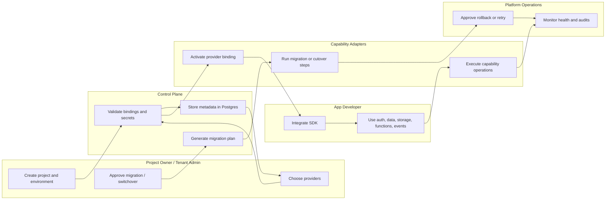
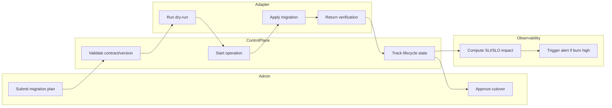

# BPMN Swimlane Diagram - Backend as a Service Platform

## Swimlane Interpretation

- The control plane owns validation, metadata, policy, and migration orchestration.
- Capability adapters perform provider-specific activation and runtime work while staying behind unified contracts.
- Platform operations remain involved whenever migration, health degradation, or rollback decisions are needed.

## BPMN Extension: Migration Governance Swimlane

