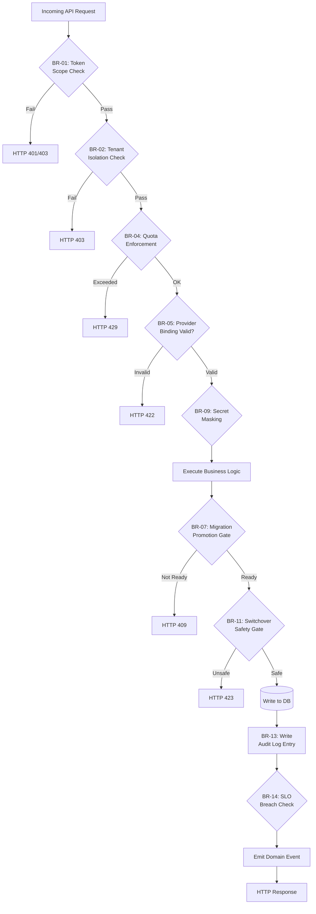

# Business Rules — Backend as a Service (BaaS) Platform

**Version:** 1.0  
**Status:** Approved  
**Last Updated:** 2025-01-01  

---

## Table of Contents

1. [Overview](#1-overview)
2. [Rule Evaluation Pipeline](#2-rule-evaluation-pipeline)
3. [Business Rules](#3-business-rules)
4. [Traceability Table](#4-traceability-table)

---

## Overview

This document defines the enforceable business rules governing the BaaS Platform's behavior. These rules are platform-level invariants — they apply across all tenants and cannot be overridden by project configuration unless explicitly noted. Rules are evaluated at specific pipeline stages (request validation, pre-write check, post-write event) and are enforced by designated services.

---

## Rule Evaluation Pipeline



---

## Enforceable Rules

---

### BR-01 — Token Scope Enforcement

**Category:** Authentication  
**Enforcer:** Auth Service / API Gateway middleware  

Every API request MUST present a credential (JWT access token or API key) whose scope is exactly authorized for the target resource. A JWT issued for Environment `staging` MUST NOT be accepted on any endpoint targeting Environment `production`. An API key scoped to the `database` capability MUST NOT be accepted on storage or function endpoints.

**Rule Logic:**
```
ALLOW if:
  token.environment_id == request.target_environment_id
  AND token.capability_scope includes request.capability
  AND token.not_expired
DENY with HTTP 403 otherwise
```

**Exceptions:** Platform Operator tokens with `platform:admin` scope bypass environment-level scope checks (but not tenant isolation).

---

### BR-02 — Tenant Isolation

**Category:** Tenancy  
**Enforcer:** All Services  

No API response MUST include resources belonging to a different Tenant than the authenticated caller's Tenant. This applies to all read and write operations. Database queries, storage operations, function executions, and realtime channel subscriptions are all silently filtered to the caller's Tenant and Project scope before being returned.

**Rule Logic:**
```
All database queries MUST include:
  WHERE tenant_id = :caller_tenant_id
  AND project_id = :caller_project_id
  AND environment_id = :caller_environment_id
```

**Violation Response:** HTTP 403 if attempting to explicitly reference a foreign resource ID.  
**Audit:** Any attempt to access a foreign resource is logged as a `UnauthorizedAccess` event.

---

### BR-03 — Project Environment Immutability

**Category:** Tenancy  
**Enforcer:** Control Plane  

The three canonical environment names (`development`, `staging`, `production`) cannot be renamed or deleted while the Project is active. Additional custom environments may be created and deleted freely. The production environment additionally requires a secondary confirmation (re-authentication or confirmation token) before any destructive operations (bulk delete, schema drop).

---

### BR-04 — Resource Quota Enforcement

**Category:** Tenancy  
**Enforcer:** Control Plane / Usage Meter  

Resource-consuming operations (file upload, function invocation, database record creation, WebSocket connection) MUST check the current UsageMeter value against the tenant's configured quota before proceeding. If the relevant counter equals or exceeds the quota limit, the operation is rejected with HTTP 429. Quota checks use the cached UsageMeter value; the cache TTL MUST NOT exceed 60 seconds.

**Quota Dimensions:**
| Dimension | Default Limit | Enforced By |
|-----------|--------------|-------------|
| Projects per tenant | 10 | Control Plane |
| Storage bytes per environment | 10 GB | Storage Facade |
| Function invocations per month | 100,000 | Functions Service |
| Concurrent WebSocket connections | 1,000 | Realtime Service |
| Database connection pool slots | 20 | DB Connection Manager |

---

### BR-05 — Provider Binding Validation on Creation

**Category:** Provider Management  
**Enforcer:** Control Plane  

A CapabilityBinding MUST be validated by performing a live connectivity check against the target provider at creation time. The check MUST:
1. Authenticate using the supplied credentials (resolved from the SecretRef).
2. Perform the lowest-privilege read operation supported by the provider type (e.g., `HeadBucket` for S3, `ListFunctions` for Lambda).
3. Complete within 10 seconds.

If the check fails, the binding is rejected with HTTP 422 and a `BindingValidationFailed` reason. Bindings MUST NOT be activated in a degraded/unknown state.

---

### BR-06 — Auth Token Expiry and Refresh Chain

**Category:** Authentication  
**Enforcer:** Auth Service  

Access tokens have a maximum TTL of 60 minutes (default 15 minutes, project-configurable within this bound). Refresh tokens have a maximum TTL of 90 days (default 30 days). The refresh token MUST be rotated on every use: the server issues a new refresh token and invalidates the presented one in a single atomic operation. If the presented refresh token has already been used (replay detection), the entire session chain MUST be immediately revoked and a `SessionHijackSuspected` event emitted.

---

### BR-07 — Schema Migration Promotion Gate

**Category:** Database  
**Enforcer:** Database API Service / Migration Orchestrator  

A migration version MUST satisfy ALL of the following conditions before promotion to `production`:
1. The migration has been applied to the `staging` environment and has status `applied`.
2. At least one automated test suite associated with the migration has executed and passed.
3. At least one authorized approver (with `environment:promote` permission) has approved the migration.
4. No destructive column operations (`DROP COLUMN`, `DROP TABLE`, `ALTER TYPE` with data loss) are present unless accompanied by a signed `destructive_acknowledged: true` flag from an authorized approver.

Violations return HTTP 409 with a structured list of failed conditions.

---

### BR-08 — Signed URL Expiry Enforcement

**Category:** Storage  
**Enforcer:** Storage Facade  

Signed URLs MUST be:
- Generated with an expiry window between 60 seconds and 7 days (inclusive).
- Single-use OR multi-use (configurable per request, default multi-use).
- Cryptographically signed using HMAC-SHA256 with a project-specific key stored in the secret manager.
- Validated on every access: the platform MUST re-verify the signature and expiry on each request to a signed URL endpoint; expiry is not relied upon solely at the CDN/proxy layer.

Accessing an expired or tampered signed URL returns HTTP 403. The platform does NOT redirect to the provider's native signed URL mechanism; all signed URL validation happens within the Storage Facade.

---

### BR-09 — Secret Masking and Non-Disclosure

**Category:** Security  
**Enforcer:** All Services  

Raw secret values MUST NEVER appear in:
- API responses (including error payloads).
- Application logs (structured or unstructured).
- Distributed trace spans or attributes.
- Audit Log entries.
- Function execution logs.

When a secret value must be referenced in a user-facing context, only the last four characters of the secret (or a masked form `****{last4}`) MUST be displayed. SecretRef objects stored in the database contain only the external secret store path/ARN and a display alias, never the resolved value.

---

### BR-10 — Function Execution Concurrency and Timeout

**Category:** Functions  
**Enforcer:** Functions Service / Worker  

A function MUST NOT execute beyond its configured timeout (default 30 s, maximum 900 s). The worker process MUST:
1. Set a hard OS-level timer at invocation start.
2. SIGTERM the function process at T=timeout, wait 5 seconds, then SIGKILL if still running.
3. Record the execution as `ExecutionTimeout` and return HTTP 504 to the caller.

Per-function concurrent invocation limits (default 10) MUST be enforced via a distributed semaphore (Redis). Invocations arriving beyond the concurrency limit MUST be queued (up to 60-second queue timeout) or immediately rejected with HTTP 429 based on project configuration.

---

### BR-11 — Provider Switchover Safety Gates

**Category:** Provider Management  
**Enforcer:** Migration Orchestrator  

A SwitchoverPlan MUST NOT advance to `in_progress` unless ALL of the following safety gates pass:
1. **Quiesce Check**: No in-flight operations (uploads, downloads, function executions) are targeting the source provider. The orchestrator waits up to 5 minutes for quiescing before aborting.
2. **Connectivity Check**: The target provider passes the same connectivity check as BR-05.
3. **Reconciliation Checksum**: After data copy, a reconciliation job computes a checksum (MD5 or SHA-256) of the copied dataset and compares it to the source. The switchover MUST NOT proceed if checksums do not match.
4. **Rollback Capability**: The source provider binding MUST remain accessible (not deleted) until the switchover is in `completed` state.

---

### BR-12 — Realtime Channel Authorization

**Category:** Realtime  
**Enforcer:** Realtime Service  

WebSocket subscription requests to private channels MUST be re-authorized on each subscribe message, not just at connection time. Authorization policy evaluation MUST:
1. Validate the JWT has not expired at message receipt time.
2. Evaluate the channel's access policy against the user's roles.
3. Re-evaluate on each message publish if the channel has a `strict_auth` flag set.

Public channels permit subscription without any credential. Mixed channels (subscribe freely, publish requires auth) enforce auth only on the publish path.

---

### BR-13 — Audit Log Immutability

**Category:** Security & Compliance  
**Enforcer:** Audit Service  

Audit Log entries:
- MUST be written to an append-only PostgreSQL table with no `UPDATE` or `DELETE` privileges granted to application roles.
- MUST be written within 1 second of the triggering event.
- MUST NOT be purged by the platform's data retention policies until the minimum retention period (1 year) has elapsed, regardless of project-level retention configuration.
- MAY be exported to customer-controlled immutable storage (S3 Object Lock, GCS Bucket Lock) via the audit export feature.

The Audit Service MUST use a PostgreSQL role that has only `INSERT` and `SELECT` permissions on the audit tables.

---

### BR-14 — SLO Breach Alert Gate

**Category:** Observability  
**Enforcer:** SLO Monitor (Control Plane)  

If the error rate for any service exceeds 1% over a rolling 5-minute window, or if the p99 latency exceeds 2× the SLO target, the platform MUST:
1. Emit a `SloBreachDetected` event with service name, metric, current value, and threshold.
2. Surface a warning banner in the tenant console for all affected projects.
3. Suppress quota enforcement for the affected capability for the duration of the breach (to avoid double-penalizing customers during platform issues).

---

### BR-15 — Webhook Delivery and Retry Policy

**Category:** Realtime  
**Enforcer:** Webhook Delivery Service  

Webhook delivery MUST follow a strict retry policy:
- **Initial attempt**: within 10 seconds of event occurrence.
- **Retry schedule**: 10 s, 1 min, 5 min, 30 min, 2 h (5 total attempts).
- **Success condition**: the target endpoint returns HTTP 2xx within 30-second timeout.
- **Suspension**: after 5 consecutive failures, the subscription is marked `suspended`. No further retries occur until the subscription is manually re-enabled.
- Each delivery attempt MUST include an `X-BaaS-Delivery-Attempt` header (1–5).
- The `X-BaaS-Signature` HMAC-SHA256 MUST be computed over the raw request body using the subscription's signing secret (a SecretRef).

---

## Traceability Table

| Rule ID | Rule Name | Related Use Cases | Related FR / NFR | Enforcer Service |
|---------|-----------|-------------------|------------------|-----------------|
| BR-01 | Token Scope Enforcement | UC-001–UC-008 | FR-012–FR-014 | API Gateway, Auth Service |
| BR-02 | Tenant Isolation | UC-001–UC-008 | FR-001–FR-004 | All Services |
| BR-03 | Environment Immutability | UC-001, UC-002 | FR-003 | Control Plane |
| BR-04 | Quota Enforcement | UC-001–UC-006 | FR-005 | Control Plane, Usage Meter |
| BR-05 | Provider Binding Validation | UC-002, UC-008 | FR-052 | Control Plane |
| BR-06 | Token Expiry and Refresh | UC-003 | FR-012–FR-013 | Auth Service |
| BR-07 | Migration Promotion Gate | UC-004 | FR-025–FR-026 | DB API, Migration Orchestrator |
| BR-08 | Signed URL Expiry | UC-005 | FR-031 | Storage Facade |
| BR-09 | Secret Non-Disclosure | UC-001–UC-008 | FR-057, NFR-016 | All Services |
| BR-10 | Function Timeout/Concurrency | UC-006 | FR-039, FR-042 | Functions Service |
| BR-11 | Switchover Safety Gates | UC-008 | FR-055 | Migration Orchestrator |
| BR-12 | Realtime Channel Auth | UC-007 | FR-045–FR-046 | Realtime Service |
| BR-13 | Audit Log Immutability | UC-001–UC-008 | FR-058, NFR-025 | Audit Service |
| BR-14 | SLO Breach Gate | All | NFR-011, NFR-012 | SLO Monitor |
| BR-15 | Webhook Retry Policy | UC-007 | FR-048 | Webhook Delivery Service |

## Exception and Override Handling

| Exception | Trigger Condition | Authorised By | Override Process |
|---|---|---|---|
| Quota bypass | Trial account needs temporary limit increase | Platform Support | Time-boxed quota exception via admin panel |
| SLA exemption | Scheduled maintenance affecting agreed SLA | Account Manager | Pre-approved maintenance window with customer notification |
| Multi-region override | Compliance requirement differs from default | Legal + CTO | Region-specific policy profile attached to tenant |
| Billing dispute | Customer contests usage-based charge | Finance + Support | Manual audit trail review, credit issued if discrepancy confirmed |
| Data residency exception | Replication needed across restricted regions | DPO approval | Legal framework and DPA amendment required before enabling |
