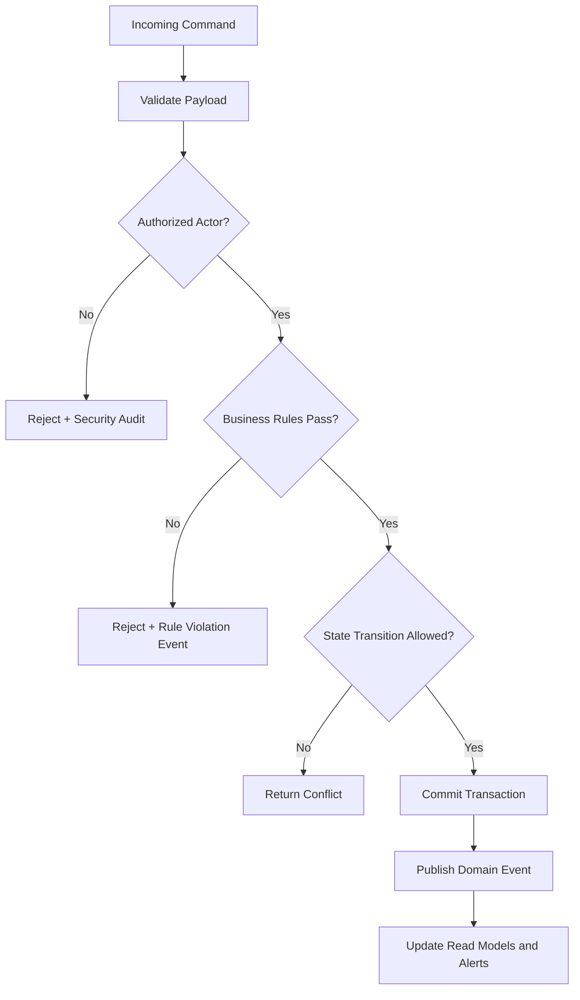

# Business Rules

This document defines enforceable policy rules for **Backend as a Service Platform** so command processing, asynchronous jobs, and operational actions behave consistently under normal and exceptional conditions.

## Context
- Domain focus: backend as a service workflows.
- Rule categories: lifecycle transitions, authorization, compliance, and resilience.
- Enforcement points: APIs, workflow/state engines, background processors, and administrative consoles.

## Enforceable Rules
1. Every state-changing command must pass authentication, authorization, and schema validation before processing.
2. Lifecycle transitions must follow the configured state graph; invalid transitions are rejected with explicit reason codes.
3. High-impact operations (financial, security, or regulated data actions) require additional approval evidence.
4. Manual overrides must include approver identity, rationale, and expiration timestamp.
5. Retries and compensations must be idempotent and must not create duplicate business effects.

## Rule Evaluation Pipeline

## Exception and Override Handling
- Overrides are restricted to approved exception classes and require dual logging (business + security audit).
- Override windows automatically expire and trigger follow-up verification tasks.
- Repeated override patterns are reviewed for policy redesign and automation improvements.

## Deep-Dive: Rules for Contracts, Isolation, and Operations

### Contract rules
1. Every façade operation maps to a canonical command contract before adapter execution.
2. Adapter-specific optional fields are allowed only under `extensions.<providerKey>` namespacing.
3. Breaking changes in request/response shape are prohibited in minor versions.

### Isolation rules
1. All rule evaluations include tenant, project, and environment context.
2. Cross-environment reads require explicit promotion workflows; direct reads are denied.
3. Secrets cannot be copied across tenants; only re-created via rotation workflows.

### Lifecycle rules
| Domain object | Allowed transitions |
|---|---|
| Capability binding | `draft -> validating -> active -> switching -> active/failed` |
| Migration | `planned -> dry-run -> applying -> verified -> completed/rolled-back` |
| Function release | `uploaded -> scanned -> deployed -> active -> deprecated` |

### Error/SLO rules
- `STATE_CONFLICT` must include current version and expected version.
- `DEP_RATE_LIMITED` must include retry-after metadata.
- SLOs are measured per capability and per environment tier (dev/stage/prod).

### Versioning rules
- API contract versions are semver-tagged; adapters declare minimum compatible contract version.
- Migration plans must record forward and backward compatibility assumptions.
